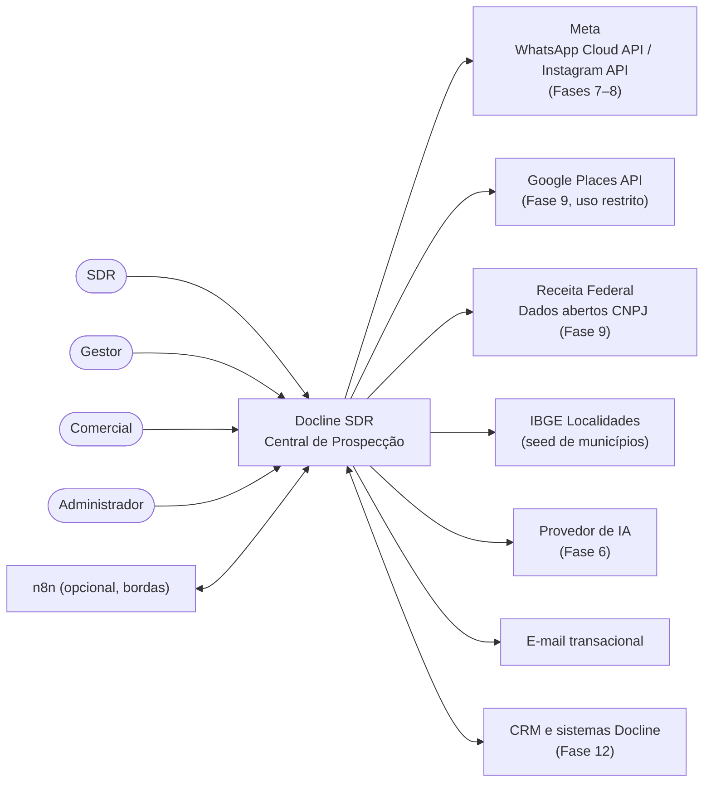
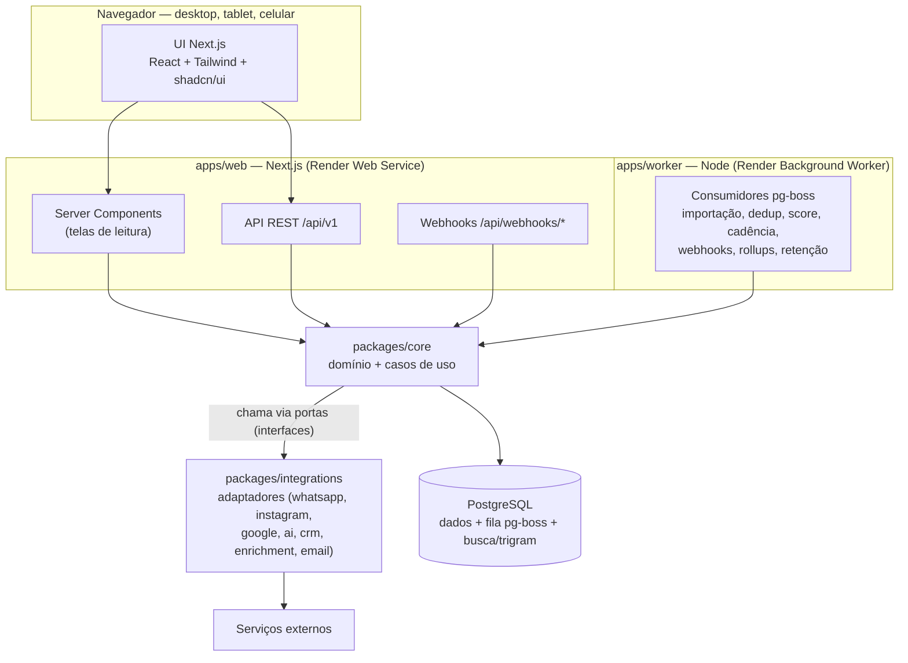
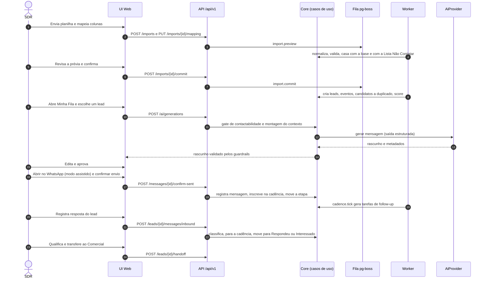

# Arquitetura — Docline SDR

> **Status:** aprovada; Fase 1 implementada · **Última revisão:** 2026-10-08
> Documentos relacionados: [DATABASE](./DATABASE.md) · [MVP](./MVP.md) · [ROADMAP](./ROADMAP.md) · [INTEGRATIONS](./INTEGRATIONS.md) · [SECURITY](./SECURITY.md) · [LGPD](./LGPD.md) · [SDR-FLOW](./SDR-FLOW.md) · [AI-SDR](./AI-SDR.md)

## Sumário

1. [Análise dos requisitos](#1-análise-dos-requisitos)
2. [Conflitos e pontos de atenção encontrados](#2-conflitos-e-pontos-de-atenção-encontrados)
3. [Drivers arquiteturais](#3-drivers-arquiteturais)
4. [Análise da stack](#4-análise-da-stack)
5. [Visão geral da arquitetura](#5-visão-geral-da-arquitetura)
6. [Módulos de domínio](#6-módulos-de-domínio)
7. [Padrões transversais](#7-padrões-transversais)
8. [Fluxo principal ponta a ponta](#8-fluxo-principal-ponta-a-ponta)
9. [APIs internas](#9-apis-internas)
10. [Jobs assíncronos (worker)](#10-jobs-assíncronos-worker)
11. [Estrutura de pastas](#11-estrutura-de-pastas)
12. [Estratégia de testes](#12-estratégia-de-testes)
13. [Escalabilidade](#13-escalabilidade)
14. [Implantação, ambientes e custos](#14-implantação-ambientes-e-custos)
15. [Registro de decisões (ADRs)](#15-registro-de-decisões-adrs)
16. [Questões em aberto](#16-questões-em-aberto)

---

## 1. Análise dos requisitos

### 1.1 O que estamos construindo

Um **sistema operacional de prospecção B2B**, não uma ferramenta de disparo. O valor está em quatro capacidades combinadas:

| Capacidade | Requisitos de origem | Consequência arquitetural |
|---|---|---|
| **Base de leads confiável** | Importação, normalização, deduplicação, origem, histórico (§4–8) | Pipeline de dados com prévia, regras puras testáveis, nunca exclusão automática |
| **Operação diária do SDR** | Pipeline, fila, cadência, follow-up, timeline, mobile (§11–13, 18, 30) | UI rápida, tarefas geradas por regras configuráveis, eventos de tudo |
| **Contato responsável** | WhatsApp, Instagram, opt-out, LGPD (§14, 15, 25) | Um único *gate* de contactabilidade, integrações oficiais, modo assistido |
| **Inteligência comercial** | Scoring, IA, dashboard, campanhas, diferencial futuro (§10, 16, 21, 22, 39) | Modelo orientado a eventos e atribuição (abordagem/canal/campanha) desde o 1º dia |

### 1.2 Requisitos não funcionais derivados

| Atributo | Meta inicial | Observação |
|---|---|---|
| Conformidade | 0 contatos a identificadores na Lista Não Contatar | Verificado no código **e** em testes automatizados |
| Rastreabilidade | 100% das mudanças relevantes geram evento/auditoria | Timeline e auditoria são *append-only* |
| Velocidade operacional | p95 < 300 ms em ações comuns; < 800 ms em listas filtradas com 100 mil leads | Paginação por cursor, índices dedicados |
| Custo inicial | 1 serviço web + 1 worker + 1 PostgreSQL | Sem Redis, sem Elasticsearch, sem Kubernetes |
| Escalabilidade | 500 mil leads sem reescrita | Ver [§13](#13-escalabilidade) |
| Evolutividade | Trocar fornecedor de integração sem tocar no domínio | Portas e adaptadores ([§7.1](#71-portas-e-adaptadores-integrações)) |
| Testabilidade | Regras críticas (normalização, dedup, score, cadência, opt-out) como funções puras | Cobertura alta no núcleo |
| Usabilidade móvel | Fluxos essenciais do SDR no celular | Responsivo; ver [MVP §7](./MVP.md#7-telas-do-mvp) |

### 1.3 Perfis de usuário

| Perfil | Uso principal |
|---|---|
| **ADMINISTRADOR** | Configurações (pipeline, score, cadência, integrações), usuários, conformidade |
| **GESTOR** | Acompanhamento da equipe, distribuição, relatórios, campanhas, decisões de duplicados |
| **SDR** | Fila diária, prospecção, follow-up, qualificação, transferência |
| **COMERCIAL** | Recebe oportunidades transferidas, negocia, registra conversão |

---

## 2. Conflitos e pontos de atenção encontrados

A análise encontrou pontos em que um requisito, se implementado literalmente, entraria em conflito com políticas de plataforma, com a lei ou com outro requisito. Cada um tem uma proposta de tratamento.

| # | Ponto | Por que importa | Proposta |
|---|---|---|---|
| A1 | **WhatsApp exige opt-in para mensagens iniciadas pela empresa.** A política de mensagens do WhatsApp Business exige que o destinatário tenha fornecido o número **e** dado permissão (opt-in) para receber mensagens da empresa no WhatsApp. | Prospecção "fria" via WhatsApp Business Platform (API) para leads encontrados no Google viola a política e pode derrubar o número/conta. | Separar **base legal LGPD** de **opt-in WhatsApp** no modelo de dados. A API só envia a quem tem opt-in registrado. Para o primeiro contato sem opt-in: **modo assistido** (humano, 1 a 1, com limites) ou outros canais. Ver [INTEGRATIONS §6](./INTEGRATIONS.md#6-whatsapp) e [LGPD §6](./LGPD.md#6-whatsapp-base-legal-lgpd--opt-in-da-meta). |
| A2 | **A API do Instagram não permite iniciar conversas por DM.** A API de mensagens só responde a quem escreveu primeiro, dentro da janela permitida. | Requisito §15 já prevê isso; precisamos de fluxo assistido desde o MVP. | DM fria = ação humana no app do Instagram, registrada na plataforma. API (Fase 8) só para receber/responder mensagens e comentários. |
| A3 | **Os Termos da Google Maps Platform restringem armazenar conteúdo do Places** (nome, endereço, telefone, avaliações). Em regra, só o `place_id` pode ser guardado indefinidamente. | Os campos "nota Google" e "quantidade de avaliações" e a "prospecção via Google" (§9) não podem virar uma base permanente copiada do Google. | Google como **ferramenta de descoberta e apoio**: guardar `place_id`, exibir dados ao vivo com atribuição. **Fonte primária proposta para descoberta:** dados abertos do CNPJ da Receita Federal (CNAE 6920-6/01 e 6920-6/02). Critérios de score baseados em Google ficam **desligados até validação jurídica**. Ver [INTEGRATIONS §8](./INTEGRATIONS.md#8-google). |
| A4 | **A soma dos pesos do score de exemplo é 140**, mas a escala é 0–100. | Sem regra explícita, as faixas ficam inconsistentes. | O modelo de score tem uma estratégia de normalização configurável (`CLAMP` limita em 100; `SCALE` faz proporção). Padrão: `CLAMP`. |
| A5 | **"Follow-up 1/2/3" como etapas do pipeline** misturam "onde o lead está no funil" com "em que passo da cadência ele está". | Mover cards à mão desincroniza a cadência. | Manter as 17 etapas pedidas (seed), mas **quem move entre Primeiro contato → FU1 → FU2 → FU3 → Sem resposta é o motor de cadência**, via chaves estáveis (`stage.key`). Alternativa futura: uma etapa "Em cadência" com selo "FU 2/3". Decisão pendente com o negócio. |
| A6 | **"Não contatar" como tag** (§19). | Uma tag pode ser removida por engano e não protege o mesmo telefone em outro lead. | "Não contatar" é **mecanismo de conformidade** (Lista Não Contatar por identificador), exibido como selo do sistema, nunca como tag editável. |
| A7 | **"WhatsApp identificado"** não pode ser verificado pela API oficial antes do contato. | Celular ≠ WhatsApp. | Estados `UNKNOWN` / `PROBABLE` (declarado pela fonte) / `CONFIRMED` (houve conversa) / `NOT_ON_WHATSAPP`. |
| A8 | **CNPJ alfanumérico.** Desde julho/2026 a Receita emite CNPJs com letras nas 12 primeiras posições (IN RFB 2.229/2024). | Validação só numérica rejeitaria CNPJs válidos e quebraria a deduplicação. | Campo `varchar(14)` em maiúsculas; validação de DV com o novo algoritmo (valor ASCII − 48) desde a Fase 3. |
| A9 | **Números brasileiros e o 9º dígito no WhatsApp.** O `wa_id` que chega nos webhooks pode vir sem o 9º dígito em números antigos. | Uma resposta recebida pode não ser associada ao lead certo. | Ao casar números, comparar as duas variantes (com e sem 9º dígito) para celulares BR. |
| A10 | **"Serviço independente" de IA** (§16). | Um microsserviço separado no MVP adiciona deploy, rede e custo sem ganho imediato. | Módulo `ai-sdr` isolado com contrato próprio (porta `AiProvider` + API interna), rodando no monólito; extraível depois sem mudar os consumidores. |
| A11 | **Dados de terceiros na IA.** Bio do Instagram, texto de site e mensagens recebidas podem conter instruções maliciosas (*prompt injection*). | A IA poderia gerar conteúdo indevido. | Dados externos são tratados como dados, nunca como instrução; saída validada; aprovação humana obrigatória. Ver [AI-SDR §9](./AI-SDR.md#9-guardrails). |

---

## 3. Drivers arquiteturais

Em ordem de prioridade, para desempate de decisões:

1. **Conformidade e confiança** — nenhuma decisão de produtividade passa por cima de opt-out, base legal ou política de plataforma.
2. **Simplicidade operacional** — poucos componentes, um banco, um idioma de programação.
3. **Velocidade do SDR** — a ferramenta precisa ser mais rápida que a planilha + WhatsApp Web que ela substitui.
4. **Rastreabilidade** — toda ação gera evento; métricas vêm de eventos, não de contadores soltos.
5. **Evolutividade** — integrações e regras de negócio trocáveis sem reescrever o domínio.

---

## 4. Análise da stack

A preferência inicial foi avaliada item a item. Onde a recomendação diverge, a justificativa está explícita.

| Função | Preferência inicial | Recomendação | Justificativa |
|---|---|---|---|
| Frontend | Next.js + React + TypeScript | ✅ **Manter** (App Router, versão estável mais recente) | Ecossistema maduro, Server Components para telas de leitura, um só idioma no projeto inteiro. |
| Backend | Node.js / TypeScript | ✅ **Manter**, como **API dentro do Next.js (route handlers) + processo worker separado** | Uma API separada (NestJS/Fastify) dobraria deploys e contratos no MVP. O domínio fica em `packages/core`, independente de framework: se a API precisar ser extraída, extrai-se a casca, não as regras. |
| Banco | PostgreSQL | ✅ **Manter** | Relacional, transacional, JSONB, busca textual, `pg_trgm` para similaridade de nomes, particionamento para crescer. Cobre fila, busca e dedup sem serviços extras. |
| ORM | Prisma ou alternativa | ✅ **Prisma**, com SQL tipado (`TypedSQL` / `$queryRaw` com `Prisma.sql`) para analytics e deduplicação | Migrações maduras e boa DX para a equipe. **Drizzle** foi considerado (mais próximo do SQL, melhor para recursos específicos do Postgres); a diferença não justifica fugir da preferência. Índices trigram e partições entram como SQL nas migrações. |
| Filas | Redis / BullMQ | ⚠️ **Substituir no MVP por `pg-boss`** (fila sobre o próprio PostgreSQL) | O volume de jobs de um time de SDR (milhares/dia) é pequeno. `pg-boss` tem retentativas, agendamento cron, *dead letter* e enfileiramento **na mesma transação** do dado de negócio, sem um Redis para pagar, monitorar e fazer backup. A interface `JobQueue` permite migrar para BullMQ se um dia for necessário. |
| Automação | n8n | ⚠️ **Somente nas bordas** (Fase 12) | Regra de negócio no n8n fica fora do Git, dos testes e da auditoria. n8n pode orquestrar integrações com sistemas Docline consumindo a nossa API, nunca decidir quem é contatado. |
| Interface | Tailwind CSS + componentes reutilizáveis | ✅ **Tailwind + shadcn/ui (Radix)**, TanStack Table (grade de leads), dnd-kit (Kanban), Recharts (gráficos), React Hook Form + Zod | shadcn/ui gera componentes acessíveis que ficam no nosso código, sem dependência de biblioteca fechada. |
| Infra | Docker | ✅ **Manter**: `docker compose` no desenvolvimento e um Dockerfile por app | Portabilidade entre Render e qualquer outro provedor. |
| Deploy | Render | ✅ **Decidido: Render, região Virginia** ([ADR-019](#15-registro-de-decisões-adrs)) | Simples e barato (web service + background worker + Postgres gerenciado). **Ressalva:** a Render não tem região no Brasil; hospedar fora exige tratamento de transferência internacional (LGPD art. 33). Alternativas com São Paulo avaliadas: Google Cloud `southamerica-east1`, Fly.io `gru`, AWS `sa-east-1`. |
| Autenticação | (não especificado) | **Better Auth** (e-mail/senha, sessões no banco, adaptador Prisma, 2FA por plugin) + **RBAC próprio no domínio** | Auth.js tem suporte fraco a login por senha; Clerk é pago e leva dados de usuários para fora. Better Auth é open source e roda no nosso banco. Permissões ficam no nosso código, testadas ([SECURITY §4](./SECURITY.md#4-autorização-rbac)). |
| Planilhas | — | ~~ExcelJS~~ **leitor próprio de XLSX** (fflate + saxes, ADR-020) + **Papa Parse** (CSV), com detecção de codificação | O pacote `xlsx` publicado no npm está desatualizado e tem vulnerabilidades conhecidas (as versões novas do SheetJS saem só pelo CDN do fornecedor). Exportações do Excel no Brasil costumam vir em Windows-1252 com `;`, o que precisa ser tratado. |
| Telefones | — | **libphonenumber-js** + regras BR próprias (DDD, 9º dígito, variantes `wa_id`) | Biblioteca de referência; regras brasileiras ficam em módulo próprio testado. |
| Busca | — | **PostgreSQL** (full-text + `pg_trgm`) | Elasticsearch/OpenSearch só se a busca virar gargalo, o que não se espera até 500 mil leads. |
| IA | `AI_API_KEY` | Porta `AiProvider` com adaptador padrão **Anthropic (Claude)** via SDK oficial; modelo configurável por variável de ambiente | Ver [AI-SDR §4](./AI-SDR.md#4-provedor-modelos-e-configuração). |
| Testes | — | **Vitest** + **fast-check** (testes de propriedade) + **Testcontainers/Postgres** (integração) + **Playwright** (E2E) + **MSW** (HTTP de adaptadores) | Ver [§12](#12-estratégia-de-testes). |
| Observabilidade | — | **pino** (logs estruturados com mascaramento de dados pessoais) + **Sentry** (erros) | Plano gratuito suficiente no início. |
| Monorepo | — | **pnpm workspaces** (sem Turborepo no início) | Dois apps e três pacotes não justificam um orquestrador de build. Turborepo entra se o build ficar lento. |
| E-mail transacional | — | Porta `EmailProvider` (SMTP/Resend/SES) | Convites e redefinição de senha. Não é canal de prospecção no MVP. |

### 4.1 Versões adotadas na Fase 1

Node.js 22 · pnpm 10.28 · TypeScript 6.0 · Next.js 16.3 (React 19.3) · Tailwind CSS 4 · Prisma 7.10 (gerador `prisma-client` + adaptador `pg`) · PostgreSQL 16/17 · Better Auth 1.7 · pg-boss 12 · Zod 4 · ESLint 10 · Vitest 5 · Playwright 1.63.

Ajustes em relação à análise acima, decididos durante a implementação:

- **TypeScript 6.0, não 7.x:** a versão 7 (compilador nativo) ainda não é suportada pelo typescript-eslint.
- **Next.js 16** renomeou o `middleware` para **`proxy`**; a CSP com nonce é aplicada ali (ADR-018).
- **Prisma 7** exige `prisma.config.ts` e adaptador de driver; o cliente é gerado em `packages/db/src/generated` (não versionado, gerado no `postinstall`).
- **Ponto de atenção (pg 9):** dentro de transações, o Prisma 7 com o adaptador `pg` carrega relações de um mesmo `select` em consultas paralelas na mesma conexão; o pg 8 as enfileira (resultado correto) e emite um aviso de *deprecation*. Antes de atualizar para o pg 9, avaliar `relationLoadStrategy: 'join'` (recurso `relationJoins`) nas leituras com muitas relações, como o detalhe do lead.
- **Índices parciais** (Fase 2) declarados no schema com o recurso `partialIndexes` do Prisma, ainda em *preview*: assim a checagem de drift do CI os cobre. Se o recurso mudar, a alternativa é SQL manual na migração, perdendo essa checagem.
- **Componentes de UI** escritos no próprio projeto sobre Radix (no estilo shadcn/ui), sem depender do gerador do shadcn.
- **Sentry (Fase 2, F2-17):** opcional, ativado por `SENTRY_DSN`. Usa `@sentry/node` 10 sem instrumentação automática, sem tracing e sem breadcrumbs: só envia o que a aplicação captura.
  - **Web:** erros 5xx da API v1 (`apiHandler`) e erros de páginas e server actions (`onRequestError` em `instrumentation.ts`), com `requestId` e rota.
  - **Worker:** falhas de job, com o nome do job; o pg-boss segue fazendo a retentativa.
  - **Sem dados pessoais:** nada de usuário, cookies, cabeçalhos ou corpo; e-mails e sequências de 8 ou mais dígitos viram marcadores em toda mensagem.
  - **Sem DSN:** nada é enviado, e os erros continuam nos logs pino com `requestId`.
- **IP do cliente:** lido só do `X-Forwarded-For`, com a lista `TRUSTED_PROXIES` (CIDR) definindo quais saltos são confiáveis; a mesma regra serve ao rate limit e à auditoria ([SECURITY §12](./SECURITY.md#12-limites-de-taxa-e-abuso)).
- **Cadeia de suprimentos:** `minimumReleaseAge` de 24 h no pnpm (já barrou uma versão publicada no mesmo dia) e sobrescritas de versão para dependências transitivas vulneráveis (`pnpm-workspace.yaml`).

---

## 5. Visão geral da arquitetura

**Estilo:** monólito modular em TypeScript, com núcleo de domínio independente de framework, integrações por **portas e adaptadores** e **eventos de domínio** como espinha dorsal de timeline, automação e analytics.

### 5.1 Contexto



### 5.2 Containers



**Por que dois processos?** O web atende requisições curtas. O worker executa o que é lento, agendado ou precisa de retentativa (importações grandes, varredura de duplicados, cadência, webhooks). Ambos usam o mesmo `packages/core`.

### 5.3 Camadas e regras de dependência

```
apps/web, apps/worker      → camada de entrega (HTTP, jobs). Sem regra de negócio.
packages/core              → domínio + casos de uso. Define PORTAS (interfaces).
packages/integrations      → ADAPTADORES que implementam as portas do core.
packages/db                → schema Prisma, migrações, seed, cliente.
```

Regras (validadas por lint com `eslint-plugin-boundaries` ou `dependency-cruiser`):

1. `core` **não importa** `integrations`, `next`, `react` nem SDKs de terceiros.
2. Chamadas externas existem **somente** em `packages/integrations`.
3. Um módulo do core só acessa outro pelo seu `index.ts` público, nunca por arquivos internos.
4. As funções puras de domínio (normalização, matching de duplicados, cálculo de score, calendário de cadência) não fazem I/O.
5. Todas as mutações passam por um caso de uso, que (a) autoriza, (b) valida, (c) persiste, (d) emite evento e (e) audita, na mesma transação.

---

## 6. Módulos de domínio

| Módulo | Responsabilidade | Entidades principais | Fase |
|---|---|---|---|
| `identity` | Usuários, equipes, sessões (via Better Auth), RBAC | users, teams | 1 |
| `audit` | Log imutável de mutações e eventos de segurança | audit_logs | 1 |
| `settings` | Configurações de negócio versionadas, visões salvas | app_settings, saved_views | 1 |
| `reference` | UFs, municípios IBGE, feriados, cidades prioritárias | states, municipalities, holidays, priority_cities | 1–2 |
| `leads` | Lead, pessoas, pontos de contato, origem, tags, observações, filtros | leads, lead_people, contact_points, lead_origins, tags, lead_notes | 2 |
| `timeline` | Eventos de domínio por lead (append-only) | lead_events | 2 |
| `normalization` | Funções puras de padronização | — | 3 |
| `import` | Upload, mapeamento, prévia, confirmação, relatório | import_batches, import_rows, import_mapping_templates | 3 |
| `dedup` | Detecção, revisão e mesclagem de duplicados | duplicate_candidates, lead_merges | 3 |
| `compliance` | Base legal, opt-in, Lista Não Contatar, *gate* de contactabilidade, direitos do titular, retenção | contact_permissions, suppression_entries, data_subject_requests, legal_basis_assessments, retention_policies | 2–5 (núcleo no MVP) |
| `scoring` | Modelos e regras de score versionados, cálculo explicável | scoring_models, scoring_rules, lead_score_history | 4 |
| `pipeline` | Etapas configuráveis, movimentação, histórico, motivos de perda | pipelines, pipeline_stages, lead_stage_history, loss_reasons | 4 |
| `distribution` | Atribuição de responsável (manual no MVP; estratégias depois) | lead_assignments, distribution_rules | 2 (manual) / futura |
| `tasks` | Atividades, follow-ups, "Minha Fila SDR" | tasks, activities | 5 |
| `cadence` | Cadências configuráveis, inscrição, avanço, parada automática | cadences, cadence_steps, cadence_enrollments | 5 |
| `messaging` | Mensagens (assistidas/API), templates, abordagens, conversas | messages, message_templates, approaches, conversations | 5 (assistido) / 7 |
| `ai-sdr` | Geração de abordagens, classificação de respostas, insights | ai_generations, ai_knowledge_items | 6 |
| `opportunities` | Qualificação, transferência ao Comercial, conversão | opportunities | 5–6 |
| `prospecting` | Buscas em fontes autorizadas, aprovação de novos leads | prospecting_searches, prospecting_results, registry_companies | 9 |
| `campaigns` | Seleção por filtros, elegibilidade, acompanhamento | campaigns, campaign_leads | 10 |
| `analytics` | Indicadores, funis, rollups, insights | daily_metrics, insights | 6 (básico) / 11 |

Cada módulo segue o mesmo layout:

```
modules/<modulo>/
  domain/        # tipos, invariantes, funções puras (sem I/O)
  application/   # casos de uso: autorizam, validam, orquestram, emitem eventos
  infra/         # repositórios Prisma e consultas SQL
  contracts/     # schemas Zod de entrada/saída (compartilhados com a API e a UI)
  index.ts       # API pública do módulo
```

---

## 7. Padrões transversais

### 7.1 Portas e adaptadores (integrações)

O core declara interfaces (portas) como `MessagingProvider`, `AiProvider`, `PlaceSearchProvider`, `CompanyRegistryProvider`, `SocialProfileProvider`, `CrmProvider`, `EmailProvider` e `JobQueue`. `packages/integrations` implementa cada uma em uma ou mais variantes (`fake`, `assisted`, `meta_cloud`, `anthropic`…). Um **registro de provedores** escolhe a implementação pela variável de ambiente (`WHATSAPP_PROVIDER=assisted`). Em desenvolvimento e testes o padrão é sempre `fake` ou `assisted`, e **nenhuma mensagem real sai de um ambiente que não seja produção**. Detalhes em [INTEGRATIONS](./INTEGRATIONS.md).

### 7.2 Eventos de domínio, timeline e auditoria

- Todo caso de uso relevante emite **eventos de domínio** tipados (`lead.created`, `lead.stage_changed`, `message.sent`, `optout.registered`…).
- Eventos relacionados a um lead viram linhas em `lead_events`, a **timeline**: append-only, legível pelo SDR, base de analytics e do "SDR assistido por IA" futuro.
- Mutações de qualquer entidade geram `audit_logs` com o diff dos campos (quem, quando, de onde). A auditoria é técnica e de conformidade; a timeline é de negócio.
- Reações assíncronas (recalcular score, procurar duplicado, parar cadência) são **jobs enfileirados na mesma transação** que o dado (pg-boss com a conexão transacional, ou tabela *outbox*). Assim nenhum evento se perde e nenhum job roda sobre dado que sofreu rollback.

### 7.3 Gate de contactabilidade

Um único serviço, `ContactabilityService.check(lead, channel, mode)`, responde **"posso contatar este lead neste canal, deste modo, agora?"** com `{ allowed, reasons[] }`. Ele considera Lista Não Contatar, base legal, opt-in do canal, status do ponto de contato, cadência ativa, limites de frequência e horário permitido. É chamado:

1. pela UI, para desabilitar botões e explicar o motivo;
2. pelo `ai-sdr`, antes de gerar mensagem;
3. pelo `messaging`, antes de registrar ou enviar;
4. pelos **adaptadores de envio** de novo, como defesa em profundidade;
5. pelo `campaigns`, para calcular elegibilidade.

### 7.4 Configuração de negócio versionada

Etapas do pipeline, regras de score, cadências, palavras-chave de opt-out, horários permitidos e cidades prioritárias ficam **no banco**, editáveis pelo administrador. Mudanças estruturais (modelo de score, cadência) geram **nova versão**; registros antigos guardam a versão usada, o que mantém a análise histórica correta.

### 7.5 Autorização

`authorize(actor, action, resource)` roda no caso de uso, nunca só na UI. Escopos por perfil e matriz de permissões em [SECURITY §4](./SECURITY.md#4-autorização-rbac). Toda consulta de lista aplica o escopo do ator, o que previne IDOR.

### 7.6 Idempotência e concorrência

- `Idempotency-Key` em criações sensíveis (mensagens, importações, mesclagens).
- Coluna `version` em `leads` (lock otimista) para movimentação no Kanban e edição concorrente.
- Webhooks e jobs são idempotentes por chave natural (id do evento do provedor, id do job).

### 7.7 Tempo, fuso e calendário

Datas em UTC (`timestamptz`). Exibição no fuso do usuário (padrão `America/Fortaleza`). A cadência respeita **dias úteis, feriados e janela de horário no fuso do lead**, derivado da UF.

### 7.8 Erros, logs e observabilidade

- Erros de domínio tipados (`NotFound`, `Forbidden`, `ValidationFailed`, `ContactNotAllowed`, `Conflict`) mapeados para `application/problem+json` (RFC 9457).
- Logs estruturados (pino) com `requestId`/`jobId`, e **mascaramento** de telefone, e-mail e tokens.
- Sentry para exceções; `/api/health` para *health checks*; métricas de jobs (falhas, atraso da fila).

---

## 8. Fluxo principal ponta a ponta



Cada etapa do fluxo de negócio (captação → conversão) está detalhada, com eventos e critérios, em [SDR-FLOW](./SDR-FLOW.md).

---

## 9. APIs internas

### 9.1 Convenções

| Tema | Convenção |
|---|---|
| Base | `/api/v1` (REST, JSON). Contrato único para a UI e futuras integrações (n8n, sistemas Docline). |
| Autenticação | Cookie de sessão (UI). Fase 12: chaves de API com escopos (`Authorization: Bearer`). |
| Validação | Zod na borda; os mesmos schemas tipam o cliente da UI. |
| Erros | `application/problem+json` com `type`, `title`, `status`, `detail`, `code`, `errors[]`. |
| Paginação | Por cursor: `?cursor=…&limit=50` → `{ data, nextCursor }`. Nunca `OFFSET` em listas grandes. |
| Filtros complexos | `POST /leads/search` com corpo em DSL de filtros (abaixo). Campos e operadores vêm de uma *whitelist*. |
| Contagem prévia | `POST /leads/count` com o mesmo filtro, retorna total e quebra por contactabilidade. Toda ação em massa exige `dryRun` antes. |
| Concorrência | `version` no corpo de `PATCH` e de movimentação de etapa; conflito → `409`. |
| Idempotência | Cabeçalho `Idempotency-Key` em criações sensíveis. |
| Datas | ISO 8601 em UTC. |
| Documentação | OpenAPI gerado a partir dos schemas Zod (Fase 2+). |

Exemplo da DSL de filtros (§20 dos requisitos):

```json
{
  "all": [
    { "field": "state", "op": "eq", "value": "CE" },
    { "field": "city", "op": "in", "value": ["Sobral"] },
    { "field": "segment", "op": "eq", "value": "contabilidade" },
    { "field": "hasWhatsapp", "op": "eq", "value": true },
    { "field": "stage", "op": "eq", "value": "NEW" },
    { "field": "origin", "op": "eq", "value": "GOOGLE" },
    { "field": "score", "op": "gt", "value": 60 }
  ]
}
```

Grupos `all` e `any` podem ser aninhados. O servidor compila a DSL para `where` do Prisma ou SQL parametrizado, nunca concatenando texto.

### 9.2 Endpoints por módulo

> **Implementado até a Fase 3** (`apps/web/src/app/api/v1`): identidade e auditoria (Fase 1); leads (`search`, `count`, `check-duplicates`, cadastro, detalhe, edição, `archive` e **`unarchive`**, `timeline`, `history`, notas, pessoas, contatos, tags, `assign`, **`claim`** — SDR assume do pool —, `contactability`, `opt-out`, `permissions/{channel}`, `anonymize`, `bulk`); `tags`, `lead-sources`, `segments`, **`states`** e **`municipalities?q=`** (autocompletar); `users/{id}/territories`; `saved-views`; `suppressions` (+ `revoke`); `data-subject-requests`; **`legal-basis-assessments`** (Fase 2); importação (`imports`: upload multipart, lote, `mapping`, `preview`, `rows/{rowId}`, **`decisions`** — mesma decisão para todas as linhas de uma situação —, `commit`, `report` e **`cancel`**) e duplicados (`duplicates`, comparação, `merge`, `keep-separate`, `ignore` e `scan`), na Fase 3. Em negrito, rotas que não estavam na lista abaixo. Possível duplicado no cadastro responde `409` com `code: POSSIBLE_DUPLICATE` e a lista em `duplicates`. O upload confere o tamanho antes de ler o corpo; `commit` e `scan` respondem `202` (o trabalho segue no worker). **`POST /exports`** devolve o CSV na própria resposta (`text/csv`, separador `;`, BOM UTF-8). Erros possíveis: `429 RATE_LIMITED` (5 exportações em 24 h) e `422` (seleção vazia ou acima de 20.000 leads). Não implementadas: `/import-mapping-templates` (o modelo é salvo no `mapping` e sugerido pelo cabeçalho) e `/normalize/preview` (a prévia da importação cobre).
>
> **Decisão (Fase 2): exportação síncrona.** O desenho previa job assíncrono, mas isso exigiria guardar o arquivo com dados pessoais até o download. A geração na hora não deixa nada no servidor, alinhada a SECURITY §8, e cabe no volume do MVP (20.000 leads em poucos segundos). Vira job quando o limite por arquivo precisar subir.

> Legenda de fase: **MVP** = Fases 1–6. Números indicam fases posteriores.

**Identidade, equipe e configurações**

| Método e rota | Descrição | Fase |
|---|---|---|
| `GET /me` | Usuário atual, perfil e permissões efetivas | MVP |
| `GET/POST /users`, `PATCH /users/{id}` | Gestão de usuários (convite, perfil, ativar/desativar) | MVP |
| `GET/PUT /users/{id}/territories` | Territórios (UF/cidade) do usuário | 2 (estrutura) |
| `GET/PUT /settings/{key}` | Configurações de negócio (horários, limites, palavras de opt-out…) | MVP |
| `GET/POST/PATCH/DELETE /saved-views` | Visões e filtros salvos | MVP |
| `GET /audit-logs` | Consulta de auditoria (ADMIN) | MVP |
| `GET /health` | Health check (sem autenticação, sem dados) | MVP |

**Leads**

| Método e rota | Descrição | Fase |
|---|---|---|
| `POST /leads/search` | Lista com filtros, ordenação e cursor | MVP |
| `POST /leads/count` | Contagem prévia do filtro, com quebra por contactabilidade | MVP |
| `POST /leads/check-duplicates` | Verificação de duplicidade antes de criar | MVP |
| `POST /leads` | Cadastro manual | MVP |
| `GET /leads/{id}` | Detalhe (inclui pessoas, pontos de contato, score explicado, contactabilidade) | MVP |
| `PATCH /leads/{id}` | Edição (com `version`) | MVP |
| `POST /leads/{id}/archive` | Arquivar (não exclui) | MVP |
| `GET /leads/{id}/timeline` | Timeline paginada | MVP |
| `GET /leads/{id}/history` | Histórico de alterações de campos (auditoria filtrada) | MVP |
| `POST /leads/{id}/notes` | Adicionar observação | MVP |
| `POST/PATCH/DELETE /leads/{id}/people[/{personId}]` | Pessoas do lead (contador, sócio…) | MVP |
| `POST/PATCH/DELETE /leads/{id}/contact-points[/{cpId}]` | Telefones, e-mails, Instagram | MVP |
| `POST/DELETE /leads/{id}/tags[/{tagId}]` | Tags | MVP |
| `POST /leads/{id}/assign` | Atribuir responsável | MVP |
| `POST /leads/{id}/stage` | Mover de etapa (motivo obrigatório em perdas) | MVP |
| `GET /leads/{id}/contactability` | Resultado do gate por canal | MVP |
| `POST /leads/{id}/activities` | Registrar contato (ligação, reunião, visita) | MVP |
| `POST /leads/{id}/handoff` | Qualificar e transferir ao Comercial (cria oportunidade) | MVP |
| `POST /leads/bulk` | Ação em massa por ids ou filtro (`dryRun` obrigatório antes) | MVP |
| `GET/POST/PATCH /tags`, `GET /lead-sources`, `GET /segments` | Cadastros auxiliares | MVP |

**Importação e deduplicação**

| Método e rota | Descrição | Fase |
|---|---|---|
| `POST /imports` | Upload (multipart) e criação do lote | MVP |
| `GET /imports/{id}` | Status, colunas detectadas, sugestões de mapeamento | MVP |
| `PUT /imports/{id}/mapping` | Mapeamento coluna → campo, política de duplicados, origem e base legal | MVP |
| `GET /imports/{id}/preview` | Prévia normalizada, com erros, avisos e status de match por linha | MVP |
| `PATCH /imports/{id}/rows/{rowId}` | Decisão por linha (importar, pular, vincular) | MVP |
| `POST /imports/{id}/commit` | Confirma e processa (assíncrono) | MVP |
| `GET /imports/{id}/report` | Relatório final | MVP |
| `GET/POST /import-mapping-templates` | Modelos de mapeamento reutilizáveis | MVP |
| `GET /duplicates` | Fila de possíveis duplicados (filtros por confiança e motivo) | MVP |
| `GET /duplicates/{id}` | Comparação lado a lado | MVP |
| `POST /duplicates/{id}/merge` | Mesclar (sobrevivente e escolhas campo a campo) | MVP |
| `POST /duplicates/{id}/keep-separate` | Manter separados (o par não volta a ser sugerido) | MVP |
| `POST /duplicates/{id}/ignore` | Ignorar por agora | MVP |
| `POST /duplicates/scan` | Disparar varredura completa (ADMIN/GESTOR) | MVP |
| `POST /normalize/preview` | Normalizar valores avulsos (apoio à UI) | MVP |

**Pipeline, score, fila, cadência**

| Método e rota | Descrição | Fase |
|---|---|---|
| `GET /pipelines`, `GET /pipelines/{id}/board` | Colunas com contagens e primeiros cards (cada coluna pagina sozinha) | MVP |
| `PUT /pipelines/{id}/stages` | Configurar etapas (ADMIN) | MVP |
| `GET /leads/{id}/stage-history` | Histórico de etapas com duração | MVP |
| `GET /scoring/models/active` | Modelo ativo e regras | MVP |
| `POST /scoring/models` | Nova versão (rascunho) | MVP |
| `POST /scoring/models/{id}/simulate` | Impacto na distribuição de faixas antes de ativar | MVP |
| `POST /scoring/models/{id}/activate` | Ativar e recalcular tudo (job) | MVP |
| `GET /queue/me` | "Minha Fila SDR" com seções e prioridade | MVP |
| `GET/POST /tasks`, `PATCH /tasks/{id}` | Tarefas: criar, concluir, reagendar | MVP |
| `GET/POST /cadences`, `PUT /cadences/{id}` | Cadências (ADMIN) | MVP |
| `POST /leads/{id}/enrollments` | Inscrever lead em cadência | MVP |
| `POST /enrollments/{id}/pause\|resume\|stop` | Controle da inscrição | MVP |

**Mensagens, IA e conformidade**

| Método e rota | Descrição | Fase |
|---|---|---|
| `POST /ai/generations` | Gerar abordagem (lead, tipo, canal, abordagem, instruções extras) | MVP |
| `PATCH /ai/generations/{id}` | Salvar edição | MVP |
| `POST /ai/generations/{id}/approve` | Aprovar (cria mensagem pendente de envio) | MVP |
| `POST /ai/generations/{id}/discard` | Descartar com motivo | MVP |
| `POST /ai/classify-reply` | Sugerir classificação para uma resposta recebida | MVP (SHOULD) |
| `GET /leads/{id}/messages` | Histórico de mensagens | MVP |
| `POST /messages` | Criar mensagem (modo `ASSISTED` no MVP; `API` na Fase 7) | MVP |
| `POST /messages/{id}/confirm-sent` | Confirmar envio feito pelo humano (modo assistido) | MVP |
| `POST /leads/{id}/messages/inbound` | Registrar resposta recebida manualmente | MVP |
| `GET/POST /message-templates`, `GET/POST /approaches` | Templates internos e abordagens | MVP |
| `GET/POST /suppressions`, `POST /suppressions/{id}/revoke` | Lista Não Contatar (revogação só ADMIN, com motivo) | MVP |
| `POST /leads/{id}/opt-out` | Registrar opt-out (todos os canais ou um) | MVP |
| `PUT /leads/{id}/permissions/{channel}` | Base legal e opt-in por canal | MVP |
| `GET/POST/PATCH /data-subject-requests` | Solicitações de titulares (LGPD art. 18) | MVP (registro manual) |
| `POST /leads/{id}/anonymize` | Anonimização (ADMIN) | MVP |
| `GET/POST /api/webhooks/whatsapp` | Verificação e eventos da Meta | 7 |
| `GET/POST /api/webhooks/instagram` | Eventos do Instagram | 8 |

**Analytics, prospecção, campanhas, integrações**

| Método e rota | Descrição | Fase |
|---|---|---|
| `GET /analytics/overview?from&to` | KPIs do período | MVP |
| `GET /analytics/funnel` | Funil por etapa | MVP |
| `GET /analytics/breakdown?dimension=city\|source\|sdr\|channel\|approach\|campaign` | Quebra por dimensão | MVP (básico) / 11 |
| `GET /analytics/timeseries?granularity=day\|month` | Evolução diária e mensal | MVP (básico) / 11 |
| `GET /analytics/insights` | Insights da carteira | 11+ |
| `POST /prospecting/searches`, `GET /prospecting/searches/{id}/results`, `POST /prospecting/searches/{id}/approve` | Busca em fontes autorizadas, comparação com a base, aprovação | 9 |
| `GET/POST/PATCH /campaigns`, `POST /campaigns/{id}/build`, `POST /campaigns/{id}/activate\|pause`, `GET /campaigns/{id}/metrics` | Campanhas | 10 |
| `POST /exports` | Exportação auditada (ADMIN/GESTOR); síncrona no MVP, ver nota acima | 2 |
| `GET /integrations`, `POST /integrations/{provider}/test` | Status e teste de conexões | 7+ |

---

## 10. Jobs assíncronos (worker)

| Job | Gatilho | O que faz | Fase |
|---|---|---|---|
| `import.parse` | Upload | Lê o arquivo (CSV/XLSX) com limites, grava as linhas como texto em `import_rows` e apaga os bytes na mesma transação | 3 |
| `import.preview` | Mapeamento salvo | Normaliza e valida cada linha, casa com a base, com o próprio arquivo e com a Lista Não Contatar (lotes de 1.000 linhas) e propõe a decisão pela política do lote | 3 |
| `import.commit` | Confirmação | Grava as linhas confirmadas, uma transação por linha (erro numa linha não derruba as outras), pelo mesmo caminho do cadastro manual. Emite eventos, sinaliza possíveis duplicados e gera o relatório. Retoma de onde parou | 3 |
| `import.purge` | Diário (04:17 UTC) | Apaga as `import_rows` 30 dias após o lote e cancela lotes abandonados há mais de 7 dias | 3 |
| `dedup.check-lead` | Cadastro manual, edição de nome/CNPJ/site/cidade, contato novo ou reativado, mesclagem (enfileirado na transação) | Busca candidatos para os leads (índices exatos + trigram por cidade) e atualiza a fila de revisão. Na importação, a busca roda na própria linha, para o relatório contar os sinalizados | 3 |
| `dedup.scan` | Diário (03:43 UTC) e manual (`POST /duplicates/scan`) | Varredura completa em blocos por UF, um bloco por transação; cada par é visto uma vez | 3 |
| `score.recompute-lead` | Eventos que mudam critérios | Recalcula score e grava histórico se mudou | 4 |
| `score.recompute-all` | Ativação de modelo | Recalcula toda a base em lotes | 4 |
| `cadence.tick` | A cada 5 min | Passos vencidos → tarefas (modo assistido) ou envios (Fase 7); fim da cadência → `NO_RESPONSE` | 5 |
| `tasks.overdue-scan` | De hora em hora | Marca atrasos, recalcula prioridade, notifica | 5 |
| `leads.forgotten-scan` | Diário | Marca leads sem atividade há N dias em etapas abertas | 5 |
| `retention.enforce` | Diário | Anonimiza conforme a política de retenção (as `import_rows` têm job próprio, `import.purge`) | 5+ |
| `ai.generate-batch` | Agendado (opcional) | Pré-gera rascunhos para a fila do dia seguinte (Batch API, custo menor) | 6+ |
| `webhook.process` | Webhook recebido | Processa eventos da Meta (status, mensagens, opt-out) | 7 |
| `message.send` | Mensagem aprovada no modo API | Envia via provedor com retentativa e idempotência | 7 |
| `registry.ingest` | Mensal | Ingestão filtrada dos dados abertos do CNPJ | 9 |
| `analytics.rollup-daily` | Diário | Consolida `daily_metrics` | 11 |

Política padrão: até 5 tentativas com backoff exponencial e jitter; depois vai para *dead letter* com alerta. Jobs de varredura usam *singleton* (uma execução por vez).

---

## 11. Estrutura de pastas

```
central-sdr-docline/
├── apps/
│   ├── web/                          # Next.js — UI + API /api/v1 + webhooks
│   │   ├── src/app/
│   │   │   ├── (auth)/login/
│   │   │   ├── (app)/                # layout com menu lateral
│   │   │   │   ├── dashboard/  fila/  leads/  leads/[id]/  pipeline/
│   │   │   │   ├── campanhas/  prospeccao/  importar/  duplicados/
│   │   │   │   ├── mensagens/  relatorios/  equipe/  integracoes/
│   │   │   │   └── configuracoes/
│   │   │   └── api/
│   │   │       ├── v1/…              # route handlers finos → casos de uso do core
│   │   │       ├── webhooks/{whatsapp,instagram}/
│   │   │       └── auth/[...all]/    # Better Auth
│   │   ├── src/components/           # ui/ (shadcn), leads/, pipeline/, queue/, …
│   │   ├── src/lib/                  # cliente da API, auth, formatação pt-BR
│   │   └── tests/e2e/                # Playwright
│   └── worker/
│       └── src/
│           ├── index.ts              # bootstrap pg-boss + registro de jobs
│           ├── jobs/                 # *.job.ts (um arquivo por job)
│           └── schedules.ts          # agendamentos cron
├── packages/
│   ├── core/
│   │   └── src/
│   │       ├── modules/              # um diretório por módulo (ver §6)
│   │       ├── ports/                # interfaces: MessagingProvider, AiProvider, JobQueue…
│   │       ├── shared/               # erros, Result, Clock, ids, paginação, DSL de filtros
│   │       └── index.ts
│   ├── db/
│   │   ├── prisma/schema.prisma
│   │   ├── prisma/migrations/        # inclui SQL manual: extensões, trigram, partições
│   │   ├── prisma/sql/               # consultas TypedSQL (analytics, dedup)
│   │   └── seed/                     # dados de referência + empresas fictícias
│   ├── integrations/
│   │   └── src/
│   │       ├── whatsapp/{assisted,meta-cloud,fake}/
│   │       ├── instagram/{assisted,meta-graph,fake}/
│   │       ├── google/{places,fake}/
│   │       ├── enrichment/{receita-open-data,brasilapi,ibge,fake}/
│   │       ├── ai/{anthropic,fake}/
│   │       ├── crm/{docline,webhook,fake}/
│   │       ├── email/{smtp,resend,console}/
│   │       └── registry.ts           # escolhe adaptadores pelo ambiente
│   └── config/                       # tsconfig base, eslint, schema Zod das envs
├── docs/                             # esta documentação
├── docker/                           # Dockerfiles
├── docker-compose.yml                # Postgres local (+ Mailpit)
├── .github/workflows/ci.yml
├── .env.example
├── package.json · pnpm-workspace.yaml
└── README.md
```

---

## 12. Estratégia de testes

### 12.1 Pirâmide

| Nível | Ferramenta | Alvo | Onde roda |
|---|---|---|---|
| Unitário | Vitest | Funções puras do domínio, guardrails, cálculo de score/cadência | Todo PR |
| Propriedade | fast-check | Normalização: idempotência, equivalência de formatos, nunca lançar exceção | Todo PR |
| Integração | Vitest + Postgres real (Testcontainers ou serviço do CI) | Repositórios, SQL de dedup (`pg_trgm`), permissões, importação, transações e eventos | Todo PR |
| Adaptadores | Vitest + MSW | Contratos HTTP de Meta/Google/IA com respostas gravadas | Todo PR |
| E2E | Playwright (Chromium) | Jornadas críticas, incluindo viewport de celular | PRs para `main` e noturno |
| Avaliação de IA | Conjunto offline de leads fictícios + rubrica | Qualidade e conformidade das mensagens | Antes de mudar prompt ou modelo |

### 12.2 Suítes obrigatórias (requisito §35)

| Área | Casos-chave |
|---|---|
| **Telefone** | `(88) 99999-9999`, `88999999999`, `+55 88 99999-9999`, `055 88 99999 9999`, `0xx88…` → mesmo E.164; DDD inexistente; fixo × celular; 8 dígitos antigos (+9 com aviso); ramais; 0800/4004/3003 (serviço, não WhatsApp); variantes do `wa_id` com e sem o 9º dígito; idempotência |
| **CNPJ** | Numéricos válidos e inválidos; **alfanuméricos** (novo formato); máscaras; todos os dígitos iguais (inválido); raiz × filial |
| **Deduplicação** | Matriz de sinais (CNPJ, telefone, e-mail, Instagram, nome+cidade, similaridade); "Contabilidade Silva" × "Contabilidade Souza" **não** é duplicado (termos genéricos removidos); filial (mesma raiz de CNPJ) sinalizada à parte; e-mail de provedor gratuito com peso menor; par "manter separados" não reaparece; mesclagem move contatos, eventos, tarefas e mensagens e **não exclui nada** |
| **Lead scoring** | Soma, teto 100 (`CLAMP`), faixas configuráveis, regra inativa, pontos negativos, versão do modelo, explicação (breakdown) |
| **Cadência** | Offsets D0/D2/D5/D10 com relógio falso; dias úteis; feriados; janela de horário; fuso do lead; parada ao responder; parada por opt-out; fim → `NO_RESPONSE`; uma inscrição ativa por lead |
| **Permissões** | Matriz perfil × ação; SDR não lê lead de outro SDR; COMERCIAL só vê o que foi transferido a ele; exportação só ADMIN/GESTOR; tentativa negada gera auditoria |
| **Pipeline** | Transições permitidas; motivo obrigatório em perda; histórico com duração; conflito de versão |
| **Opt-out** | Palavra-chave → supressão imediata; supressão por identificador bloqueia o mesmo número em outro lead e em reimportação; gate bloqueia geração e envio; revogação só ADMIN com motivo |
| **Importação** | CSV UTF-8 e Windows-1252; delimitadores `;` e `,`; XLSX com várias abas e cabeçalho fora da linha 1; linhas vazias; colunas extras → `custom_fields`; duplicados dentro do arquivo; limite de tamanho; XLSX malicioso (bomba zip) rejeitado; relatório confere com a prévia |

### 12.3 Dados de teste

- *Factories* com `@faker-js/faker` (locale `pt_BR`) e semente fixa, ou seja, determinísticas.
- **Nunca** usar dados pessoais reais em testes ou seeds. Empresas fictícias ("Contabilidade Exemplo Sobral Ltda."), CNPJs gerados com DV válido e marcados `is_test_data = true`.
- Provedores `fake` em teste e desenvolvimento; um *guard* nos adaptadores reais recusa enviar para `is_test_data`.
- Fixtures de planilhas em `packages/core/test/fixtures/` (o `.gitignore` bloqueia `*.csv`/`*.xlsx` fora de `fixtures/`).

### 12.4 Pipeline de CI

`pnpm install --frozen-lockfile` → lint → typecheck → unit/propriedade → integração (Postgres) → build → checagem de migrações (`prisma migrate diff`) → varredura de segredos (gitleaks) → auditoria de dependências → E2E (para `main`).

---

## 13. Escalabilidade

O volume de **leads** é pequeno para o PostgreSQL. O que cresce são **eventos, mensagens e auditoria** (≈ 20–50 linhas por lead ao longo da vida). A estratégia é crescer por etapas, sem reescrita:

| Volume de leads | Estratégia |
|---|---|
| até 50 mil | Postgres único; índices B-tree + GIN trigram; paginação por cursor; dashboards consultando ao vivo |
| ~100 mil | Rollups diários (`daily_metrics`) e *materialized views* para dashboards; jobs em lotes; `tsvector` gerado para busca |
| ~500 mil | Particionamento mensal de `lead_events`, `messages`, `audit_logs`; réplica de leitura para analytics; filas por prioridade; avaliar Redis só para cache e rate limit distribuído |
| > 500 mil / BI | Exportação incremental para um armazém analítico (BigQuery, ClickHouse ou DuckDB/Parquet) alimentado pelos eventos |

Práticas desde o início: nada de `OFFSET` em listas; nada de `SELECT *` em listas; colunas de busca normalizadas e indexadas (o `unaccent` não é `IMMUTABLE`, então a normalização é feita na aplicação e gravada em `name_search`); contagens com filtros indexados; Kanban carrega contagem por coluna e pagina os cards de cada uma.

---

## 14. Implantação, ambientes e custos

### 14.1 Ambientes

| Ambiente | Onde | Dados | Provedores externos |
|---|---|---|---|
| Local | `docker compose` (Postgres, Mailpit) | Seed fictício | `fake` / `assisted` |
| Staging | Render (instâncias mínimas) | Seed fictício | `fake` / sandboxes oficiais |
| Produção | Render (ou alternativa com região BR, ver §16) | Reais | Reais, depois de checklist ([INTEGRATIONS §16](./INTEGRATIONS.md#16-checklist-de-ativação-de-uma-integração)) |

### 14.2 Topologia (produção)

- **Uma imagem Docker** (`Dockerfile`) para os dois serviços; o comando define o papel (ADR-016).
- **Web Service** (`docker/start-web.sh`), com *health check* em `/api/health` e *pre-deploy* `pnpm db:deploy && pnpm db:seed` (migrações + dados de referência).
- **Background Worker** (`docker/start-worker.sh`), executado com `tsx` (ADR-017).
- **PostgreSQL gerenciado**, plano pago com backup diário e recuperação a um ponto no tempo (verificar plano). Os bancos gratuitos da Render expiram e não servem para produção.
- Segredos em *environment groups*; `render.yaml` (Blueprint de staging) versionado no repositório.
- Teste de restauração de backup trimestral.

### 14.3 Custos (ordem de grandeza, a validar)

| Item | Estimativa inicial |
|---|---|
| Web + worker + Postgres (Render, planos iniciais pagos) | dezenas de US$/mês |
| IA (volume de MVP: alguns milhares de gerações/mês) | dezenas de US$/mês (ver [AI-SDR §15](./AI-SDR.md#15-custos-e-controles)) |
| Sentry, e-mail transacional | planos gratuitos no início |
| WhatsApp Cloud API (Fase 7) | cobrança por mensagem conforme categoria e país (tabela vigente da Meta) |
| Google Places (Fase 9) | pago por uso, por SKU e campos solicitados; usar *field masks* e cotas |

---

## 15. Registro de decisões (ADRs)

| ADR | Decisão | Motivo | Alternativas descartadas | Consequências |
|---|---|---|---|---|
| 001 | **Monólito modular** em monorepo TypeScript (`apps/web`, `apps/worker`, `packages/*`) | Simplicidade, um deploy de código, refatoração barata | Microsserviços; API NestJS separada | Fronteiras de módulo garantidas por lint; extração futura possível |
| 002 | **PostgreSQL como única base** (dados, fila, busca, similaridade) | Menos infraestrutura e custo | Redis + Elasticsearch desde o início | Migrações com SQL manual para extensões e índices |
| 003 | **pg-boss** em vez de Redis/BullMQ no MVP | Enfileiramento transacional, custo zero adicional | BullMQ, Graphile Worker | Interface `JobQueue` mantém a troca possível |
| 004 | **Prisma** + SQL tipado para consultas especiais | Produtividade, migrações | Drizzle, Kysely | Consultas de dedup e analytics em `.sql` revisado |
| 005 | **API REST `/api/v1`** como contrato único | Reuso por UI, n8n e sistemas Docline | Server Actions como única via; GraphQL; tRPC | Schemas Zod compartilhados; OpenAPI gerado |
| 006 | **Portas e adaptadores**, com `fake` como padrão fora de produção | Trocar fornecedor sem mexer no domínio; testes sem rede | Chamadas diretas a SDKs | Um pouco mais de código de interface |
| 007 | **Modo assistido** de envio no MVP (humano envia, sistema registra) | Valor imediato sem depender de aprovação da Meta e respeitando o opt-in | Esperar a Fase 7; automação não oficial (proibida) | Registro depende de confirmação do SDR; UX precisa ser de 1 clique |
| 008 | **Timeline por eventos de domínio** (append-only) | Rastreabilidade e base para a IA futura | Timeline montada de várias tabelas | Mais escrita; particionamento futuro |
| 009 | **Lista Não Contatar por identificador** (HMAC do valor normalizado), independente do lead | Opt-out sobrevive a reimportação, mesclagem e exclusão | Flag no lead; tag | Exige *pepper* estável (`SUPPRESSION_HASH_PEPPER`) |
| 010 | **Configuração de negócio versionada no banco** | Admin ajusta sem deploy; histórico consistente | Constantes no código | Telas de configuração e versionamento |
| 011 | **Single-tenant** (somente Docline) | YAGNI; menos complexidade em todas as consultas | `tenant_id` em todas as tabelas | Se virar SaaS: migração + RLS |
| 012 | **Better Auth + RBAC próprio** | Open source, dados no nosso banco | Auth.js, Clerk, Supabase Auth | Autorização testada no domínio |
| 013 | **Código em inglês, interface e documentação em pt-BR** | Padrão de mercado e bibliotecas; usuário em português | Código em português | Glossário no [README](../README.md#glossário) |
| 014 | **Google Places só como apoio** (guardar só `place_id`); **dados abertos CNPJ** como fonte primária de descoberta | Termos da Google Maps Platform; dado público oficial | Copiar dados do Places para a base | Depende de validação jurídica (Fase 9) |
| 015 | **n8n apenas nas bordas** | Regra de negócio versionada, testada e auditada | Fluxos de negócio no n8n | n8n consome a API com chave e escopo |
| 016 | **Imagem Docker única** para web e worker | Um artefato por versão; a imagem do web traz o CLI do Prisma, então as migrações rodam no pre-deploy | Next `standalone` + imagem separada para o worker | Imagem maior (~1,5 GB descompactada); separar imagens é otimização futura |
| 017 | **Worker executado com `tsx`** (sem etapa de build) | Resolve os pacotes TypeScript do workspace sem bundler; menos configuração | Bundling com tsup/esbuild | Pequeno custo de transpilação na inicialização |
| 018 | **CSP com nonce por requisição** no `proxy.ts`; o nonce do documento é registrado para estilos injetados por bibliotecas (Radix) | Política estrita sem `unsafe-inline` para scripts e estilos em produção | `unsafe-inline` em `style-src` | Todas as páginas são dinâmicas; atributos `style=""` liberados via `style-src-attr` |
| 019 | **Hospedagem na Render, região Virginia (EUA)**, para staging e produção (decisão da Docline em 2026-10-08) | Blueprint (`render.yaml`) e imagem já validados; operação simples; custo baixo; Virginia é a região da Render mais próxima do Brasil | Google Cloud em São Paulo (mais configuração); Fly.io em São Paulo (Postgres gerenciado recente); Railway (sem região no Brasil) | **Transferência internacional** (LGPD art. 33): exige cláusulas-padrão da ANPD no contrato/DPA da Render e validação jurídica **antes de dados pessoais reais**; até lá, só dados fictícios. A Render não muda a região de um serviço existente (trocar = recriar e migrar). A Render acrescenta ao `X-Forwarded-For`: `TRUSTED_PROXIES` deve ser configurado no primeiro deploy ([SECURITY §12](./SECURITY.md#12-limites-de-taxa-e-abuso)) |
| 020 | **Leitor próprio de XLSX** (fflate para o ZIP, saxes para o XML), só valores das células como texto, em vez do ExcelJS (Fase 3) | O ExcelJS 4.4.0 está sem versão nova desde 2023 e depende de pacotes antigos (`tmp`, `archiver`, `unzipper`). Com o leitor próprio, os limites contra zip bomb são explícitos: o total declarado e o número de entradas são conferidos antes de descompactar, e o buffer tem o tamanho declarado, então o arquivo não cresce além dele. Também recusa macros e lê em streaming, com 3 dependências pequenas | ExcelJS; SheetJS (o pacote `xlsx` do npm está desatualizado) | Não converte datas (vêm como número serial; não há campo de data no mapeamento do lead) nem avalia fórmulas: vale o último resultado gravado no arquivo. Testado com planilhas montadas no próprio teste |

---

## 16. Questões em aberto

Decisões que dependem da Docline (não bloqueiam a Fase 1, salvo indicação):

1. ~~**Hospedagem:** Render (EUA/Europa) com cláusulas de transferência internacional, ou provedor com região em São Paulo?~~ ✅ **Decidido em 2026-10-08:** Render, região Virginia ([ADR-019](#15-registro-de-decisões-adrs)). Continua pendente a **validação jurídica da transferência internacional** (cláusulas-padrão no DPA da Render) antes de usar dados pessoais reais.
2. **Base atual da Docline:** formato, volume, onde foi coletada e com qual base legal/consentimento. *(antes da Fase 3)*
3. **Número de WhatsApp:** já existe conta WhatsApp Business ou WABA? Existe base com opt-in? *(iniciar verificação da empresa na Meta já na Fase 1)*
4. **Oferta comercial** (programa de parceria, comissionamento, diferenciais) para alimentar a base de conhecimento da IA. *(antes da Fase 6)*
5. **Cidades prioritárias** e territórios por SDR. *(antes da Fase 4)*
6. **Etapas de follow-up**: manter FU1/FU2/FU3 como colunas (padrão) ou consolidar em "Em cadência"? *(antes da Fase 4)*
7. **Login:** e-mail/senha ou SSO com Google Workspace da Docline? *(Fase 1)*
8. **Encarregado (DPO)** e validação jurídica de LIA, textos de primeira abordagem e política de retenção. *(antes do go-live do MVP)*
9. **Sistemas Docline** (CRM, Gestão AR, Gestão 360): existem APIs documentadas? *(antes da Fase 12)*
10. **Equipe:** quantos SDRs e comerciais no piloto? *(dimensionamento e plano de distribuição)*
