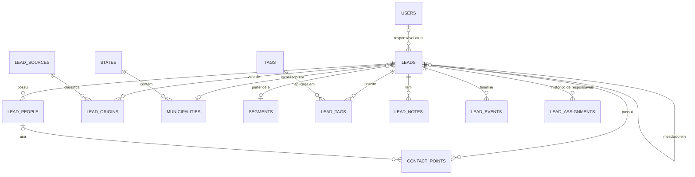
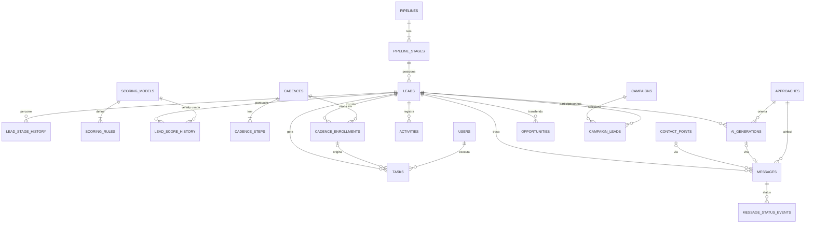
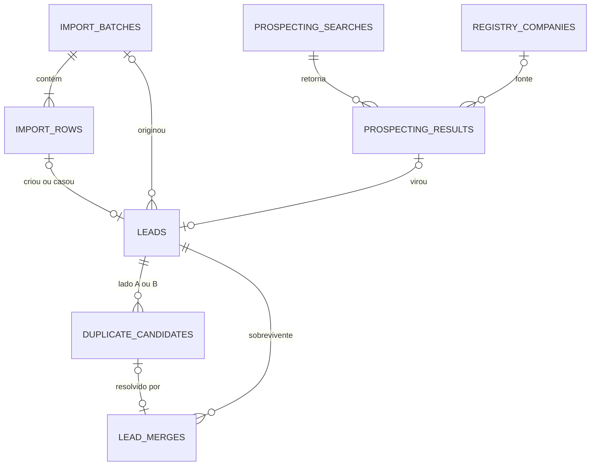
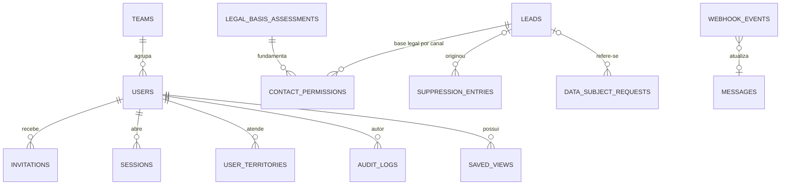

# Modelo de Dados — Docline SDR

> **Status:** modelo aprovado; tabelas das Fases 1 a 7 implementadas em `packages/db/prisma/schema.prisma` (diferenças em [§4.11](#411-implementação-até-a-fase-7)) · **Banco:** PostgreSQL · **ORM:** Prisma 7
> Este documento define entidades, relacionamentos e regras de integridade. O `schema.prisma` será escrito na Fase 1/2 a partir daqui; divergências devem atualizar este documento.

## Sumário

1. [Convenções](#1-convenções)
2. [Mapa de domínios](#2-mapa-de-domínios)
3. [Diagramas entidade-relacionamento](#3-diagramas-entidade-relacionamento)
4. [Entidades](#4-entidades)
5. [Relacionamentos e cardinalidades](#5-relacionamentos-e-cardinalidades)
6. [Enumerações](#6-enumerações)
7. [Índices e restrições críticas](#7-índices-e-restrições-críticas)
8. [Dados de configuração iniciais (seed)](#8-dados-de-configuração-iniciais-seed)
9. [Preparação para inteligência comercial](#9-preparação-para-inteligência-comercial)
10. [Crescimento, retenção e manutenção](#10-crescimento-retenção-e-manutenção)

---

## 1. Convenções

| Tema | Convenção |
|---|---|
| Nomes | Tabelas e colunas em `snake_case`, inglês, plural nas tabelas (`leads`, `contact_points`). No Prisma: modelos em `PascalCase` com `@@map`/`@map`. |
| Chave primária | `id uuid`, **UUIDv7** (ordenado no tempo, bom para índices). Leads também têm `code` sequencial legível (`L-000123`). |
| Datas | `timestamptz` em UTC. `created_at` e `updated_at` em todas as tabelas mutáveis. `created_by_id` quando houver ator. |
| Exclusão | **Sem exclusão física** em dados de negócio. Usa-se `status` (`ARCHIVED`, `MERGED`, `ANONYMIZED`). Exclusão física só pela rotina de retenção/LGPD, auditada. |
| Enums | Valores fixos do sistema em enum (Postgres/Prisma). O que o admin edita (etapas, tags, origens, motivos) vira **tabela**. |
| JSONB | Só para dados flexíveis por natureza: *breakdown* de score, *snapshots*, *payloads* de webhook, `custom_fields`, parâmetros de regras. Nunca para dados que precisam de filtro frequente e integridade. |
| Extensões | `pg_trgm` (similaridade), `unaccent` (apoio à normalização em consultas *ad hoc*). |
| Normalização | Valores normalizados são **calculados na aplicação** e gravados em colunas próprias (`value_normalized`, `name_search`, `name_core`), porque `unaccent` não pode ser usado em índice de expressão. |
| Dados de teste | Coluna `is_test_data` em `leads`; adaptadores reais recusam enviar para esses registros. |
| Fase | Cada tabela indica a fase em que nasce. **MVP = Fases 1–6.** |

---

## 2. Mapa de domínios

| Domínio | Tabelas |
|---|---|
| Identidade e equipe | `users`, `teams`, `invitations`, `user_territories`, `user_availability` (+ tabelas do Better Auth: `sessions`, `accounts`, `verifications`, `rate_limits`) |
| Referência | `states`, `municipalities`, `holidays`, `priority_cities`, `lead_sources`, `segments`, `loss_reasons` |
| Núcleo de leads | `leads`, `lead_people`, `contact_points`, `lead_origins`, `tags`, `lead_tags`, `lead_notes`, `lead_assignments` |
| Timeline e auditoria | `lead_events`, `audit_logs` |
| Pipeline e score | `pipelines`, `pipeline_stages`, `lead_stage_history`, `scoring_models`, `scoring_rules`, `lead_score_history` |
| Operação SDR | `cadences`, `cadence_steps`, `cadence_enrollments`, `tasks`, `activities`, `opportunities` |
| Mensagens e IA | `approaches`, `message_templates`, `whatsapp_templates`, `conversations`, `messages`, `message_status_events`, `ai_generations`, `ai_knowledge_items` |
| Entrada de dados | `import_batches`, `import_rows`, `import_mapping_templates`, `duplicate_candidates`, `lead_merges`, `prospecting_searches`, `prospecting_results`, `registry_companies` |
| Conformidade | `contact_permissions`, `legal_basis_assessments`, `suppression_entries`, `data_subject_requests`, `retention_policies` |
| Campanhas e analytics | `campaigns`, `campaign_leads`, `daily_metrics`, `insights` |
| Plataforma | `app_settings`, `saved_views`, `webhook_events`, `integration_connections`, `api_keys`, `external_references`, `distribution_rules` |

---

## 3. Diagramas entidade-relacionamento

Os diagramas mostram entidades e cardinalidades; colunas estão na [§4](#4-entidades).

### 3.1 Núcleo de leads



### 3.2 Operação SDR



### 3.3 Entrada de dados



### 3.4 Governança e plataforma



---

## 4. Entidades

> Colunas de controle (`id`, `created_at`, `updated_at`, `created_by_id`) omitidas quando óbvias.

### 4.1 Identidade e equipe

**`users`** (Fase 1)

| Coluna | Tipo | Notas |
|---|---|---|
| name, email | text | `email` único, minúsculo |
| role | enum `UserRole` | `ADMIN`, `MANAGER`, `SDR`, `SALES` |
| team_id | fk → teams | opcional |
| status | enum | `INVITED`, `ACTIVE`, `INACTIVE` |
| timezone | text | padrão `America/Fortaleza` |
| last_login_at | timestamptz | |

**`teams`** (Fase 1): `name` (único), `manager_id`.
**`invitations`** (Fase 1): convite de acesso. `user_id`, `token_hash` (SHA-256 do token; o token em claro só existe no link enviado), `expires_at` (72 h), `used_at`, `revoked_at` (reenvio invalida o anterior), `created_by_id`.
**Tabelas do Better Auth** (Fase 1), nomes em `snake_case` com IDs UUIDv7 gerados pela aplicação: `sessions` (`token` único, `expires_at`, IP, user agent), `accounts` (credencial `providerId = credential`, `password` só com hash; único `(provider_id, account_id)`), `verifications` (tokens de redefinição de senha) e `rate_limits` (limites de tentativa persistidos, válidos entre instâncias).
**`user_territories`** (Fase 2, estrutura): `user_id`, `state_uf`, `municipality_code` (nulo = UF inteira), `priority`.
**`user_availability`** (futura): `user_id`, `available`, `max_active_leads`, `max_daily_contacts`, `out_of_office_until`.

### 4.2 Referência

| Tabela | Colunas principais | Fase |
|---|---|---|
| `states` | `uf` (PK, 2 letras), `name`, `ibge_code`, `timezone` | 1 |
| `municipalities` | `ibge_code` (PK, 7 dígitos), `name`, `name_search`, `uf`, `population` (estimativa IBGE, para análise de potencial), `ddd` | 1 |
| `holidays` | `date`, `scope` (`NATIONAL`/`STATE`/`MUNICIPAL`), `uf`, `municipality_code`, `name` | 5 |
| `priority_cities` | `municipality_code`, `weight`, `active`, `notes` | 4 |
| `lead_sources` | `key` (único), `name`, `active` | 2 |
| `segments` | `key`, `name`, `active` | 2 |
| `loss_reasons` | `key`, `name`, `applies_to_stage_keys[]`, `active` | 4 |

### 4.3 Núcleo de leads

**`leads`** (Fase 2): representa a **organização prospectada** (escritório, empresa, parceiro).

| Grupo | Colunas | Notas |
|---|---|---|
| Identificação | `code` (serial único), `company_name` (razão social), `trade_name` (nome fantasia), `display_name` (gerado: fantasia → razão), `name_search` (minúsculo, sem acento), `name_core` (sem termos genéricos, ex.: "contabilidade", "assessoria", "ltda") | `name_core` alimenta a similaridade |
| Tipo | `lead_type` enum (`ACCOUNTING_FIRM`, `ACCOUNTANT`, `REFERRAL_PARTNER`, `COMPANY`, `OTHER`), `segment_id`, `category` (texto livre/categoria da fonte), `cnae_main` | |
| Documento | `cnpj` varchar(14) (maiúsculo, aceita **alfanumérico**), `cnpj_root` varchar(8) | Único parcial: `cnpj` quando não nulo e `status <> 'MERGED'` |
| Endereço | `address_line`, `address_number`, `address_complement`, `neighborhood`, `city_raw`, `municipality_code` (fk), `state_uf`, `postal_code` (8 dígitos) | |
| Web | `website_url`, `website_domain` | Instagram fica em `contact_points` |
| Google | `google_place_id` | ⚠️ Somente o `place_id` é persistido. Nota/avaliações são exibidas ao vivo ([INTEGRATIONS §8](./INTEGRATIONS.md#8-google)). Colunas `google_rating`/`google_reviews_count` **só** serão criadas se a validação jurídica permitir. |
| Origem | `origin_source_id` (primeira origem, fk), `origin_detail`, `origin_url`, `collected_at` (data da coleta), `created_via` enum (`IMPORT`, `MANUAL`, `PROSPECTING`, `API`, `MERGE`), `import_batch_id` | Atribuição *first-touch*; histórico completo em `lead_origins` |
| Pipeline | `pipeline_id`, `stage_id`, `stage_entered_at` | |
| Responsáveis | `owner_id` (atual), `previous_owner_id` (último), `assigned_at`, `created_by_id` (criador) | Histórico em `lead_assignments` |
| Score | `score` (0–100), `score_band` enum, `score_model_id`, `score_computed_at` | Cache do último cálculo; histórico em `lead_score_history` |
| Caches de canal | `has_phone`, `has_whatsapp`, `has_email`, `has_instagram`, `has_website` | Mantidos pelo caso de uso na mesma transação |
| Contactabilidade | `contact_status` enum (`CONTACTABLE`, `RESTRICTED`, `NO_LEGAL_BASIS`, `OPTED_OUT`, `BLOCKED`) | Cache do gate, para filtros e contagens |
| Atividade | `first_contact_at`, `last_contact_at` (último outbound), `first_reply_at`, `last_inbound_at`, `last_activity_at`, `next_action_at` | Alimentam fila, "esquecidos" e métricas |
| Desfecho | `converted_at`, `conversion_type` (`PARTNER`, `CUSTOMER`), `lost_at`, `loss_reason_id` | |
| Ciclo de vida | `status` enum (`ACTIVE`, `ARCHIVED`, `MERGED`, `ANONYMIZED`), `merged_into_id` (fk → leads) | |
| Outros | `description` (observações gerais), `custom_fields` jsonb (colunas extras de importação), `is_test_data`, `version` (lock otimista), `search_vector` tsvector (Fase 2+) | |

**`lead_people`** (Fase 2): pessoas do lead (contador, sócio, recepção).
`lead_id`, `full_name`, `first_name`, `role_title`, `is_primary`, `is_decision_maker`, `notes`, `status` (`ACTIVE`/`LEFT`/`ANONYMIZED`).

**`contact_points`** (Fase 2): **fonte da verdade dos canais**. Um registro por valor.

| Coluna | Notas |
|---|---|
| `lead_id`, `person_id` (opcional) | |
| `type` enum | `PHONE`, `EMAIL`, `INSTAGRAM` (futuro: `LINKEDIN`, `FACEBOOK`) |
| `value_raw`, `value_normalized` | Telefone em E.164 (`+5588999999999`); e-mail minúsculo; Instagram como `handle` sem `@` |
| `value_hash` | HMAC-SHA256 do normalizado (cruzamento com a Lista Não Contatar) |
| `label` | `comercial`, `celular`, `whatsapp`, `pessoal`… |
| `phone_kind` | `MOBILE`, `LANDLINE`, `SERVICE`, `UNKNOWN` |
| `whatsapp_status` | `UNKNOWN`, `PROBABLE` (declarado pela fonte), `CONFIRMED` (houve conversa), `NOT_ON_WHATSAPP` |
| `is_primary` | um por tipo por lead |
| `status` | `ACTIVE`, `INVALID`, `BOUNCED`, `WRONG_PERSON`, `REMOVED` |
| `source_id`, `source_detail`, `collected_at` | Origem **deste dado** (LGPD) |
| `verified_at`, `verification_method` | |
| `normalization_flags` text[] | ex.: `ADDED_NINTH_DIGIT`, `INFERRED_DDD` |

Não existe um tipo `WHATSAPP` separado: o WhatsApp é um `PHONE` com `whatsapp_status`. Isso evita duplicar o mesmo número.

**`lead_origins`** (Fase 2): `lead_id`, `source_id`, `detail`, `url`, `collected_at`, `import_batch_id`, `prospecting_search_id`, `campaign_id`, `referrer_lead_id`, `referrer_name` (indicação), `is_first_touch`. Após mesclagens, um lead pode ter várias origens.

**`tags`** (Fase 2): `name` (único), `color`, `category`, `active`. **`lead_tags`**: `lead_id`, `tag_id`, `added_by_id`, `added_at` (PK composta).

**`lead_notes`** (Fase 2): `lead_id`, `author_id`, `body` (texto simples), `pinned`. Ver diretriz de dados sensíveis em [LGPD §11](./LGPD.md#11-minimização-e-qualidade).

**`lead_assignments`** (Fase 2): `lead_id`, `from_user_id`, `to_user_id`, `strategy` (`MANUAL`, `IMPORT`, `ROUND_ROBIN`, `TERRITORY`, `PRIORITY`, `AVAILABILITY`), `assigned_by_id`, `reason`, `assigned_at`.

### 4.4 Timeline e auditoria

**`lead_events`** (Fase 2), append-only:

| Coluna | Notas |
|---|---|
| `lead_id`, `occurred_at` | índice `(lead_id, occurred_at desc)` |
| `type` | `lead.created`, `lead.imported`, `lead.updated`, `lead.merged`, `owner.assigned`, `stage.changed`, `score.changed`, `note.added`, `tag.added`, `task.created`, `task.completed`, `activity.logged`, `cadence.enrolled`, `cadence.step_due`, `cadence.stopped`, `ai.generated`, `ai.approved`, `message.sent`, `message.delivered`, `message.read`, `message.received`, `reply.classified`, `optout.registered`, `permission.changed`, `handoff.created`, `opportunity.won`, `opportunity.lost`… |
| `actor_type`, `actor_id` | `USER`, `SYSTEM`, `AUTOMATION`, `INTEGRATION`, `AI` |
| `payload` jsonb | Dados do evento (versionados por `type`) |
| `subject_type`, `subject_id` | Entidade relacionada (mensagem, tarefa…) |
| `campaign_id`, `approach_id`, `channel` | Desnormalizados para analytics |

**`audit_logs`** (Fase 1), append-only (trigger bloqueia `UPDATE`/`DELETE`):
`occurred_at`, `actor_type`, `actor_id`, `action` (`CREATE`, `UPDATE`, `DELETE`, `MERGE`, `EXPORT`, `LOGIN`, `LOGIN_FAILED`, `PERMISSION_CHANGE`, `SUPPRESSION_REVOKE`, `ANONYMIZE`, `ACCESS_DENIED`…), `entity_type`, `entity_id`, `changes` jsonb (`{campo: [antes, depois]}`, com dados sensíveis mascarados), `ip`, `user_agent`, `request_id`.

### 4.5 Pipeline e score

**`pipelines`** (Fase 4): `name`, `is_default`, `active`.

**`pipeline_stages`** (Fase 4):
`pipeline_id`, `key` (estável, usado por automações: `FIRST_CONTACT`, `FOLLOW_UP_1`…), `name` (editável), `position`, `category` (`OPEN`, `WON`, `LOST`, `PARKED`), `owner_role` (`SDR`/`SALES`), `color`, `requires_loss_reason`, `sla_hours`, `is_system` (não pode ser excluída), `active`.

**`lead_stage_history`** (Fase 4): `lead_id`, `from_stage_id`, `to_stage_id`, `changed_by_id` (nulo se automação), `automation_source` (`CADENCE`, `INBOUND`, `IMPORT`, `HANDOFF`, `RULE`), `loss_reason_id`, `note`, `entered_at`, `left_at`, `duration_seconds` (preenchido na saída).

**`scoring_models`** (Fase 4): `name`, `version`, `status` (`DRAFT`, `ACTIVE`, `ARCHIVED`), `normalization` (`CLAMP`, `SCALE`), `bands` jsonb (`[{band:"COLD",min:0,max:30},…]`), `activated_at`, `activated_by_id`. Um único `ACTIVE`.

**`scoring_rules`** (Fase 4): `model_id`, `criterion_key` (registrado em código, ex.: `has_whatsapp`), `params` jsonb, `points` (aceita negativos), `active`, `position`, `description`.

**`lead_score_history`** (Fase 4): `lead_id`, `model_id`, `score`, `band`, `breakdown` jsonb (`[{criterion, matched, points, detail}]`), `trigger` (evento que causou), `computed_at`. Só grava quando o score ou a faixa muda.

### 4.6 Operação SDR

**`cadences`** (Fase 5): `name`, `description`, `version`, `active`, `stop_on_reply` (padrão `true`), `use_business_days`, `send_window_start`/`send_window_end` (hora local), `no_response_after_days` (dias após o último passo para ir a `NO_RESPONSE`).

**`cadence_steps`** (Fase 5): `cadence_id`, `position`, `day_offset`, `channel` (`WHATSAPP`, `INSTAGRAM`, `EMAIL`, `PHONE`, `ANY`), `action` (`ASSISTED_MESSAGE`, `API_MESSAGE`, `CALL`, `TASK`), `message_type`, `target_stage_key`, `template_id`, `instructions`.

**`cadence_enrollments`** (Fase 5): `lead_id`, `cadence_id`, `cadence_version`, `campaign_id`, `status` (`ACTIVE`, `PAUSED`, `COMPLETED`, `STOPPED`), `stop_reason` (`REPLIED`, `OPTED_OUT`, `MANUAL`, `STAGE_CHANGED`, `LEAD_ARCHIVED`, `CONTACT_INVALID`), `current_step_position`, `next_step_due_at`, `enrolled_by_id`, `enrolled_at`, `ended_at`. **Único parcial:** uma inscrição `ACTIVE` por lead.

**`tasks`** (Fase 5): `lead_id`, `assignee_id`, `type` (`FIRST_CONTACT`, `FOLLOW_UP`, `REPLY_NEEDED`, `CALL`, `MEETING`, `HANDOFF_REVIEW`, `CUSTOM`), `title`, `description`, `due_at`, `priority_score` (calculado), `status` (`OPEN`, `DONE`, `CANCELED`, `SKIPPED`), `outcome`, `completed_at`, `completed_by_id`, `enrollment_id`, `cadence_step_id`.

**`activities`** (Fase 5): interações que não são mensagens. `lead_id`, `user_id`, `type` (`CALL`, `MEETING`, `VISIT`, `EMAIL_EXTERNAL`, `OTHER`), `direction`, `outcome` (`CONNECTED`, `NO_ANSWER`, `BUSY`, `WRONG_NUMBER`, `VOICEMAIL`, `HELD`, `NO_SHOW`), `notes`, `occurred_at`, `duration_seconds`.

**`opportunities`** (Fase 5–6): `lead_id`, `sdr_id`, `sales_owner_id`, `status` (`OPEN`, `WON`, `LOST`), `handoff_at`, `accepted_at`, `qualification` jsonb (checklist de qualificação, ver [SDR-FLOW §8](./SDR-FLOW.md#8-qualificação-e-transferência-ao-comercial)), `product_interest`, `expected_value`, `won_at`, `lost_at`, `loss_reason_id`, `external_crm_id`.

### 4.7 Mensagens e IA

**`approaches`** (Fase 5): a "abordagem" comparável em analytics. `key`, `name`, `description`, `hypothesis`, `active`.

**`message_templates`** (Fase 5): templates internos. `name`, `channel`, `message_type`, `body` (com `{{variáveis}}`), `approach_id`, `version`, `status` (`DRAFT`, `ACTIVE`, `ARCHIVED`).

**`whatsapp_templates`** (Fase 7): espelho dos templates aprovados na Meta. `meta_name`, `language`, `category` (`MARKETING`, `UTILITY`, `AUTHENTICATION`), `status`, `components` jsonb, `approach_id`, `last_synced_at`.

**`conversations`** (Fase 7): `lead_id`, `channel`, `contact_point_id`, `external_thread_id`, `last_inbound_at`, `last_outbound_at`, `service_window_expires_at` (janela de atendimento), `status`.

**`messages`** (Fase 5):

| Coluna | Notas |
|---|---|
| `lead_id`, `contact_point_id`, `conversation_id` | |
| `channel` | `WHATSAPP`, `INSTAGRAM`, `EMAIL`, `SMS`, `OTHER` |
| `direction` | `OUTBOUND`, `INBOUND` |
| `mode` | `ASSISTED` (humano enviou fora do sistema), `API` (enviado pelo sistema), `LOGGED` (registro manual retroativo) |
| `message_type` | `FIRST_CONTACT`, `FOLLOW_UP_1..3`, `INTERESTED_REPLY`, `OBJECTION_REPLY`, `SCHEDULING`, `REACTIVATION`, `OTHER` |
| `body` | Texto **efetivamente enviado** (versão final para análise) |
| `template_id`, `whatsapp_template_id`, `ai_generation_id`, `approach_id`, `campaign_id`, `enrollment_id`, `cadence_step_id` | **Atribuição** |
| `status` | `PENDING_CONFIRMATION`, `QUEUED`, `SENT`, `DELIVERED`, `READ`, `FAILED`, `RECEIVED`, `CANCELED` |
| `provider`, `provider_message_id` | Único por provedor |
| `sent_by_id`, `approved_by_id`, `approved_at`, `sent_at`, `delivered_at`, `read_at`, `failed_at`, `received_at` | |
| `error_code`, `error_detail` | |
| `classification`, `classification_source`, `classification_confidence`, `classified_by_id` | Para `INBOUND`: `INTERESTED`, `QUESTION`, `OBJECTION`, `NOT_INTERESTED`, `OPT_OUT`, `OUT_OF_OFFICE`, `WRONG_CONTACT`, `OTHER`; fonte `RULE`/`AI`/`HUMAN` |
| `idempotency_key` | Único |

**`message_status_events`** (Fase 7): `message_id`, `status`, `occurred_at`, `webhook_event_id`.

**`ai_generations`** (Fase 6):

| Coluna | Notas |
|---|---|
| `lead_id`, `requested_by_id` | |
| `kind` | Tipos de mensagem + `REPLY_CLASSIFICATION`, `INSIGHT` |
| `channel`, `approach_id` | |
| `prompt_id`, `prompt_version` | Prompts versionados no código (Git) |
| `provider`, `model`, `params` jsonb | Ex.: esforço, limite de tokens |
| `input_snapshot` jsonb | **Contexto minimizado** efetivamente enviado |
| `output` jsonb | Saída estruturada completa |
| `text_generated`, `text_final` | Rascunho e versão aprovada |
| `edit_distance_ratio` | Quanto o humano alterou (0–1) |
| `guardrail_flags` jsonb | Avisos dos guardrails |
| `status` | `GENERATED`, `EDITED`, `APPROVED`, `DISCARDED`, `SENT`, `FAILED`, `BLOCKED` |
| `discard_reason`, `rating` (1–5), `feedback` | Aprendizado |
| `input_tokens`, `output_tokens`, `cost_estimate_usd`, `latency_ms` | Custos |
| `approved_by_id`, `approved_at`, `message_id` | |

**`ai_knowledge_items`** (Fase 6): fatos aprovados sobre a Docline que a IA pode usar. `key`, `title`, `content`, `active`, `approved_by_id`, `version`.

### 4.8 Entrada de dados

**`import_batches`** (Fase 3): `file_name`, `file_size`, `file_sha256` (detecta reimportação do mesmo arquivo), `file_type`, `encoding`, `delimiter`, `sheet_name`, `header_row`, `row_count`, `status` (`UPLOADED`, `MAPPING`, `PREVIEWING`, `PREVIEW_READY`, `COMMITTING`, `COMPLETED`, `FAILED`, `CANCELED`), `mapping` jsonb, `duplicate_policy` (`CREATE_AND_FLAG`, `SKIP`, `UPDATE_EMPTY_FIELDS`), `source_id`, `source_detail`, `collected_at`, `default_legal_basis`, `legal_basis_assessment_id`, `default_owner_id`, `default_tag_ids`, `stats` jsonb, `completed_at`, `purge_after`.

**`import_rows`** (Fase 3, temporária, purgada após 30 dias): `batch_id`, `row_number`, `raw` jsonb, `normalized` jsonb, `errors` jsonb, `warnings` jsonb, `match_status` (`NEW`, `EXISTING`, `POSSIBLE_DUPLICATE`, `DUPLICATE_IN_FILE`, `SUPPRESSED`, `INVALID`), `matched_lead_id`, `match_reasons` jsonb, `decision` (`IMPORT`, `SKIP`, `LINK_EXISTING`, `UPDATE_EXISTING`), `result_lead_id`, `status`.

**`import_mapping_templates`** (Fase 3): `name`, `header_signature` (para sugerir automaticamente), `mapping` jsonb.

**`duplicate_candidates`** (Fase 3): `lead_a_id`, `lead_b_id` (sempre `a < b`), `score` (0–1), `confidence` (`HIGH`, `MEDIUM`, `LOW`), `reasons` jsonb (`[{rule, detail, weight}]`), `status` (`PENDING`, `MERGED`, `KEPT_SEPARATE`, `IGNORED`), `detected_by` (`IMPORT`, `SCAN`, `MANUAL`, `PROSPECTING`), `detected_at`, `decided_by_id`, `decided_at`, `decision_note`. **Único:** `(lead_a_id, lead_b_id)`.

**`lead_merges`** (Fase 3): `survivor_lead_id`, `merged_lead_id`, `candidate_id`, `field_choices` jsonb, `merged_snapshot` jsonb (cópia integral do lead mesclado e ids dos filhos movidos), `performed_by_id`, `performed_at`.

**`prospecting_searches`** (Fase 9): `provider` (`RECEITA_OPEN_DATA`, `GOOGLE_PLACES`), `params` jsonb (UF, cidade, categoria/CNAE, raio, quantidade), `requested_by_id`, `status`, `result_count`.

**`prospecting_results`** (Fase 9, temporária): `search_id`, `provider_ref` (`place_id` ou CNPJ), `match_status`, `matched_lead_id`, `decision` (`PENDING`, `APPROVED`, `REJECTED`), `created_lead_id`. **Não guarda conteúdo do Google** além do `place_id`.

**`registry_companies`** (Fase 9): recorte dos dados abertos do CNPJ (somente CNAEs de interesse e situação ativa). `cnpj`, `cnpj_root`, `company_name`, `trade_name`, `cnae_main`, `cnaes_secondary`, `registration_status`, `opened_at`, `municipality_code`, `uf`, endereço, `phone_1`, `phone_2`, `email`, `is_individual_entrepreneur`, `dataset_reference` (mês da base), `ingested_at`. Base de descoberta separada de `leads`: só vira lead quando o SDR aprova.

### 4.9 Conformidade

**`legal_basis_assessments`** (Fase 2): registro das avaliações de base legal (ex.: LIA de legítimo interesse). `name`, `legal_basis`, `purpose`, `document_url`, `version`, `approved_by`, `approved_at`, `valid_until`.

**`contact_permissions`** (Fase 2):

| Coluna | Notas |
|---|---|
| `lead_id`, `person_id`, `contact_point_id` | Granularidade flexível (lead inteiro ou ponto de contato) |
| `channel` | `ALL`, `WHATSAPP`, `INSTAGRAM`, `EMAIL`, `PHONE` |
| `legal_basis` | `CONSENT`, `LEGITIMATE_INTEREST`, `CONTRACT` (execução de contrato ou procedimentos preliminares), `NOT_ASSESSED` |
| `legal_basis_assessment_id` | LIA aplicável |
| `opt_in_status` | `NONE`, `GRANTED`, `REVOKED`: **opt-in de plataforma** (ex.: exigido pela Meta), separado da base legal |
| `opt_in_at`, `opt_in_method` | `INBOUND_MESSAGE`, `FORM`, `EVENT`, `EXISTING_RELATIONSHIP`, `VERBAL_RECORDED`, `CLICK_TO_WHATSAPP` |
| `evidence` | Texto/URL da evidência |
| `recorded_by_id`, `recorded_at`, `valid_until` | |

**`suppression_entries`** (Fase 2), a **Lista Não Contatar**:

| Coluna | Notas |
|---|---|
| `type` | `PHONE`, `EMAIL`, `INSTAGRAM`, `CNPJ`, `LEAD` |
| `value_hash` | HMAC-SHA256 do valor normalizado (com *pepper* secreto) |
| `value_masked` | Ex.: `+55 88 9****-9999`, para exibição |
| `scope` | `ALL_CHANNELS`, `WHATSAPP`, `INSTAGRAM`, `EMAIL`, `PHONE` |
| `reason` | `OPT_OUT`, `DATA_SUBJECT_REQUEST`, `COMPLAINT`, `LEGAL`, `INVALID_CONTACT`, `INTERNAL_DECISION` |
| `source` | `INBOUND_KEYWORD`, `SDR`, `ADMIN`, `IMPORT`, `WEBHOOK`, `DSR` |
| `lead_id` | Opcional (o registro sobrevive à anonimização do lead) |
| `notes`, `created_by_id`, `revoked_at`, `revoked_by_id`, `revoke_reason` | Revogação só por ADMIN |

**Único parcial:** `(type, value_hash, scope)` onde `revoked_at is null`.

**`data_subject_requests`** (Fase 2/5): `requester_name`, `requester_contact`, `type` (`CONFIRMATION`, `ACCESS`, `CORRECTION`, `ANONYMIZATION`, `DELETION`, `PORTABILITY`, `SHARING_INFO`, `CONSENT_REVOCATION`, `OPPOSITION`), `lead_id`, `status`, `received_at`, `due_at`, `resolved_at`, `handled_by_id`, `response_summary`.

**`retention_policies`** (Fase 3+): `entity`, `condition` jsonb, `action` (`ANONYMIZE`, `DELETE`, `ARCHIVE`), `after_days`, `active`.

### 4.10 Campanhas, analytics e plataforma

**`campaigns`** (Fase 10): `name`, `objective`, `status` (`DRAFT`, `READY`, `ACTIVE`, `PAUSED`, `COMPLETED`, `ARCHIVED`), `filter_definition` jsonb, `snapshot_at`, `channel`, `cadence_id`, `approach_id`, `owner_id`, `daily_contact_limit`, `starts_at`, `ends_at`.

**`campaign_leads`** (Fase 10): PK `(campaign_id, lead_id)`, `eligibility` (`ELIGIBLE`, `INELIGIBLE`), `ineligibility_reasons` text[], `assigned_to_id`, marcos `added_at`, `contacted_at`, `delivered_at`, `replied_at`, `interested_at`, `opportunity_at`, `converted_at`, `opted_out_at`.

> **Implementação (Fase 10).** Como desenhado acima, com estes acréscimos:
> - **`campaigns`:** status com `BUILDING` (montagem no worker) e sem `objective` obrigatório; `filter_definition` guarda a seleção da lista de leads (filtro + busca) e `filter_label` de onde ela veio (ex.: visão salva); `channel` é o canal da elegibilidade; `cadence_id` nulo = cadência padrão; `daily_contact_limit` vale **por SDR por dia**; `min_days_since_last_contact` (padrão 30) é a regra de frequência; `snapshot_at`, `build_stats` (selecionados, aptos e motivos) e `build_error` registram a montagem; `activated_at`, `completed_at` e `version` (lock otimista).
> - **`campaign_sdrs`:** SDRs que recebem os leads da campanha.
> - **`campaign_variants`:** abordagens em teste (A/B): letra única e abordagem única por campanha; a abordagem em uso não pode ser apagada.
> - **`campaign_leads`:** além do desenho, `status` (`PENDING` → `RELEASED`; `SKIPPED` para quem já era inapto na montagem ou deixou de ser apto na hora de liberar, com os motivos em `ineligibility_reasons`; `REMOVED` por uma pessoa ou ao concluir/arquivar com o lead ainda aguardando), `variant_id`, `priority` (score na montagem), `released_at` e `enrollment_id` (a inscrição na cadência criada na liberação). Os marcos (`contacted_at` … `opted_out_at`) são recalculados por SQL idempotente numa janela de 90 dias a partir da liberação (ou até a liberação do mesmo lead por outra campanha); ver ADR 030.
> - **Atribuição:** `campaign_id` em `cadence_enrollments` e em `messages` (SET NULL: apagar a campanha não apaga o histórico do lead); estratégia de atribuição `CAMPAIGN` em `lead_assignments`.
> - A campanha **não envia mensagens**: libera leads para a cadência; cada contato segue o gate e o modo de envio de sempre.

**`daily_metrics`** (Fase 11): `date`, `dimension` (`GLOBAL`, `SDR`, `CITY`, `SOURCE`, `CAMPAIGN`, `APPROACH`, `CHANNEL`, `SEGMENT`), `dimension_id`, `new_leads`, `contacted`, `replied`, `interested`, `opportunities`, `converted`, `opt_outs`, `messages_out`, `messages_in`. Único `(date, dimension, dimension_id)`.

**`insights`** (Fase 11+): `generated_at`, `scope`, `audience_user_id`, `type`, `text`, `data` jsonb (números que sustentam o texto), `valid_until`, `feedback`.

| Tabela | Uso | Fase |
|---|---|---|
| `app_settings` | `key`, `value` jsonb, `updated_by_id`: horários, limites, palavras de opt-out, dias para "esquecido" | 1 |
| `saved_views` | `owner_id`, `name`, `entity`, `filter`, `columns`, `sort`, `shared` | 2 |
| `webhook_events` | *Inbox*: `provider`, `external_event_id` (único por provedor), `signature_valid`, `payload`, `received_at`, `processed_at`, `status`, `attempts`, `error` | 7 |
| `integration_connections` | `provider`, `status`, `config` (não secreta), `credentials_encrypted`, `last_check_at`, `last_error` | 7 |
| `api_keys` | `name`, `key_hash`, `scopes[]`, `last_used_at`, `revoked_at` | 12 |
| `external_references` | `entity_type`, `entity_id`, `system` (`DOCLINE_CRM`, `GESTAO_AR`, `GESTAO_360`…), `external_id`, `synced_at` | 12 |
| `distribution_rules` | `name`, `strategy`, `params`, `priority`, `active`, `state` jsonb (ex.: ponteiro do round-robin) | futura |

### 4.11 Implementação até a Fase 9

Tabelas criadas na Fase 2: `lead_sources`, `segments`, `tags`, `leads`, `lead_people`, `contact_points`, `lead_origins`, `lead_tags`, `lead_notes`, `lead_assignments`, `lead_events`, `legal_basis_assessments`, `contact_permissions`, `suppression_entries`, `data_subject_requests`, `saved_views`, `user_territories`.

Tabelas de segurança, fora do modelo original:

- **`login_throttles`:** falhas de login por conta + IP ou dispositivo, e por conta. As chaves usam o HMAC do e-mail ([SECURITY §12](./SECURITY.md#12-limites-de-taxa-e-abuso)).
- **`two_factors`:** segredo TOTP e códigos de recuperação cifrados (plugin do Better Auth), mais a coluna `users.two_factor_enabled` ([SECURITY §3](./SECURITY.md#3-autenticação)).

O seed de desenvolvimento (`pnpm db:seed:dev`) marca seus leads com `is_test_data`.

Diferenças em relação às seções acima:

| Tabela | Diferença | Motivo |
|---|---|---|
| `leads` | Colunas de pipeline, score, atividade (exceto `last_activity_at`) e desfecho entram nas Fases 4–5; `merged_into_id`, `import_batch_id` e `custom_fields` na Fase 3; `google_place_id` na Fase 9. Sem `search_vector`: a busca usa `name_search` (trigram), CNPJ e os valores normalizados de `contact_points`. Acrescentadas `archived_at` e `anonymized_at`. | Cada coluna nasce na fase que a usa |
| `leads` (cont.) | `cnpj_hash` (HMAC do CNPJ, como `contact_points.value_hash`) | Encontrar os leads de uma supressão de CNPJ ao incluí-la ou revogá-la |
| `lead_sources` | `default_legal_basis` (base legal sugerida no cadastro, [LGPD §4](./LGPD.md#4-bases-legais-por-origem)) e `position` | O cadastro exige base legal "com padrão por origem" (MVP M02) |
| `tags` | `name_search` único | Evita "Parceiro" e "parceiro" ao mesmo tempo |
| `lead_notes` | Remoção lógica (`removed_at`, `removed_by_id`), auditada | Corrigir observação com dado que não deveria estar ali ([LGPD §11](./LGPD.md#11-minimização-e-qualidade)) |
| `lead_assignments` | Estratégia `CLAIM` | SDR "puxa do pool" do seu território ([SECURITY §4.2](./SECURITY.md#42-matriz-de-permissões-inicial)) |
| `lead_origins` | `import_batch_id`, `prospecting_search_id`, `campaign_id` e `referrer_lead_id` entram nas fases dessas entidades | — |
| `contact_permissions` | Na Fase 2, uma permissão por lead e canal (único parcial sem pessoa/ponto de contato) | Granularidade por ponto de contato quando houver envio por API (Fase 7) |
| `data_subject_requests` | Status `RECEIVED`, `IN_PROGRESS`, `COMPLETED`, `REJECTED`; campo `notes` | — |

**Fase 3 (importação e deduplicação):** `import_batches`, `import_rows`, `import_mapping_templates`, `duplicate_candidates` e `lead_merges`, como nas seções acima, mais:

- **`import_files`:** bytes do arquivo enviado, só até a leitura no worker, apagados em seguida ([SECURITY §8](./SECURITY.md#8-upload-de-arquivos)).
- **`import_batches`:** `sheet_names` (para escolher outra aba), `progress` (barra de progresso) e `error`. O status começa em `UPLOADED` e passa a `MAPPING` depois da leitura.
- **`import_rows`:** `raw` guarda as células como texto; `status` e `error` registram o resultado da gravação de cada linha.
- **`leads`:** ganha `custom_fields` (colunas extras) e `merged_into_id` (o sobrevivente da mesclagem).
- **`lead_origins`:** ganha `import_batch_id`.
- **`duplicate_candidates`:** além do índice único, um `CHECK (lead_a_id < lead_b_id)` impede o mesmo par nas duas ordens. Par `KEPT_SEPARATE` ou `MERGED` nunca volta à fila; `IGNORED` volta só se surgir uma regra nova entre os motivos.
- **Índices da deduplicação:** `leads(website_domain)` (mesmo site) e os trigram de `name_core`; `import_rows(result_lead_id)` e `import_rows(matched_lead_id)` para a anonimização achar as linhas ainda não purgadas de um lead.
- **Mesclagem** (`lead_merges`): o mesclado vira `MERGED` com `merged_into_id`; contatos, pessoas, origens (sem `is_first_touch`), observações, eventos, responsáveis, bases legais por canal que o sobrevivente não tem e solicitações de titulares passam para o sobrevivente; tags são copiadas; contato repetido fica no mesclado. Leads já mesclados no mesclado passam a apontar para o sobrevivente (cadeia de um nível). Nenhuma linha é apagada.

**Fase 4 (pipeline e score):** `pipelines`, `pipeline_stages`, `lead_stage_history`, `loss_reasons`, `priority_cities`, `scoring_models`, `scoring_rules` e `lead_score_history`, como nas seções acima, mais:

- **`leads`:** ganha `pipeline_id`, `stage_id`, `stage_entered_at`, `lost_at`, `loss_reason_id`, `converted_at`, `score`, `score_band`, `score_model_id` e `score_computed_at`. `conversion_type` fica para a oportunidade (Fases 5–6). A etapa é obrigatória na aplicação, mas a coluna aceita nulo: os leads existentes recebem "Novo" no seed, que roda depois das migrações.
- **`pipelines`:** `key` estável (`DEFAULT`); só um `is_default` (único parcial).
- **`pipeline_stages`:** `description`; `owner_role` é `SDR`, `SALES` ou nulo.
- **`lead_stage_history`:** `automation_source` também aceita `MERGE` (mesclagem). Uma única passagem aberta por lead (único parcial em `lead_id` onde `left_at` é nulo).
- **`loss_reasons`:** `position`; `applies_to_stage_keys` vazio vale para todas as etapas de perda.
- **`scoring_models`:** `notes` e `created_by_id`; um único `ACTIVE` (único parcial).
- **`lead_score_history`:** `previous_score` e `previous_band`, para mostrar a mudança sem consultar a linha anterior.
- **Recálculo do score:** os critérios ficam no código (`modules/scoring/domain/criteria.ts`); o modelo no banco escolhe critérios, parâmetros e pesos. Mudar um lead (contatos, cidade, tipo, tags) recalcula na mesma transação; ações em massa, cidades prioritárias e a ativação de um modelo recalculam no worker (`score.recompute-lead` e `score.recompute-all`). `lead_score_history` recebe uma linha só quando o score ou a faixa mudam; o primeiro cálculo não gera evento `score.changed` na timeline.
- **Configuração inicial** (`seed/sales-config.ts`): só cria o que falta, então renomear, reordenar ou recolorir etapas não é desfeito no próximo deploy. Os leads sem etapa vão para "Novo" com a primeira linha do histórico (`backfillLeadStages`, também chamada na subida do worker).

**Fase 5 (operação do SDR):** `tasks`, `activities`, `messages`, `cadences`, `cadence_steps`, `cadence_enrollments` e `opportunities`, como nas seções acima, mais:

- **`notifications`** (nova): avisos no app (sino do cabeçalho). `user_id`, `type` (ex.: `handoff.created`, `task.overdue`), `title`, `body`, `lead_id`, `link`, `read_at`.
- **`leads`:** ganha `first_contact_at`, `last_contact_at` (último contato de saída), `first_reply_at`, `last_inbound_at` e `next_action_at` (vencimento da próxima tarefa aberta).
- **`tasks`:** sem `priority_score`; a prioridade da Minha Fila é calculada na leitura, para não ficar desatualizada. Ganha `message_type` e `channel` (copiados do passo da cadência), `overdue_notified_at` (o aviso de atraso sai uma vez) e `created_by_id`.
- **`activities`:** `task_id` (tarefa concluída com o registro) e `contact_point_id`.
- **`messages`:** `is_first_contact` (limite diário de primeiros contatos por SDR), `task_id`, `canceled_at`, `classified_at` e `opt_out_match` (expressão de opt-out encontrada no texto recebido). `conversation_id`, `template_id`, `whatsapp_template_id`, `ai_generation_id`, `approach_id` e `campaign_id` entram com as tabelas dessas fases (6, 7 e 10). `body` é dado pessoal e é apagado na anonimização.
- **`cadences`:** `key` estável (`DEFAULT`) e um único `is_default` (único parcial). A janela (`send_window_start`/`end`) é texto `HH:MM` na hora local do lead.
- **`cadence_enrollments`:** `last_step_executed_at` e `paused_until` (resposta "fora do escritório"). `current_step_position` nulo significa "todos os passos executados", e então `next_step_due_at` é o prazo para "Sem resposta". `campaign_id` entra na Fase 10. O único parcial vale para `ACTIVE` e `PAUSED`: uma inscrição em andamento por lead.
- **`opportunities`:** `accept_due_at` (prazo de aceite pelo comercial), `sla_alerted_at`, `conversion_type` (`PARTNER`, `CUSTOMER`) e `notes`. Uma oportunidade `OPEN` por lead (único parcial).
- **Modelos de mensagem e abordagens** (`message_templates`, `approaches`) ficam para a Fase 6, junto com a IA; na Fase 5 o SDR escreve o texto do contato assistido.
- **Regras de contato** (janela, limites de frequência, palavras de opt-out, dias para "esquecido", SLAs) ficam em `app_settings`; sem linha gravada, valem os padrões do código.

**Fase 6 (IA e indicadores):** `ai_generations`, `ai_knowledge_items` e `approaches`, como nas seções acima, mais:

- **`ai_generations`:** sem `message_id`. O vínculo é `messages.ai_generation_id`, com único parcial "um envio ativo por rascunho" (`status <> 'CANCELED'`): cancelar o envio permite preparar de novo. Ganha `cached_input_tokens`, `stop_reason`, `error_code` (código da falha do provedor; `IN_PROGRESS` enquanto a chamada corre fora da transação) e `source_message_id` (a resposta que foi classificada). `kind` ainda sem `INSIGHT` (Fase 11).
- **`ai_knowledge_items`:** `approved_at`; a versão sobe quando o conteúdo muda, e cada geração grava as versões usadas no contexto. **Sem seed:** os fatos sobre a Docline são cadastrados e aprovados pela própria Docline.
- **`approaches`:** `guidance` (orientação enviada à IA) e `created_by_id`. `message_templates` não foi criada: a IA com abordagens cobre o MVP, e os modelos aprovados da Meta entram com a Fase 7.
- **`messages`:** ganha `ai_generation_id`, `approach_id`, `approved_by_id`, `approved_at` e o índice `(approach_id, sent_at)`.
- **Regras da IA** (limites por tipo, opt-out exigido, termos proibidos, personalização mínima, parecença) em `app_settings` (`ai.rules`); sem linha gravada, valem os padrões do código.
- **Mesclagem** leva os rascunhos para o sobrevivente; **anonimização** apaga contexto, saída, textos, comentário e motivo de descarte dos rascunhos do lead.
- **Indicadores** sem `daily_metrics`: consultas agregadas ao vivo, medidas com 100 mil leads ([ARCHITECTURE §13](./ARCHITECTURE.md#13-escalabilidade)).

**Fase 7 (WhatsApp Cloud API):** `whatsapp_templates`, `conversations`, `message_status_events`, `webhook_events` e `integration_connections`, como nas seções acima, mais:

- **`contact_permissions`:** o opt-in do WhatsApp passa a ser **do número** (`contact_point_id` preenchido, único parcial por número e canal), com `evidence_message_id` quando a evidência é uma mensagem recebida. A linha do lead (sem pessoa nem contato) continua guardando a base legal por canal.
- **`messages`:** ganha `conversation_id`, `whatsapp_template_id`, `template_params` (valores das variáveis; dado pessoal), `send_attempted_at` (o job de envio nunca repete uma chamada de resultado incerto), `delivered_at`, `read_at`, `failed_at`, `error_code`, `error_detail`, `pricing_category`, `billable` e `cost_estimate_usd`, mais os índices `(conversation_id, created_at desc)` e `(channel, mode, sent_at)`.
- **`whatsapp_templates`:** `meta_template_id` único (não `(name, language)`: a Meta permite recriar um nome depois de apagado); `status` e `quality_score` em texto, porque a Meta acrescenta valores; `body_text` e `body_parameters` para a prévia; `supported`/`unsupported_reason` (o app envia modelos com variáveis só no corpo); `active` (o ADMIN pode tirar um modelo do uso) e `removed_at` (sumiu da conta, fica para o histórico).
- **`conversations`:** `external_thread_id` é o `wa_id`; `profile_name` (nome do perfil na Meta, dado pessoal). Sem `status`: a janela de atendimento (`service_window_expires_at`) é o que importa. Único `(lead_id, channel, external_thread_id)`.
- **`webhook_events`:** `external_event_id` é o SHA-256 do corpo recebido (a Meta não manda id de evento); só entram eventos com assinatura válida, então não há `signature_valid`. `contact_hashes` (HMAC dos telefones citados, índice GIN) permite à anonimização apagar os payloads de um lead.
- **`inbound_unmatched`** (nova): mensagem recebida de um número que não está em nenhum lead ativo, ou que está em mais de um (`candidate_lead_ids`). Nunca vira lead sozinha: uma pessoa vincula ou descarta.
- **`integration_connections`:** sem `credentials_encrypted`; os tokens ficam só no ambiente. `config` guarda dados não secretos (número exibido, nome verificado, qualidade, limite de mensagens).

**Fase 8 (Instagram):** reaproveita `conversations`, `messages`, `webhook_events` e `inbound_unmatched` (canal `INSTAGRAM`), mais:

- **`instagram_profiles`** (nova): métricas públicas do perfil profissional do lead pelo Business Discovery: `followers_count`, `media_count`, `last_post_at` (critério "Instagram ativo" do score), `status` (`FOUND`, `NOT_FOUND` quando o @ não existe ou não é conta profissional, `ERROR`), `checked_at` e o `handle` consultado. Uma por contato (`contact_point_id` único, apagada com o contato), sem `lead_id`: na mesclagem, vai junto com o contato. Nada de mídias, legendas ou biografia.
- **`social_comments`** (nova): comentário de um **lead** numa publicação da Docline (`external_comment_id` único por provedor), com o IGSID e o @ do autor, a publicação, o texto (dado pessoal) e a data. `private_reply_message_id` (único) aponta a resposta privada, que a Meta aceita uma vez por comentário e até 7 dias depois dele. Comentários de quem não é lead não viram linha.
- **`conversations`** e **`inbound_unmatched`:** ganham `handle` (o @ de quem escreveu no Instagram). No Instagram, `external_thread_id` é o IGSID (id de quem escreveu, por conta da empresa).
- **`webhook_events`:** linhas do Instagram com `provider = instagram:<provedor>`; `contact_hashes` leva o HMAC do @ e do IGSID (`igsid:<id>`). **`integration_connections`:** a conta do Instagram fica em `instagram:<provedor>`, separada do WhatsApp.

**Fase 9 (dados abertos do CNPJ e Prospecção):**

- **`registry_companies`** (nova): recorte da base aberta da Receita Federal com só os estabelecimentos **ativos** de contabilidade (CNAE 6920-6/01 e 6920-6/02). Chave pelo CNPJ (aceita o alfanumérico); razão social sem dígitos de CPF; natureza jurídica e porte; CNAE principal e secundários; município do IBGE (casado pelo nome e UF; nulo se não casar) e o código próprio da Receita; endereço; telefones em E.164 e e-mail como declarados; `dataset_reference` (mês da base). Sem sócios. Separada de `leads`: nada aqui é contatado.
- **`registry_ingestions`** (nova): cada carga mensal, com o mês, o andamento (`progress`, para retomar), os contadores e a falha. **Uma de cada vez** (índice único parcial em `status = 'RUNNING'`).
- **`prospecting_searches`** e **`prospecting_results`** (novas): a busca com os parâmetros e, para cada CNPJ encontrado, a comparação com a base (`match_status`, o mesmo da importação, e os motivos), a decisão de uma pessoa (`PENDING`, `APPROVED`, `REJECTED`) e o lead criado. Um resultado por CNPJ em cada busca; os resultados somem com a busca e não guardam conteúdo da fonte.

**Garantias no banco** (testadas em `packages/db/src/leads-schema.int.test.ts`, `pipeline-scoring-schema.int.test.ts`, `sdr-operation-schema.int.test.ts`, `ai-schema.int.test.ts`, `whatsapp-schema.int.test.ts`, `instagram-schema.int.test.ts` e `registry-schema.int.test.ts`):

- `lead_events` é append-only por trigger: só `lead_id` pode mudar (mesclagem); `DELETE`/`TRUNCATE` só na purga autorizada da retenção.
- `suppression_entries` não pode ser alterada nem apagada, só revogada uma vez; `lead_id` pode virar nulo (o hash continua valendo após a exclusão do lead).
- Índices únicos parciais (`partialIndexes`, recurso em *preview* do Prisma 7, para que a checagem de drift do CI os cubra): CNPJ ativo, contato principal por tipo, primeira origem, permissão por lead e canal, supressão vigente, territórios, pipeline padrão, passagem aberta por lead, modelo de score ativo, cadência padrão, inscrição em andamento por lead, tarefa aberta por inscrição, oportunidade aberta por lead, envio ativo por rascunho da IA e opt-in por número e canal.
- Idempotência dos webhooks: `webhook_events (provider, external_event_id)`, `messages (provider, provider_message_id)`, `message_status_events (message_id, status)`, `inbound_unmatched (provider, provider_message_id)` e `social_comments (provider, external_comment_id)`.
- Uma consulta de perfil por contato (`instagram_profiles.contact_point_id`) e uma resposta privada por comentário (`social_comments.private_reply_message_id`).
- Uma carga da base aberta por vez (`registry_ingestions`) e um resultado por CNPJ em cada busca da Prospecção (`prospecting_results (search_id, provider_ref)`).

---

## 5. Relacionamentos e cardinalidades

| Relação | Cardinalidade | Regra |
|---|---|---|
| lead → pessoas | 1:N | Pessoa pertence a um lead; mesclagem move pessoas |
| lead → pontos de contato | 1:N | Único `(lead_id, type, value_normalized)` |
| pessoa → pontos de contato | 1:N (opcional) | Ponto de contato pode ser só do lead |
| lead → origens | 1:N | Exatamente uma `is_first_touch = true` |
| lead → etapa | N:1 | Sempre em uma etapa do pipeline do lead |
| lead → responsável | N:1 (opcional) | Sem responsável = pool não atribuído |
| lead → lead (mesclagem) | N:1 | `merged_into_id` aponta o sobrevivente; cadeia resolvida para o último |
| lead → inscrições em cadência | 1:N | No máximo 1 `ACTIVE` |
| lead → mensagens/tarefas/atividades/eventos | 1:N | Movidos ao sobrevivente na mesclagem |
| geração IA → mensagem | 1:0..1 | Mensagem guarda `ai_generation_id` |
| lead → oportunidades | 1:N | Normalmente uma aberta por vez |
| campanha ↔ lead | N:M | Via `campaign_leads` |
| lead → permissões | 1:N | Por canal/ponto de contato |
| supressão → lead | N:0..1 | Independente do lead (por identificador) |
| lote de importação → linhas | 1:N | Linhas purgadas após o prazo |
| candidato a duplicado → leads | N:2 | Par ordenado, único |

---

## 6. Enumerações

| Enum | Valores |
|---|---|
| `UserRole` | `ADMIN`, `MANAGER`, `SDR`, `SALES` (UI: Administrador, Gestor, SDR, Comercial) |
| `LeadType` | `ACCOUNTING_FIRM`, `ACCOUNTANT`, `REFERRAL_PARTNER`, `COMPANY`, `OTHER` |
| `LeadStatus` | `ACTIVE`, `ARCHIVED`, `MERGED`, `ANONYMIZED` |
| `ScoreBand` | `COLD` (Frio), `WARM` (Morno), `HOT` (Quente), `PRIORITY` (Prioridade) |
| `ContactStatus` | `CONTACTABLE`, `RESTRICTED`, `NO_LEGAL_BASIS`, `OPTED_OUT`, `BLOCKED` |
| `ContactPointType` | `PHONE`, `EMAIL`, `INSTAGRAM` |
| `WhatsappStatus` | `UNKNOWN`, `PROBABLE`, `CONFIRMED`, `NOT_ON_WHATSAPP` |
| `Channel` | `WHATSAPP`, `INSTAGRAM`, `EMAIL`, `PHONE`, `SMS`, `OTHER` |
| `MessageMode` | `ASSISTED`, `API`, `LOGGED` |
| `MessageType` | `FIRST_CONTACT`, `FOLLOW_UP_1`, `FOLLOW_UP_2`, `FOLLOW_UP_3`, `INTERESTED_REPLY`, `OBJECTION_REPLY`, `SCHEDULING`, `REACTIVATION`, `OTHER` |
| `ReplyClassification` | `INTERESTED`, `QUESTION`, `OBJECTION`, `NOT_INTERESTED`, `OPT_OUT`, `OUT_OF_OFFICE`, `WRONG_CONTACT`, `OTHER` |
| `StageCategory` | `OPEN`, `WON`, `LOST`, `PARKED` |
| `LegalBasis` | `CONSENT`, `LEGITIMATE_INTEREST`, `CONTRACT`, `NOT_ASSESSED` |
| `SuppressionReason` | `OPT_OUT`, `DATA_SUBJECT_REQUEST`, `COMPLAINT`, `LEGAL`, `INVALID_CONTACT`, `INTERNAL_DECISION` |

---

## 7. Índices e restrições críticas

| Tabela | Índice / restrição | Finalidade |
|---|---|---|
| `leads` | único parcial `(cnpj)` `where cnpj is not null and status <> 'MERGED'` | Garante um lead ativo por CNPJ (estabelecimento) |
| `leads` | `(cnpj_root)` | Sinalizar filiais |
| `leads` | GIN `name_core gin_trgm_ops` | Similaridade de nomes |
| `leads` | `(municipality_code, stage_id)`, `(owner_id, stage_id)`, `(state_uf)`, `(score desc)`, `(contact_status)`, `(next_action_at)`, `(last_activity_at)` | Filtros, fila e Kanban |
| `leads` | GIN `search_vector` | Busca textual |
| `contact_points` | `(type, value_normalized)` | Dedup exato |
| `contact_points` | `(type, value_hash)` | Cruzamento com a Lista Não Contatar |
| `contact_points` | único `(lead_id, type, value_normalized)` | Sem repetição no mesmo lead |
| `suppression_entries` | único parcial `(type, value_hash, scope) where revoked_at is null` | Uma supressão vigente por identificador/escopo |
| `duplicate_candidates` | único `(lead_a_id, lead_b_id)` + `check (lead_a_id < lead_b_id)` | Par não se repete |
| `cadence_enrollments` | único parcial `(lead_id) where status = 'ACTIVE'` | Uma cadência ativa por lead |
| `tasks` | `(assignee_id, status, due_at)` | Minha Fila |
| `messages` | único `(provider, provider_message_id)`; `(lead_id, created_at desc)`; `(approach_id, message_type)` | Idempotência, histórico, analytics |
| `lead_events` | `(lead_id, occurred_at desc)`; `(type, occurred_at)` | Timeline e analytics |
| `audit_logs` | `(entity_type, entity_id, occurred_at desc)` | Histórico de alterações |
| `webhook_events` | único `(provider, external_event_id)` | Idempotência |

---

## 8. Dados de configuração iniciais (seed)

### 8.1 Etapas do pipeline (§11 dos requisitos)

| # | `key` | Nome | Categoria | Dono | Movida por |
|---|---|---|---|---|---|
| 1 | `NEW` | Novo | OPEN | SDR | Importação/cadastro |
| 2 | `TO_QUALIFY` | A qualificar | OPEN | SDR | SDR |
| 3 | `QUALIFIED` | Qualificado | OPEN | SDR | SDR |
| 4 | `AWAITING_OUTREACH` | Aguardando prospecção | OPEN | SDR | SDR / distribuição |
| 5 | `FIRST_CONTACT` | Primeiro contato | OPEN | SDR | Cadência (D0) |
| 6 | `FOLLOW_UP_1` | Follow-up 1 | OPEN | SDR | Cadência |
| 7 | `FOLLOW_UP_2` | Follow-up 2 | OPEN | SDR | Cadência |
| 8 | `FOLLOW_UP_3` | Follow-up 3 | OPEN | SDR | Cadência |
| 9 | `REPLIED` | Respondeu | OPEN | SDR | Resposta recebida |
| 10 | `INTERESTED` | Interessado | OPEN | SDR | Classificação |
| 11 | `MEETING` | Reunião | OPEN | SDR/Comercial | SDR |
| 12 | `OPPORTUNITY` | Oportunidade | OPEN | Comercial | Transferência |
| 13 | `NEGOTIATION` | Negociação | OPEN | Comercial | Comercial |
| 14 | `CONVERTED` | Convertido | WON | Comercial | Comercial |
| 15 | `NOT_INTERESTED` | Sem interesse | LOST | — | SDR (motivo obrigatório) |
| 16 | `NO_RESPONSE` | Sem resposta | PARKED | — | Fim da cadência |
| 17 | `DISCARDED` | Descartado | LOST | — | SDR/Gestor (motivo obrigatório) |

### 8.2 Modelo de score inicial (§10)

| `criterion_key` | Parâmetros | Pontos | Observação |
|---|---|---|---|
| `has_whatsapp` | — | +20 | `whatsapp_status ∈ {PROBABLE, CONFIRMED}` |
| `has_instagram` | — | +15 | |
| `has_website` | — | +10 | |
| `google_reviews_gte` | `{min: 1}` | +10 | ⚠️ **inativo** até validação jurídica (Google) |
| `google_reviews_gte` | `{min: 21}` ("mais de 20") | +10 | ⚠️ **inativo** até validação jurídica (Google) |
| `instagram_active` | `{max_days_since_post: 30}` | +10 | ⚠️ **inativo** no seed; usa a última publicação do @ atual do lead em `instagram_profiles` (Business Discovery, Fase 8). O ADMIN liga depois de ligar a consulta de perfis |
| `in_priority_city` | — | +15 | Tabela `priority_cities` |
| `replied_before` | — | +20 | Já houve mensagem `INBOUND` |
| `showed_interest` | — | +30 | Classificação `INTERESTED` alguma vez |

Normalização `CLAMP` (máximo 100). Faixas: **0–30 Frio · 31–60 Morno · 61–80 Quente · 81–100 Prioridade**.

> **Evolução recomendada:** separar **score de perfil** (fit: canais, cidade, porte) de **score de engajamento** (respondeu, interesse). Misturar os dois faz um lead engajado de baixo potencial parecer igual a um lead ideal não contatado. A estrutura `scoring_models` suporta dois modelos ativos por `kind` quando isso for decidido.

### 8.3 Cadência padrão (§18)

"Padrão — Contabilidade": D0 `FIRST_CONTACT` → D2 `FOLLOW_UP_1` → D5 `FOLLOW_UP_2` → D10 `FOLLOW_UP_3` → +3 dias sem resposta → `NO_RESPONSE`. Dias úteis, janela 08h–18h no fuso do lead, `stop_on_reply = true`.

### 8.4 Demais seeds

- **Origens** (`lead_sources`): `BASE_DOCLINE` (Base Docline), `GOOGLE`, `INSTAGRAM`, `REFERRAL` (Indicação), `SPREADSHEET` (Planilha), `MANUAL` (Cadastro manual), `EVENT` (Evento), `CAMPAIGN` (Campanha), `RECEITA_OPEN_DATA` (Dados abertos CNPJ), `OTHER` (Outro).
- **Tags** (§19): tags editáveis para o que **não** tem campo próprio, como `Cliente`, `Parceiro`, `Indicação`. Itens como cidade, UF, origem, "Lead quente" e "Sem WhatsApp" aparecem como **rótulos automáticos** calculados a partir dos campos (cidade, `score_band`, `has_whatsapp`, origem), para não ficarem desatualizados. "Não contatar" é selo de conformidade, nunca tag ([ARCHITECTURE §2 A6](./ARCHITECTURE.md#2-conflitos-e-pontos-de-atenção-encontrados)).
- **Motivos de perda:** Sem interesse; Já tem fornecedor; Não atua com certificado digital; Contato inválido; Empresa encerrada; Pediu para não ser contatado; Fora do perfil; Outro.
- **Segmentos:** Contabilidade; Parceiro indicador; Empresa (outros).
- **Referência:** UFs e municípios via API de Localidades do IBGE; feriados nacionais.
- **Desenvolvimento:** ~2.000 leads fictícios distribuídos por cidades do Ceará e de outros estados, com duplicados propositais, telefones em formatos variados, CNPJs numéricos e alfanuméricos válidos, todos `is_test_data = true`.

---

## 9. Preparação para inteligência comercial

O requisito §39 ("Hoje existem 37 escritórios prioritários…") exige que os **fatos** existam no banco desde o primeiro dia. O modelo garante:

| Necessidade | Onde está |
|---|---|
| Sequência de ações por lead | `lead_events` (tipado, com ator, canal, abordagem, campanha) |
| Velocidade e gargalos do funil | `lead_stage_history` com `duration_seconds` |
| O que foi dito, por qual abordagem e com qual resultado | `messages` com `approach_id`, `ai_generation_id`, `template_id`, `campaign_id` + resposta seguinte |
| Qualidade da IA | `ai_generations` (edição humana, descarte, nota, custo) |
| Calibração do score | `lead_score_history` × desfecho do lead |
| Potencial por cidade | `municipalities.population` + `registry_companies` (universo de escritórios) − leads já trabalhados |
| Tendências | `daily_metrics` |
| Narrativas | `insights` (texto + números que o sustentam) |

Esboços de consultas (indicativos):

```sql
-- "Hoje existem N escritórios prioritários para contato"
SELECT count(*)
FROM leads l JOIN pipeline_stages s ON s.id = l.stage_id
WHERE l.status = 'ACTIVE' AND l.score_band = 'PRIORITY'
  AND l.contact_status = 'CONTACTABLE'
  AND s.key IN ('QUALIFIED', 'AWAITING_OUTREACH');

-- "N leads de <cidade> estão sem follow-up" (etapa aberta, sem tarefa aberta, parados há X dias)
SELECT count(*)
FROM leads l JOIN pipeline_stages s ON s.id = l.stage_id
WHERE l.status = 'ACTIVE' AND s.category = 'OPEN'
  AND l.municipality_code = $1
  AND l.last_activity_at < now() - make_interval(days => $2)
  AND NOT EXISTS (SELECT 1 FROM tasks t WHERE t.lead_id = l.id AND t.status = 'OPEN');

-- "N leads responderam e precisam de ação humana"
SELECT count(*) FROM leads l
WHERE l.status = 'ACTIVE'
  AND l.last_inbound_at IS NOT NULL
  AND (l.last_contact_at IS NULL OR l.last_inbound_at > l.last_contact_at);

-- "Abordagem X tem taxa de resposta Y% maior" (resposta em até 7 dias após o 1º contato)
SELECT m.approach_id,
       count(*) AS enviados,
       count(*) FILTER (WHERE EXISTS (
         SELECT 1 FROM messages r
         WHERE r.lead_id = m.lead_id AND r.direction = 'INBOUND'
           AND r.received_at BETWEEN m.sent_at AND m.sent_at + interval '7 days')) AS responderam
FROM messages m
WHERE m.direction = 'OUTBOUND' AND m.message_type = 'FIRST_CONTACT' AND m.sent_at >= $1
GROUP BY m.approach_id;
```

Regra para a IA: **números vêm do banco; o modelo só redige** ([AI-SDR §13](./AI-SDR.md#13-insights-da-carteira-futuro)).

---

## 10. Crescimento, retenção e manutenção

- **Particionamento** (quando passar de ~10–20 milhões de linhas): `lead_events`, `messages` e `audit_logs` por mês (particionamento declarativo via SQL nas migrações; o Prisma convive com tabelas particionadas).
- **Purga e anonimização**: job `retention.enforce` aplica `retention_policies` (proposta em [LGPD §12](./LGPD.md#12-retenção-proposta)).
- **Migrações**: `prisma migrate` com revisão em PR; SQL manual para extensões, índices trigram, índices parciais, triggers de *append-only* e partições. Nunca editar migração já aplicada.
- **Backups**: diários com recuperação a um ponto no tempo; teste de restauração trimestral.
- **Seeds**: `seed:reference` (produção e dev) separado de `seed:dev` (somente fictício, bloqueado em produção).
