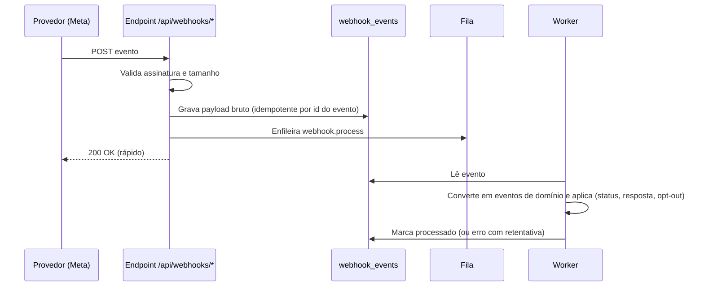

# Integrações — Docline SDR

> **Status:** Fase 0 (desenho). **Nenhuma integração externa real é implementada antes da fase indicada.**
> Políticas de plataformas (Meta, Google) mudam com frequência: cada seção marcada com ⚠️ deve ser **revalidada na documentação oficial** antes da fase correspondente.
> Relacionados: [ARCHITECTURE](./ARCHITECTURE.md) · [SECURITY](./SECURITY.md) · [LGPD](./LGPD.md) · [AI-SDR](./AI-SDR.md)

## Sumário

1. [Princípios](#1-princípios)
2. [Estrutura](#2-estrutura)
3. [Portas (interfaces)](#3-portas-interfaces)
4. [Registro de provedores e ambientes](#4-registro-de-provedores-e-ambientes)
5. [Mapa das integrações](#5-mapa-das-integrações)
6. [WhatsApp](#6-whatsapp)
7. [Instagram](#7-instagram)
8. [Google](#8-google)
9. [Fontes públicas brasileiras](#9-fontes-públicas-brasileiras)
10. [IA](#10-ia)
11. [CRM e sistemas Docline](#11-crm-e-sistemas-docline)
12. [E-mail, calendário e telefonia](#12-e-mail-calendário-e-telefonia)
13. [Webhooks recebidos (padrão inbox)](#13-webhooks-recebidos-padrão-inbox)
14. [Resiliência e tratamento de erros](#14-resiliência-e-tratamento-de-erros)
15. [O que não faremos](#15-o-que-não-faremos)
16. [Checklist de ativação de uma integração](#16-checklist-de-ativação-de-uma-integração)

---

## 1. Princípios

1. **APIs oficiais e permitidas.** Sem scraping, sem bibliotecas não oficiais, sem automação de apps.
2. **Chamadas externas só em `packages/integrations`.** O domínio conhece apenas portas (interfaces).
3. **Provedores falsos por padrão** fora de produção. Nenhuma mensagem real sai de dev ou staging.
4. **Configuração por ambiente** (`*_PROVIDER`), segredos só em variáveis de ambiente ou cofre.
5. **Gate de contactabilidade também no adaptador** de envio (defesa em profundidade).
6. **Idempotência** em envios e webhooks; **retentativas** com backoff; **limites de taxa** por provedor.
7. **Observabilidade:** cada chamada registra provedor, operação, latência, resultado e custo estimado, sem dados pessoais nos logs.
8. **Fixar versões de API** (ex.: versão da Graph API) e planejar atualizações.

---

## 2. Estrutura

```
packages/integrations/src/
├── whatsapp/
│   ├── assisted/        # links wa.me (MVP)
│   ├── meta-cloud/      # WhatsApp Business Platform — Cloud API (Fase 7)
│   └── fake/
├── instagram/
│   ├── assisted/        # link do perfil + copiar texto (MVP)
│   ├── meta-graph/      # Instagram API (Fase 8)
│   └── fake/
├── google/
│   ├── places/          # Places API (New) (Fase 9)
│   └── fake/
├── enrichment/
│   ├── receita-open-data/  # dados abertos CNPJ (Fase 9)
│   ├── brasilapi/          # consulta pontual CNPJ/CEP (a validar)
│   ├── ibge/               # localidades (seed)
│   └── fake/
├── ai/
│   ├── anthropic/
│   └── fake/
├── crm/
│   ├── docline/         # (Fase 12, depende de API)
│   ├── webhook/         # webhooks de saída assinados
│   └── fake/
├── email/{smtp,resend,console}/
└── registry.ts          # resolve adaptadores conforme o ambiente
```

---

## 3. Portas (interfaces)

Declaradas em `packages/core/src/ports/`. Versões simplificadas:

```ts
// Mensageria (WhatsApp, Instagram, futuramente outros)
interface MessagingProvider {
  readonly channel: 'WHATSAPP' | 'INSTAGRAM';
  readonly mode: 'ASSISTED' | 'API';
  /** Modo assistido: devolve a ação para o humano executar (link, texto a copiar). */
  prepareAssisted?(msg: OutboundMessage): Promise<AssistedAction>;
  /** Modo API: envia e devolve o id do provedor. */
  send?(msg: OutboundMessage, opts: { idempotencyKey: string }): Promise<SendResult>;
  /** Converte o payload de webhook já validado em eventos de domínio. */
  parseWebhook?(payload: unknown): InboundEvent[];
}

interface SocialProfileProvider {           // Instagram Business Discovery (Fase 8)
  getPublicBusinessProfile(handle: string): Promise<SocialProfileSnapshot | null>;
}

interface PlaceSearchProvider {             // Google Places (Fase 9)
  search(q: PlaceQuery): Promise<PlaceSearchResult[]>;   // exibição ao vivo, não persistida
  getDetails(placeId: string): Promise<PlaceDetails>;    // sob demanda
}

interface CompanyRegistryProvider {         // dados abertos CNPJ / consultas pontuais
  findByCnpj(cnpj: string): Promise<CompanyRecord | null>;
  search(q: { uf: string; municipalityCode?: string; cnaes: string[]; limit: number }): Promise<CompanyRecord[]>;
}

interface AiProvider { /* ver AI-SDR §3 */ }

interface CrmProvider {                     // Fase 12
  upsertOpportunity(o: OpportunityExport): Promise<{ externalId: string }>;
}

interface EmailProvider { send(m: TransactionalEmail): Promise<void>; }

interface JobQueue {
  enqueue(name: string, data: unknown, opts?: { tx?: Tx; singletonKey?: string; startAfter?: Date }): Promise<string>;
}
```

Os tipos (`OutboundMessage`, `InboundEvent`…) são do domínio. Nenhum tipo de SDK de terceiros atravessa a porta.

---

## 4. Registro de provedores e ambientes

| Variável | Valores | Padrão dev | Padrão prod (inicial) |
|---|---|---|---|
| `WHATSAPP_PROVIDER` | `assisted`, `fake`, `meta_cloud` | `assisted` | `assisted` → `meta_cloud` (Fase 7) |
| `INSTAGRAM_PROVIDER` | `assisted`, `fake`, `meta_graph` | `assisted` | `assisted` → `meta_graph` (Fase 8) |
| `PLACES_PROVIDER` | `disabled`, `fake`, `google_places` | `fake` | `disabled` até validação jurídica |
| `COMPANY_REGISTRY_PROVIDER` | `disabled`, `fake`, `receita_open_data`, `brasilapi` | `fake` | `disabled` → Fase 9 |
| `AI_PROVIDER` | `fake`, `anthropic` | `fake` | `anthropic` (Fase 6) |
| `EMAIL_PROVIDER` | `console`, `smtp`, `resend` | `console` | `smtp`/`resend` |
| `CRM_PROVIDER` | `disabled`, `fake`, `webhook`, `docline` | `disabled` | Fase 12 |

O `registry.ts` valida as variáveis na inicialização (schema Zod) e **falha ao subir** se um provedor real estiver configurado sem as credenciais necessárias. Em ambiente não produtivo, adaptadores de envio real recusam operar sem `ALLOW_REAL_SENDS=true` explícito.

---

## 5. Mapa das integrações

| Integração | Fase | Modo no MVP | Modo alvo | Dependências externas |
|---|---|---|---|---|
| WhatsApp | 7 | Assistido (`wa.me`) | Cloud API para leads com opt-in | Verificação da empresa na Meta, WABA, número, nome de exibição, templates aprovados |
| Instagram | 8 | Assistido (perfil + copiar texto) | API para DMs recebidas, comentários e enriquecimento | Conta profissional, app Meta, App Review |
| Google Places | 9 | — | Descoberta com exibição ao vivo, `place_id` | Projeto Google Cloud, faturamento, chave restrita, **validação jurídica** |
| Dados abertos CNPJ | 9 | Importação manual via CSV, se necessário | Ingestão mensal filtrada | Nenhuma (dado público); validação LGPD |
| IBGE Localidades | 1 | Seed de municípios | Atualização anual | Nenhuma |
| IA | 6 | `fake` até a Fase 6 | Provedor configurado | Conta, chave, DPA |
| E-mail transacional | 1 | Console/Mailpit | SMTP/Resend | Domínio com SPF/DKIM |
| CRM / Gestão AR / Gestão 360 | 12 | — | API e webhooks | Documentação das APIs Docline |
| Google Calendar / Gmail | Futura | — | OAuth por usuário | Projeto Google, verificação de app |
| Telefonia | Futura | `tel:` | Click-to-call e registro | Fornecedor de telefonia |

---

## 6. WhatsApp

### 6.1 Modo assistido (MVP)

- O sistema gera o link **click-to-chat** oficial `https://wa.me/<número E.164 sem +>?text=<mensagem codificada>`. O humano abre, revisa e envia pelo app do WhatsApp (ou WhatsApp Web) da conta corporativa.
- Após enviar, o SDR confirma no sistema → `messages.mode = ASSISTED`.
- Tudo é 1 a 1 e iniciado por pessoa. Não há automação do app.
- ⚠️ Os termos do WhatsApp e do WhatsApp Business App proíbem mensagens em massa, automatizadas ou não solicitadas que gerem denúncias. Muitos bloqueios ou denúncias podem restringir a conta. Mitigações: limites diários por SDR, intervalo mínimo entre contatos, personalização, opt-out imediato, só leads com base legal registrada.

### 6.2 WhatsApp Business Platform — Cloud API (Fase 7) ⚠️

**Pré-requisitos:** conta Meta Business verificada; WhatsApp Business Account (WABA); número dedicado registrado; nome de exibição aprovado; app Meta com permissões de WhatsApp; token de *System User* (não de pessoa) com rotação; templates aprovados.

**Regras centrais da plataforma:**

| Tema | Regra (revalidar) | Impacto no sistema |
|---|---|---|
| **Opt-in** | Mensagens iniciadas pela empresa exigem que a pessoa tenha fornecido o número e dado permissão para receber mensagens da empresa no WhatsApp | `contact_permissions.opt_in_status = GRANTED` é condição do gate para `mode = API` |
| **Janela de atendimento** | Mensagem livre só até 24h após a última mensagem do usuário; fora dela, só template aprovado | `conversations.service_window_expires_at`; UI indica se a janela está aberta |
| **Templates** | Categorias Marketing, Utility e Authentication; aprovação pela Meta; prospecção = Marketing | `whatsapp_templates` sincronizado; abordagem vinculada ao template |
| **Cobrança** | Por mensagem, conforme categoria e país (modelo em vigor desde jul/2025) | Custo estimado gravado por mensagem; limites por campanha |
| **Qualidade e limites** | Avaliação de qualidade do número e limites de mensagens por período, que sobem com bom histórico | Monitorar; alertar quando a qualidade cair; pausar campanhas |
| **Opt-out** | Respeitar pedidos de parada; a Meta oferece mecanismos de bloqueio/parada de marketing ao usuário | Palavras-chave + eventos → Lista Não Contatar |
| **Uso de IA** | Políticas da Meta sobre provedores de IA no WhatsApp Business (atualizadas 2025/2026) | Nosso desenho (IA como copiloto do SDR, sem chatbot de propósito geral) é compatível; revalidar |

**Webhooks:** verificação do endpoint (`hub.verify_token`/`hub.challenge`); validação de `X-Hub-Signature-256` (HMAC-SHA256 com o *app secret*, comparação em tempo constante); eventos de mensagens recebidas e de status (`sent`, `delivered`, `read`, `failed`) gravados em `webhook_events` e processados por job ([§13](#13-webhooks-recebidos-padrão-inbox)).

**Casamento de números:** o `wa_id` de números brasileiros pode chegar sem o 9º dígito. O casamento com `contact_points` testa as duas variantes.

**Fluxo de envio API:** mensagem aprovada → gate → `message.send` (job, idempotente) → `messages.status = SENT` com `provider_message_id` → webhooks atualizam para `DELIVERED`/`READ`/`FAILED`. Resposta do lead → `message.received` → **cadência parada** → classificação.

**Alternativa — BSPs** (Twilio, 360dialog, Gupshup, Zenvia, Blip…): a porta permite trocar a Cloud API direta por um BSP, se a Docline já tiver contrato ou precisar de suporte local. A Cloud API direta costuma ser a opção de menor custo.

### 6.3 Como obter opt-in de forma legítima

Clientes e parceiros atuais com relação comercial (validar com o jurídico); leads que escrevem primeiro (botão de WhatsApp no site, anúncios click-to-WhatsApp, QR code em eventos); formulários com caixa de opt-in específica para WhatsApp; confirmação explícita durante uma conversa iniciada por outro canal. Cada forma é registrada em `opt_in_method` com evidência.

---

## 7. Instagram

### 7.1 Modo assistido (MVP)

Guardar o `handle`; botão "Copiar mensagem e abrir perfil" (`https://instagram.com/<handle>`); o SDR envia a DM pelo app; confirma no sistema. Registro de interações manuais (curtida, comentário, visita ao perfil) como `activities`.

### 7.2 Instagram API (Fase 8) ⚠️

| Capacidade | Situação (revalidar) | Uso |
|---|---|---|
| Receber DMs enviadas à conta da Docline | Permitido via webhooks, com permissões aprovadas | Registrar resposta, parar cadência, classificar |
| Responder DMs | Permitido dentro da janela de mensagens após a mensagem do usuário | Responder interessados pelo sistema |
| **Iniciar DM com quem não escreveu** | **Não permitido** pela API | Continua assistido (humano no app) |
| Comentários e menções | Webhooks/consulta para a conta da Docline | Registrar interação, sinal de interesse |
| **Business Discovery** | Consulta de dados públicos básicos de outras contas profissionais (seguidores, número de posts, mídias recentes) | Critério "Instagram ativo" (data do último post); enriquecimento |

Requer conta profissional da Docline, app Meta, **App Review** das permissões necessárias e conformidade com os Termos da Plataforma Meta (inclusive limites de armazenamento e exclusão de dados obtidos pela API).

---

## 8. Google

### 8.1 Places API (New) (Fase 9) ⚠️ requer validação jurídica

**Uso desejado (§9):** buscar "escritório de contabilidade em Sobral CE" por UF, cidade, categoria, raio e quantidade, comparar com a base e aprovar novos leads.

**Restrição relevante:** os Termos da Google Maps Platform proíbem, em regra, pré-buscar, armazenar, copiar ou fazer cache do conteúdo (inclui nomes, endereços, telefones e avaliações de estabelecimentos) fora das exceções previstas; o **`place_id` pode ser armazenado**. Há também regras de atribuição na exibição.

**Fluxo proposto, compatível com os termos:**

1. Busca (Text Search / Nearby Search) com *field mask* mínima.
2. Resultados **exibidos ao vivo**, com atribuição Google, sem persistir o conteúdo.
3. Comparação com a base **em memória** durante a sessão (por `place_id` já conhecido, nome/telefone normalizados), mostrando "já existe", "possível duplicado" ou "novo".
4. O SDR aprova os novos → o sistema cria o lead com **`google_place_id`**, origem `GOOGLE` e somente dados obtidos ou confirmados por **outra fonte legítima** (site da própria empresa, dados abertos CNPJ, contato direto).
5. Na ficha do lead, nota e avaliações aparecem **ao vivo** pelo `place_id`, sob demanda (com custo por chamada e cota diária).

**Consequências:** critérios de score baseados em avaliações Google ficam inativos até que o jurídico confirme uma forma permitida ([DATABASE §8.2](./DATABASE.md#82-modelo-de-score-inicial-10)). Chave de API restrita por API e por origem/IP; cotas e alertas de faturamento configurados.

### 8.2 Google Calendar e Gmail (futuro)

OAuth por usuário com escopos mínimos (criar eventos de reunião; registrar e-mails trocados com leads). Exige verificação do app pelo Google conforme os escopos.

---

## 9. Fontes públicas brasileiras

### 9.1 Dados abertos do CNPJ (Receita Federal) — fonte primária de descoberta proposta (Fase 9)

- Publicação periódica (mensal) de arquivos com empresas e estabelecimentos.
- Filtro por **CNAE 6920-6/01** (Atividades de contabilidade) e **6920-6/02** (Atividades de consultoria e auditoria contábil e tributária), situação cadastral **ativa**, UF/município.
- Ingestão por job (`registry.ingest`) para `registry_companies`, **separada de `leads`**: o SDR pesquisa nesse universo e aprova quem vira lead (origem `RECEITA_OPEN_DATA`).
- Os arquivos são grandes: processamento em streaming, guardando só os CNAEs de interesse.
- **LGPD:** dados de empresário individual/MEI e e-mails/telefones informados podem ser **dados pessoais**. Dado público não dispensa base legal, finalidade compatível e boa-fé (LGPD art. 7º, §§ 3º e 4º). Ver [LGPD §4](./LGPD.md#4-bases-legais-por-origem).
- ⚠️ Verificar formato, endereço de publicação e periodicidade vigentes antes da Fase 9.

### 9.2 Consultas pontuais (enriquecimento)

- **CNPJ por consulta** (ex.: BrasilAPI ou serviços comerciais de CNPJ): completar razão social, CNAE e situação de um lead já existente. Avaliar limites, termos e confiabilidade de cada serviço antes de adotar.
- **CEP** (ViaCEP/BrasilAPI): completar endereço.
- **IBGE Localidades** (API pública de serviços de dados do IBGE): seed de UFs e municípios com código IBGE.

### 9.3 Conselhos profissionais (CFC/CRC)

Verificar se há dados abertos ou API oficial de organizações contábeis registradas. **Não fazer scraping** de consultas públicas.

---

## 10. IA

Porta `AiProvider`, adaptador padrão Anthropic (SDK oficial), configuração por `AI_*`. Detalhes de modelos, saídas estruturadas, cache, custos e privacidade em [AI-SDR](./AI-SDR.md).

---

## 11. CRM e sistemas Docline

**Escopo futuro (Fase 12):** CRM da Docline, Gestão AR, Docline Gestão 360, sistemas internos, BI.

| Mecanismo | Uso |
|---|---|
| **API de entrada** `/api/v1` com chaves de API e escopos | Sistemas Docline e n8n consultam/criam dados |
| **Webhooks de saída** assinados (HMAC, `OUTBOUND_WEBHOOK_SIGNING_SECRET`) | `opportunity.created`, `lead.converted`, `optout.registered`… |
| **`external_references`** | Mapeia ids internos ↔ ids de cada sistema Docline |
| **n8n (opcional)** | Orquestra fluxos entre sistemas consumindo a API; **não contém regra de negócio de contato** |
| **Exportação para BI** | Eventos e `daily_metrics` em formato incremental |

A Lista Não Contatar deve ser **compartilhada** com outros sistemas Docline que contatem as mesmas pessoas (evento `optout.registered`).

---

## 12. E-mail, calendário e telefonia

- **E-mail transacional** (Fase 1): convites, redefinição de senha, notificações. Domínio com SPF/DKIM/DMARC.
- **E-mail como canal de prospecção** (futuro): exigiria link de descadastro, controle de reputação e base legal própria. Fora do MVP.
- **Telefonia** (futuro): click-to-call e registro automático de ligações por um fornecedor com API.

---

## 13. Webhooks recebidos (padrão inbox)



Regras: responder rápido (o processamento é assíncrono); idempotência por `(provider, external_event_id)`; assinatura inválida → `401` e registro de segurança; payloads brutos purgados após 90 dias.

---

## 14. Resiliência e tratamento de erros

| Situação | Tratamento |
|---|---|
| Timeout / 5xx / 429 | Retentativa com backoff exponencial + jitter; respeitar `Retry-After` |
| 4xx de validação | Sem retentativa; erro registrado e exibido ao usuário |
| Token expirado / permissão revogada | Integração marcada `DEGRADED`; alerta ao ADMIN; envios pausados |
| Falhas repetidas | Disjuntor simples: pausa o provedor por N minutos |
| Job esgotou tentativas | *Dead letter* + alerta; reprocessamento manual |
| Mudança de versão de API | Versão fixada em variável; atualização planejada com testes de contrato |

---

## 15. O que não faremos

- Scraping de Google, Instagram, Facebook, LinkedIn, sites de conselhos ou qualquer serviço que proíba isso.
- Bibliotecas não oficiais de WhatsApp/Instagram ou automação de navegador/app para enviar mensagens.
- Disparo em massa para números só porque foram encontrados.
- Contornar limites, janelas, aprovação de templates ou exigência de opt-in.
- Armazenar conteúdo do Google Places além do permitido.
- Compartilhar ou vender a base de leads.

---

## 16. Checklist de ativação de uma integração

- [ ] Política/termos da plataforma revisados na versão vigente (data registrada).
- [ ] Validação jurídica/LGPD quando envolver dados pessoais.
- [ ] Credenciais de produção criadas com menor privilégio, guardadas no cofre/ambiente, nunca no Git.
- [ ] Adaptador com testes de contrato (MSW) e testes do gate de contactabilidade.
- [ ] Testado em staging com sandbox/números de teste.
- [ ] Limites de taxa, cotas e alertas de custo configurados.
- [ ] Webhooks com assinatura verificada e idempotência testada.
- [ ] Logs sem dados pessoais nem tokens.
- [ ] Runbook: como pausar a integração rapidamente.
- [ ] Documentação atualizada (este arquivo e o `.env.example`).
