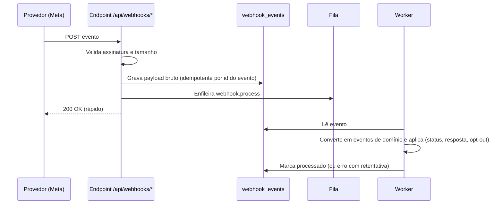

# Integrações — Docline SDR

> **Status:** desenho da Fase 0, com as notas **Implementação** das fases já entregues: IA (Fase 6, [§10](#10-ia)), WhatsApp Cloud API (Fase 7, [§6.2](#6-whatsapp)) e Instagram API (Fase 8, [§7.2](#7-instagram)). **Nenhuma integração externa real é implementada antes da fase indicada**, e as reais ficam desligadas por padrão.
> Políticas de plataformas (Meta, Google) mudam com frequência: cada seção marcada com ⚠️ deve ser **revalidada na documentação oficial** antes da fase correspondente.
> Relacionados: [ARCHITECTURE](./ARCHITECTURE.md) · [SECURITY](./SECURITY.md) · [LGPD](./LGPD.md) · [AI-SDR](./AI-SDR.md)

## Sumário

1. [Princípios](#1-princípios)
2. [Estrutura](#2-estrutura)
3. [Portas (interfaces)](#3-portas-interfaces)
4. [Registro de provedores e ambientes](#4-registro-de-provedores-e-ambientes)
5. [Mapa das integrações](#5-mapa-das-integrações)
6. [WhatsApp](#6-whatsapp)
7. [Instagram](#7-instagram)
8. [Google](#8-google)
9. [Fontes públicas brasileiras](#9-fontes-públicas-brasileiras)
10. [IA](#10-ia)
11. [CRM e sistemas Docline](#11-crm-e-sistemas-docline)
12. [E-mail, calendário e telefonia](#12-e-mail-calendário-e-telefonia)
13. [Webhooks recebidos (padrão inbox)](#13-webhooks-recebidos-padrão-inbox)
14. [Resiliência e tratamento de erros](#14-resiliência-e-tratamento-de-erros)
15. [O que não faremos](#15-o-que-não-faremos)
16. [Checklist de ativação de uma integração](#16-checklist-de-ativação-de-uma-integração)

---

## 1. Princípios

1. **APIs oficiais e permitidas.** Sem scraping, sem bibliotecas não oficiais, sem automação de apps.
2. **Chamadas externas só em `packages/integrations`.** O domínio conhece apenas portas (interfaces).
3. **Provedores falsos por padrão** fora de produção. Nenhuma mensagem real sai de dev ou staging.
4. **Configuração por ambiente** (`*_PROVIDER`), segredos só em variáveis de ambiente ou cofre.
5. **Gate de contactabilidade também no adaptador** de envio (defesa em profundidade).
6. **Idempotência** em envios e webhooks; **retentativas** com backoff; **limites de taxa** por provedor.
7. **Observabilidade:** cada chamada registra provedor, operação, latência, resultado e custo estimado, sem dados pessoais nos logs.
8. **Fixar versões de API** (ex.: versão da Graph API) e planejar atualizações.

---

## 2. Estrutura

Situação na Fase 8 (o que ainda não existe aparece como planejado):

```
packages/integrations/src/
├── whatsapp/
│   ├── meta-cloud.ts    # WhatsApp Cloud API pela Graph API oficial (Fase 7)
│   └── signature.ts     # X-Hub-Signature-256 e verificação do endpoint do webhook
├── instagram/
│   └── meta-graph.ts    # Instagram API com Facebook Login, pela Graph API oficial (Fase 8)
├── ai/anthropic.ts      # SDK oficial da Anthropic (Fase 6)
├── email/{console,file,smtp,resend}.ts
├── queue/pg-boss.ts
├── spreadsheet/{csv,xlsx}.ts           # leitura segura de planilhas (Fase 3)
├── observability/{logger,error-reporter}.ts
└── registry.ts          # resolve adaptadores conforme o ambiente

planejado: google/places (Fase 9) · enrichment/ (Fase 9) · crm/ (Fase 12)
```

Os **provedores falsos** (WhatsApp, Instagram, IA) ficam no core (`packages/core/src/modules/*/infra/fake-*.ts`), porque testes, CI e E2E usam o mesmo código. O **modo assistido** não passa por adaptador: é o link `wa.me` ou o link do perfil do Instagram, montados no módulo de mensagens. A assinatura do webhook (`whatsapp/signature.ts`) serve aos dois canais da Meta.

---

## 3. Portas (interfaces)

Declaradas em `packages/core/src/ports/`. Versões simplificadas:

```ts
// Mensageria (WhatsApp, Instagram, futuramente outros)
interface MessagingProvider {
  readonly channel: 'WHATSAPP' | 'INSTAGRAM';
  readonly mode: 'ASSISTED' | 'API';
  /** Modo assistido: devolve a ação para o humano executar (link, texto a copiar). */
  prepareAssisted?(msg: OutboundMessage): Promise<AssistedAction>;
  /** Modo API: envia e devolve o id do provedor. */
  send?(msg: OutboundMessage, opts: { idempotencyKey: string }): Promise<SendResult>;
  /** Converte o payload de webhook já validado em eventos de domínio. */
  parseWebhook?(payload: unknown): InboundEvent[];
}

interface SocialProfileProvider {           // Instagram Business Discovery (Fase 8)
  getPublicBusinessProfile(handle: string): Promise<SocialProfileSnapshot | null>;
}

interface PlaceSearchProvider {             // Google Places (Fase 9)
  search(q: PlaceQuery): Promise<PlaceSearchResult[]>;   // exibição ao vivo, não persistida
  getDetails(placeId: string): Promise<PlaceDetails>;    // sob demanda
}

interface CompanyRegistryProvider {         // dados abertos CNPJ / consultas pontuais
  findByCnpj(cnpj: string): Promise<CompanyRecord | null>;
  search(q: { uf: string; municipalityCode?: string; cnaes: string[]; limit: number }): Promise<CompanyRecord[]>;
}

interface AiProvider { /* ver AI-SDR §3 */ }

interface CrmProvider {                     // Fase 12
  upsertOpportunity(o: OpportunityExport): Promise<{ externalId: string }>;
}

interface EmailProvider { send(m: TransactionalEmail): Promise<void>; }

interface JobQueue {
  enqueue(name: string, data: unknown, opts?: { tx?: Tx; singletonKey?: string; startAfter?: Date }): Promise<string>;
}
```

Os tipos (`OutboundMessage`, `InboundEvent`…) são do domínio. Nenhum tipo de SDK de terceiros atravessa a porta.

> **Implementado na Fase 7:** em vez da `MessagingProvider` genérica, a porta `WhatsappProvider` (`packages/core/src/ports/whatsapp.ts`) com `send(outbound)` (texto ou modelo, sempre com a nossa referência), `listTemplates()` e `getPhoneHealth()`. Falhas viram `WhatsappProviderError` com o desfecho (`NOT_SENT` ou `UNKNOWN`), o código e se é passageira. A leitura do webhook (formato da Meta) fica no core, não no adaptador (ADR 023).
>
> **Implementado na Fase 8:** a porta `InstagramProvider` (`packages/core/src/ports/instagram.ts`), separada da do WhatsApp porque as regras são outras (ADR 025): `sendText` (só a quem escreveu, em 24 h), `sendPrivateReply` (uma por comentário, em 7 dias), `getUserProfile` (o @ de quem escreveu), `discover` (Business Discovery) e `getAccount`. Falhas viram `InstagramProviderError`, com o mesmo desfecho `NOT_SENT`/`UNKNOWN` do WhatsApp. O webhook também é lido no core (`parseInstagramWebhook`).

---

## 4. Registro de provedores e ambientes

| Variável | Valores | Padrão dev | Padrão prod (inicial) |
|---|---|---|---|
| `WHATSAPP_PROVIDER` | `assisted`, `fake`, `meta_cloud` | `assisted` (`fake` para homologar a API sem a Meta) | `assisted` → `meta_cloud` depois do [§16.1](#161-ativar-o-whatsapp-pela-api-cloud-api) |
| `INSTAGRAM_PROVIDER` | `assisted`, `fake`, `meta_graph` | `assisted` (`fake` para homologar a API sem a Meta) | `assisted` → `meta_graph` depois do [§16.2](#162-ativar-o-instagram-pela-api) |
| `PLACES_PROVIDER` | `disabled`, `fake`, `google_places` | `fake` | `disabled` até validação jurídica |
| `COMPANY_REGISTRY_PROVIDER` | `disabled`, `fake`, `receita_open_data`, `brasilapi` | `fake` | `disabled` → Fase 9 |
| `AI_PROVIDER` | `fake`, `anthropic` | `fake` | `fake` até a decisão da Docline sobre a transferência internacional; depois `anthropic` |
| `EMAIL_PROVIDER` | `console`, `smtp`, `resend` | `console` | `smtp`/`resend` |
| `CRM_PROVIDER` | `disabled`, `fake`, `webhook`, `docline` | `disabled` | Fase 12 |

O `registry.ts` valida as variáveis na inicialização (schema Zod) e **falha ao subir** se um provedor real estiver configurado sem as credenciais necessárias. Em ambiente não produtivo, adaptadores de envio real recusam operar sem `ALLOW_REAL_SENDS=true` explícito.

Com `WHATSAPP_PROVIDER=meta_cloud` são obrigatórias: `META_APP_SECRET`, `META_ACCESS_TOKEN` (token de *System User*), `META_GRAPH_API_VERSION` (ex.: `v26.0`), `META_WEBHOOK_VERIFY_TOKEN`, `WHATSAPP_BUSINESS_ACCOUNT_ID` e `WHATSAPP_PHONE_NUMBER_ID`. Com `fake`, só `META_APP_SECRET` e `META_WEBHOOK_VERIFY_TOKEN` de teste (para o webhook e o simulador). Todas só em variáveis de ambiente; nunca no código nem no Git.

Com `INSTAGRAM_PROVIDER=meta_graph` são obrigatórias: `META_APP_SECRET`, `META_GRAPH_API_VERSION`, `META_WEBHOOK_VERIFY_TOKEN` (as mesmas do app da Meta usado pelo WhatsApp), `INSTAGRAM_BUSINESS_ACCOUNT_ID` (id da conta profissional), `FACEBOOK_PAGE_ID` (Página ligada a ela) e `INSTAGRAM_PAGE_ACCESS_TOKEN` (token da Página, de longa duração). Com `fake`, só os dois segredos de teste do webhook.

---

## 5. Mapa das integrações

| Integração | Fase | Modo no MVP | Modo alvo | Dependências externas |
|---|---|---|---|---|
| WhatsApp | 7 | Assistido (`wa.me`) | Cloud API para leads com opt-in | Verificação da empresa na Meta, WABA, número, nome de exibição, templates aprovados |
| Instagram | 8 | Assistido (perfil + copiar texto) | API para DMs recebidas, comentários e enriquecimento | Conta profissional, app Meta, App Review |
| Google Places | 9 | — | Descoberta com exibição ao vivo, `place_id` | Projeto Google Cloud, faturamento, chave restrita, **validação jurídica** |
| Dados abertos CNPJ | 9 | Importação manual via CSV, se necessário | Ingestão mensal filtrada | Nenhuma (dado público); validação LGPD |
| IBGE Localidades | 1 | Seed de municípios | Atualização anual | Nenhuma |
| IA | 6 | `fake` até a Fase 6 | Provedor configurado | Conta, chave, DPA |
| E-mail transacional | 1 | Console/Mailpit | SMTP/Resend | Domínio com SPF/DKIM |
| CRM / Gestão AR / Gestão 360 | 12 | — | API e webhooks | Documentação das APIs Docline |
| Google Calendar / Gmail | Futura | — | OAuth por usuário | Projeto Google, verificação de app |
| Telefonia | Futura | `tel:` | Click-to-call e registro | Fornecedor de telefonia |

---

## 6. WhatsApp

### 6.1 Modo assistido (MVP)

- O sistema gera o link **click-to-chat** oficial `https://wa.me/<número E.164 sem +>?text=<mensagem codificada>`. O humano abre, revisa e envia pelo app do WhatsApp (ou WhatsApp Web) da conta corporativa.
- Após enviar, o SDR confirma no sistema → `messages.mode = ASSISTED`.
- Tudo é 1 a 1 e iniciado por pessoa. Não há automação do app.
- ⚠️ Os termos do WhatsApp e do WhatsApp Business App proíbem mensagens em massa, automatizadas ou não solicitadas que gerem denúncias. Muitos bloqueios ou denúncias podem restringir a conta. Mitigações: limites diários por SDR, intervalo mínimo entre contatos, personalização, opt-out imediato, só leads com base legal registrada.

### 6.2 WhatsApp Business Platform — Cloud API (Fase 7) ⚠️

**Pré-requisitos:** conta Meta Business verificada; WhatsApp Business Account (WABA); número dedicado registrado; nome de exibição aprovado; app Meta com permissões de WhatsApp; token de *System User* (não de pessoa) com rotação; templates aprovados.

**Regras centrais da plataforma:**

| Tema | Regra (revalidar) | Impacto no sistema |
|---|---|---|
| **Opt-in** | Mensagens iniciadas pela empresa exigem que a pessoa tenha fornecido o número e dado permissão para receber mensagens da empresa no WhatsApp | `contact_permissions.opt_in_status = GRANTED` é condição do gate para `mode = API` |
| **Janela de atendimento** | Mensagem livre só até 24h após a última mensagem do usuário; fora dela, só template aprovado | `conversations.service_window_expires_at`; UI indica se a janela está aberta |
| **Templates** | Categorias Marketing, Utility e Authentication; aprovação pela Meta; prospecção = Marketing | `whatsapp_templates` sincronizado; abordagem vinculada ao template |
| **Cobrança** | Por mensagem, conforme categoria e país (modelo em vigor desde jul/2025) | Custo estimado gravado por mensagem; limites por campanha |
| **Qualidade e limites** | Avaliação de qualidade do número e limites de mensagens por período, que sobem com bom histórico | Monitorar; alertar quando a qualidade cair; pausar campanhas |
| **Opt-out** | Respeitar pedidos de parada; a Meta oferece mecanismos de bloqueio/parada de marketing ao usuário | Palavras-chave + eventos → Lista Não Contatar |
| **Uso de IA** | Políticas da Meta sobre provedores de IA no WhatsApp Business (atualizadas 2025/2026) | Nosso desenho (IA como copiloto do SDR, sem chatbot de propósito geral) é compatível; revalidar |

**Webhooks:** verificação do endpoint (`hub.verify_token`/`hub.challenge`); validação de `X-Hub-Signature-256` (HMAC-SHA256 com o *app secret*, comparação em tempo constante); eventos de mensagens recebidas e de status (`sent`, `delivered`, `read`, `failed`) gravados em `webhook_events` e processados por job ([§13](#13-webhooks-recebidos-padrão-inbox)).

**Casamento de números:** o `wa_id` de números brasileiros pode chegar sem o 9º dígito. O casamento com `contact_points` testa as duas variantes.

**Fluxo de envio API:** mensagem aprovada → gate → `message.send` (job, idempotente) → `messages.status = SENT` com `provider_message_id` → webhooks atualizam para `DELIVERED`/`READ`/`FAILED`. Resposta do lead → `message.received` → **cadência parada** → classificação.

**Alternativa — BSPs** (Twilio, 360dialog, Gupshup, Zenvia, Blip…): a porta permite trocar a Cloud API direta por um BSP, se a Docline já tiver contrato ou precisar de suporte local. A Cloud API direta costuma ser a opção de menor custo.

> **Implementação (Fase 7).** Desligada por padrão (`WHATSAPP_PROVIDER=assisted`); ligar segue o [§16.1](#161-ativar-o-whatsapp-pela-api-cloud-api).
>
> - **Adaptador** `packages/integrations/src/whatsapp/meta-cloud.ts`: `fetch` direto na Graph API (a Meta não mantém SDK oficial para Node), versão fixada em `META_GRAPH_API_VERSION`, tempo limite de 15 s, sem nova tentativa no adaptador. Cada envio leva o id da nossa mensagem em `biz_opaque_callback_data`, que volta nos webhooks de status. Fora de produção recusa enviar sem `ALLOW_REAL_SENDS=true`. Testado contra um servidor local que imita a Graph API (sem rede e sem custo).
> - **Provedor simulado** (`WHATSAPP_PROVIDER=fake`): aceita os envios sem sair nada, com marcas no texto para simular erros (`[fake:janela-fechada]`, `[fake:opt-out]`, `[fake:limite]`, `[fake:incerto]`) e 5 modelos fictícios. Respostas e status chegam pelo webhook real, assinados pelo simulador: `pnpm whatsapp:simulate resposta --de "(88) 99999-0000" --texto "Tenho interesse"` e `pnpm whatsapp:simulate status --status delivered`. Recusa rodar com `meta_cloud`.
> - **Envio** (job `whatsapp.send`): gate do modo API → mensagem `QUEUED` e job na mesma transação → o job marca a tentativa e confere o gate de novo → chama a Meta fora da transação → grava `SENT` (com `provider_message_id`) ou `FAILED` com uma atualização condicional, para que o job e o webhook não apliquem o mesmo efeito duas vezes. **Nunca há reenvio automático** (ADR 022): a Cloud API não tem chave de idempotência, e mandar a mesma mensagem duas vezes é pior que não mandar. Falha conhecida vira "Tentar de novo" para a pessoa; resultado incerto (tempo esgotado, conexão caída, 5xx sem código) só é repetido depois de 10 minutos sem status e com confirmação do risco de duplicidade. Pedidos repetidos da tela (duplo clique) são absorvidos pelo `clientRequestId`.
> - **Regras aplicadas:** texto livre só com a janela de 24 h aberta (contada da última mensagem recebida daquele número); fora dela, só modelo aprovado e ativo, e só para número com opt-in registrado. O gate do modo API só libera números com opt-in ou com a janela aberta (ADR 021).
> - **Webhook** `/api/webhooks/whatsapp`: `GET` responde à verificação (`hub.mode=subscribe`, `hub.verify_token`, `hub.challenge`); `POST` confere a assinatura sobre os bytes exatos recebidos (HMAC-SHA256 com `META_APP_SECRET`, comparação em tempo constante), recusa corpo acima de 1 MB (`413`), assinatura inválida (`401`, com registro de segurança sem o conteúdo) e formato inválido (`400`); grava na inbox e responde `200`. Sem `meta_cloud`/`fake` configurado, a rota responde `404`.
> - **Status:** `sent` → `delivered` → `read` só avançam (status atrasado não volta a mensagem); `failed` grava o código e a explicação em português; o objeto `pricing` (categoria, `billable`) alimenta o custo estimado da mensagem.
> - **Erros com efeito:** `131050` (o contato pediu ao WhatsApp para não receber marketing da empresa) põe o número na supressão do WhatsApp e revoga o opt-in daquele número; `131047` (janela fechada) pede modelo; `131049` (limite de marketing por pessoa) não é repetido; token inválido ou conta restrita marcam a conexão como degradada e avisam os administradores. A tabela de códigos está em `packages/core/src/modules/whatsapp/domain/errors.ts`; código desconhecido aparece com o número para o suporte.
> - **Mensagens recebidas:** casadas pelo número com e sem o 9º dígito (F7-06); resposta registrada, cadência parada e palavras de opt-out aplicadas como nas respostas registradas à mão (Fase 5); a IA **sugere** uma classificação (F7-07), nunca aplica. Número sem lead (ou em mais de um lead) vai para "Números sem lead" em Conversas: **nenhum lead é criado sozinho**; ADMIN/GESTOR vinculam, procuram de novo depois de cadastrar o lead ou descartam.
> - **Modelos** (F7-04): sincronizados uma vez por dia (job `whatsapp.sync-templates`), pelo botão em Configurações → WhatsApp e pelos webhooks de situação e qualidade do modelo; só modelos com corpo de texto e variáveis no corpo são suportados; cada modelo pode ser vinculado a uma abordagem e desativado para uso. Modelo que some da conta fica marcado como removido, sem apagar o histórico.
> - **Qualidade, limite e custo** (F7-08): job `whatsapp.health-check` de hora em hora lê qualidade, limite de mensagens e situação do número; piora avisa os administradores uma vez. O custo é **estimado** por mensagem com a tabela editável em Configurações → WhatsApp (valores iniciais em USD tirados de fontes secundárias; conferir na tabela oficial da Meta, que desde 1/7/2026 fatura em BRL para clientes elegíveis no Brasil).
>
> **Conferido em 2026-10-09** (pesquisa na documentação e no changelog da Meta): Graph API v26.0 (29/07/2026); cobrança por mensagem desde 01/07/2025; `pricing` nos status com `pricing_model`, `type`, `category` e `billable`; `biz_opaque_callback_data`; modelos com `parameter_format` `NAMED`/`POSITIONAL`; códigos 131047, 131049, 131050 e 131064 (adicionado em abr/2026). A página oficial de códigos de erro não pôde ser lida diretamente: **revalidar a tabela antes de ligar a API** e a cada troca de versão.

### 6.3 Como obter opt-in de forma legítima

Clientes e parceiros atuais com relação comercial (validar com o jurídico); leads que escrevem primeiro (botão de WhatsApp no site, anúncios click-to-WhatsApp, QR code em eventos); formulários com caixa de opt-in específica para WhatsApp; confirmação explícita durante uma conversa iniciada por outro canal. Cada forma é registrada em `opt_in_method` com evidência.

---

## 7. Instagram

### 7.1 Modo assistido (MVP)

Guardar o `handle`; botão "Copiar mensagem e abrir perfil" (`https://instagram.com/<handle>`); o SDR envia a DM pelo app; confirma no sistema. Registro de interações manuais (curtida, comentário, visita ao perfil) como `activities`.

### 7.2 Instagram API (Fase 8) ⚠️

| Capacidade | Situação (revalidar) | Uso |
|---|---|---|
| Receber DMs enviadas à conta da Docline | Permitido via webhooks, com permissões aprovadas | Registrar resposta, parar cadência, classificar |
| Responder DMs | Permitido dentro da janela de mensagens após a mensagem do usuário | Responder interessados pelo sistema |
| **Iniciar DM com quem não escreveu** | **Não permitido** pela API | Continua assistido (humano no app) |
| Comentários e menções | Webhooks/consulta para a conta da Docline | Registrar interação, sinal de interesse |
| **Business Discovery** | Consulta de dados públicos básicos de outras contas profissionais (seguidores, número de posts, mídias recentes) | Critério "Instagram ativo" (data do último post); enriquecimento |

Requer conta profissional da Docline, app Meta, **App Review** das permissões necessárias e conformidade com os Termos da Plataforma Meta (inclusive limites de armazenamento e exclusão de dados obtidos pela API).

> **Implementação (Fase 8).** Desligada por padrão (`INSTAGRAM_PROVIDER=assisted`); ligar segue o [§16.2](#162-ativar-o-instagram-pela-api). Variante **com Facebook Login** (conta profissional ligada a uma Página), a única com Business Discovery.
>
> - **Adaptador** `packages/integrations/src/instagram/meta-graph.ts`: `fetch` direto na Graph API, versão fixada em `META_GRAPH_API_VERSION`, tempo limite de 15 s, sem nova tentativa. Envia por `POST /{page-id}/messages` com o token da Página; fora de produção recusa enviar sem `ALLOW_REAL_SENDS=true`. Testado contra um servidor local que imita a Graph API.
> - **Provedor simulado** (`INSTAGRAM_PROVIDER=fake`): nada sai do servidor; marcas no texto simulam erros (`[fake:janela-fechada]`, `[fake:indisponivel]`, `[fake:limite]`, `[fake:incerto]`); o IGSID simulado sai do @ (`fake-igsid-<@>`); Business Discovery determinístico pelo @. Mensagens, comentários, ecos e "visto" chegam pelo webhook real, assinados pelo simulador: `pnpm instagram:simulate mensagem --de @perfil --texto "Tenho interesse"`, `comentario`, `eco` e `visto`. Recusa rodar com `meta_graph`.
> - **Só responder, nunca iniciar** (ADR 025): texto livre só em até 24 h da última mensagem do contato (o gate do modo API exige a janela aberta naquele @); resposta privada a um comentário do lead, **uma por comentário, até 7 dias**, com o gate do contato assistido (Lista Não Contatar, base legal, horário e intervalo). A tag `human_agent` (até 7 dias) **não** é usada. O primeiro contato continua assistido, pelo app.
> - **Envio** (job `instagram.send`): o mesmo desenho do WhatsApp (ADR 022) — fila e job na mesma transação, prazos da Meta e gate conferidos de novo no job, chamada fora da transação, desfecho com atualização condicional, **nenhum reenvio automático**, resultado incerto só repetido depois de 10 minutos e com confirmação. Texto até 1.000 bytes (UTF-8).
> - **Webhook** `/api/webhooks/instagram`: mesma verificação do endpoint e da assinatura do WhatsApp (o app da Meta é o mesmo). Lidos: `messages` (mensagem recebida, eco do que a conta enviou, "visto", postback) e `comments`. Mensagens apagadas, de teste e de outras contas são ignoradas.
> - **Mensagens recebidas** (F8-02): casadas pela conversa já existente (IGSID) ou pelo @ cadastrado no lead; o @ de quem escreve pela primeira vez vem do perfil na Meta (consultado no worker, fora da transação). Viram resposta do lead com as regras da Fase 5 (cadência, opt-out por palavra, etapa, tarefa) e a sugestão de classificação da IA. Quem não é lead (ou tem o @ em mais de um lead) vai para "Quem não é lead" em Conversas; **nenhum lead é criado sozinho**.
> - **Ecos:** confirmam envios da API (inclusive os de resultado incerto, pelo texto e pelo destinatário em até 48 h), guardam o id da Meta no contato assistido já confirmado e registram no histórico o que a equipe respondeu direto pelo app numa conversa conhecida. Eco de conversa desconhecida (primeiro contato pelo app) é ignorado.
> - **Comentários** nas publicações da Docline: guardados **só de leads já cadastrados** (o @ em um único lead), com aviso ao responsável; o texto fica só no comentário (a timeline registra o evento sem o texto). Comentário não é resposta à cadência; pedido de opt-out num comentário público é sinalizado para uma pessoa conferir. De quem não é lead, nada é gravado.
> - **Business Discovery** (F8-04, job `instagram.discovery` de hora em hora): consulta os @ dos leads ativos — exceto opt-out e bloqueados — com teto por rodada (padrão 50/h) e validade de 30 dias (falha volta no dia seguinte); cada @ é consultado uma vez mesmo se estiver em mais de um lead. Guarda **só** seguidores, número de publicações e a data da última publicação; nada de legendas, mídias ou comentários. Limite da Meta interrompe a rodada; token recusado marca a integração em erro. O critério "Instagram ativo" do score usa a última publicação do @ atual e continua **inativo no seed** até o ADMIN ligá-lo.
> - **Conta:** job diário `instagram.account-check` e o botão em Configurações → Instagram conferem o token e a conta; erro de permissão avisa os administradores uma vez.
>
> **Conferido em 2026-10-09** (documentação da Meta): Instagram API com Facebook Login; envio por `/{page-id}/messages`; janela de 24 h para texto; resposta privada com `recipient: {comment_id}`, uma por comentário, em até 7 dias; User Profile API (`name`, `username`) só para quem escreveu; Business Discovery com `business_discovery.username(...)` (seguidores, número de mídias, mídias); limite de 1.000 bytes por mensagem; webhooks `messages` (com `is_echo`, `is_deleted`, `is_self`, `read`) e `comments`. Permissões: `instagram_basic`, `instagram_manage_messages`, `instagram_manage_comments`, `pages_manage_metadata`, `pages_show_list`, `pages_read_engagement`, `pages_messaging` e `business_management`. **Revalidar antes de ligar** e a cada troca de versão.

---

## 8. Google

### 8.1 Places API (New) (Fase 9) ⚠️ requer validação jurídica

**Uso desejado (§9):** buscar "escritório de contabilidade em Sobral CE" por UF, cidade, categoria, raio e quantidade, comparar com a base e aprovar novos leads.

**Restrição relevante:** os Termos da Google Maps Platform proíbem, em regra, pré-buscar, armazenar, copiar ou fazer cache do conteúdo (inclui nomes, endereços, telefones e avaliações de estabelecimentos) fora das exceções previstas; o **`place_id` pode ser armazenado**. Há também regras de atribuição na exibição.

**Fluxo proposto, compatível com os termos:**

1. Busca (Text Search / Nearby Search) com *field mask* mínima.
2. Resultados **exibidos ao vivo**, com atribuição Google, sem persistir o conteúdo.
3. Comparação com a base **em memória** durante a sessão (por `place_id` já conhecido, nome/telefone normalizados), mostrando "já existe", "possível duplicado" ou "novo".
4. O SDR aprova os novos → o sistema cria o lead com **`google_place_id`**, origem `GOOGLE` e somente dados obtidos ou confirmados por **outra fonte legítima** (site da própria empresa, dados abertos CNPJ, contato direto).
5. Na ficha do lead, nota e avaliações aparecem **ao vivo** pelo `place_id`, sob demanda (com custo por chamada e cota diária).

**Consequências:** critérios de score baseados em avaliações Google ficam inativos até que o jurídico confirme uma forma permitida ([DATABASE §8.2](./DATABASE.md#82-modelo-de-score-inicial-10)). Chave de API restrita por API e por origem/IP; cotas e alertas de faturamento configurados.

### 8.2 Google Calendar e Gmail (futuro)

OAuth por usuário com escopos mínimos (criar eventos de reunião; registrar e-mails trocados com leads). Exige verificação do app pelo Google conforme os escopos.

---

## 9. Fontes públicas brasileiras

### 9.1 Dados abertos do CNPJ (Receita Federal) — fonte primária de descoberta proposta (Fase 9)

- Publicação periódica (mensal) de arquivos com empresas e estabelecimentos.
- Filtro por **CNAE 6920-6/01** (Atividades de contabilidade) e **6920-6/02** (Atividades de consultoria e auditoria contábil e tributária), situação cadastral **ativa**, UF/município.
- Ingestão por job (`registry.ingest`) para `registry_companies`, **separada de `leads`**: o SDR pesquisa nesse universo e aprova quem vira lead (origem `RECEITA_OPEN_DATA`).
- Os arquivos são grandes: processamento em streaming, guardando só os CNAEs de interesse.
- **LGPD:** dados de empresário individual/MEI e e-mails/telefones informados podem ser **dados pessoais**. Dado público não dispensa base legal, finalidade compatível e boa-fé (LGPD art. 7º, §§ 3º e 4º). Ver [LGPD §4](./LGPD.md#4-bases-legais-por-origem).
- ⚠️ Verificar formato, endereço de publicação e periodicidade vigentes antes da Fase 9.

### 9.2 Consultas pontuais (enriquecimento)

- **CNPJ por consulta** (ex.: BrasilAPI ou serviços comerciais de CNPJ): completar razão social, CNAE e situação de um lead já existente. Avaliar limites, termos e confiabilidade de cada serviço antes de adotar.
- **CEP** (ViaCEP/BrasilAPI): completar endereço.
- **IBGE Localidades** (API pública de serviços de dados do IBGE): seed de UFs e municípios com código IBGE.

### 9.3 Conselhos profissionais (CFC/CRC)

Verificar se há dados abertos ou API oficial de organizações contábeis registradas. **Não fazer scraping** de consultas públicas.

---

## 10. IA

Porta `AiProvider`, adaptador padrão Anthropic (SDK oficial), configuração por `AI_*`. Detalhes de modelos, saídas estruturadas, cache, custos e privacidade em [AI-SDR](./AI-SDR.md).

> **Implementação (Fase 6).**
> - **Porta** em `packages/core/src/ports/ai.ts`; **provedor falso** (determinístico, sem custo e sem dados para terceiros) no core, usado em desenvolvimento, testes, CI e E2E; **adaptador Anthropic** em `packages/integrations/src/ai/anthropic.ts` (`@anthropic-ai/sdk`), o único lugar que conhece o SDK.
> - **Variáveis:** `AI_PROVIDER` (`fake`/`anthropic`), `AI_API_KEY` (obrigatória com `anthropic`; nunca no código), `AI_MODEL` (padrão `claude-opus-5-5`), `AI_MODEL_CLASSIFICATION` (padrão: o mesmo), `AI_EFFORT_GENERATION` (`medium`), `AI_EFFORT_CLASSIFICATION` (`low`), `AI_MAX_GENERATIONS_PER_USER_PER_DAY` (200) e `AI_MONTHLY_BUDGET_USD` (opcional).
> - **Pedido:** saída estruturada validada por Zod, esforço explícito, cache no prompt de sistema, *fallback* de recusa do lado do servidor, tempo limite de 60 s e duas novas tentativas do SDK; `stop_reason` conferido antes de ler a resposta. Erros viram `AiProviderError` (sem tipos do SDK fora do adaptador).
> - **Testes** do adaptador contra um servidor local que imita a API (sem rede e sem custo). Antes de ligar ou trocar modelo, rode a avaliação offline com o modelo real (`pnpm ai:eval`, AI-SDR §14.1).
> - A tela Integrações mostra a IA como "simulada" com o provedor falso e "ativa" com o real.

---

## 11. CRM e sistemas Docline

**Escopo futuro (Fase 12):** CRM da Docline, Gestão AR, Docline Gestão 360, sistemas internos, BI.

| Mecanismo | Uso |
|---|---|
| **API de entrada** `/api/v1` com chaves de API e escopos | Sistemas Docline e n8n consultam/criam dados |
| **Webhooks de saída** assinados (HMAC, `OUTBOUND_WEBHOOK_SIGNING_SECRET`) | `opportunity.created`, `lead.converted`, `optout.registered`… |
| **`external_references`** | Mapeia ids internos ↔ ids de cada sistema Docline |
| **n8n (opcional)** | Orquestra fluxos entre sistemas consumindo a API; **não contém regra de negócio de contato** |
| **Exportação para BI** | Eventos e `daily_metrics` em formato incremental |

A Lista Não Contatar deve ser **compartilhada** com outros sistemas Docline que contatem as mesmas pessoas (evento `optout.registered`).

---

## 12. E-mail, calendário e telefonia

- **E-mail transacional** (Fase 1): convites, redefinição de senha, notificações. Domínio com SPF/DKIM/DMARC.
- **E-mail como canal de prospecção** (futuro): exigiria link de descadastro, controle de reputação e base legal própria. Fora do MVP.
- **Telefonia** (futuro): click-to-call e registro automático de ligações por um fornecedor com API.

---

## 13. Webhooks recebidos (padrão inbox)



Regras: responder rápido (o processamento é assíncrono); idempotência por `(provider, external_event_id)`; assinatura inválida → `401` e registro de segurança; payloads brutos purgados após 90 dias.

> **Implementação (Fase 7, WhatsApp).** A Meta não manda um id por entrega, então `external_event_id` é o **SHA-256 do corpo**: a mesma entrega repetida não é gravada duas vezes. O job `whatsapp.webhook` processa os itens um a um, cada um idempotente (status por `(mensagem, status)`, recebidas por `provider_message_id`); falha de um item não perde os outros e o job tenta de novo até 3 vezes. Cada evento guarda HMACs dos números citados (`contact_hashes`), para que a anonimização de um titular apague também os payloads brutos dele. O job `webhooks.purge` apaga payloads e mensagens de números sem lead com mais de 90 dias.
>
> **Instagram (Fase 8):** a mesma inbox (job `instagram.webhook`), com as linhas em `webhook_events.provider = instagram:<provedor>`. Os `contact_hashes` levam o HMAC do @ de quem comentou e do IGSID (`igsid:<id>`), para a anonimização achar também os payloads de quem só tinha o IGSID registrado. A mesma purga de 90 dias vale para o Instagram.

---

## 14. Resiliência e tratamento de erros

| Situação | Tratamento |
|---|---|
| Timeout / 5xx / 429 | Retentativa com backoff exponencial + jitter; respeitar `Retry-After` |
| 4xx de validação | Sem retentativa; erro registrado e exibido ao usuário |
| Token expirado / permissão revogada | Integração marcada `DEGRADED`; alerta ao ADMIN; envios pausados |
| Falhas repetidas | Disjuntor simples: pausa o provedor por N minutos |
| Job esgotou tentativas | *Dead letter* + alerta; reprocessamento manual |
| Mudança de versão de API | Versão fixada em variável; atualização planejada com testes de contrato |

---

## 15. O que não faremos

- Scraping de Google, Instagram, Facebook, LinkedIn, sites de conselhos ou qualquer serviço que proíba isso.
- Bibliotecas não oficiais de WhatsApp/Instagram ou automação de navegador/app para enviar mensagens.
- Disparo em massa para números só porque foram encontrados.
- Contornar limites, janelas, aprovação de templates ou exigência de opt-in.
- Armazenar conteúdo do Google Places além do permitido.
- Compartilhar ou vender a base de leads.

---

## 16. Checklist de ativação de uma integração

- [ ] Política/termos da plataforma revisados na versão vigente (data registrada).
- [ ] Validação jurídica/LGPD quando envolver dados pessoais.
- [ ] Credenciais de produção criadas com menor privilégio, guardadas no cofre/ambiente, nunca no Git.
- [ ] Adaptador com testes de contrato (MSW) e testes do gate de contactabilidade.
- [ ] Testado em staging com sandbox/números de teste.
- [ ] Limites de taxa, cotas e alertas de custo configurados.
- [ ] Webhooks com assinatura verificada e idempotência testada.
- [ ] Logs sem dados pessoais nem tokens.
- [ ] Runbook: como pausar a integração rapidamente.
- [ ] Documentação atualizada (este arquivo e o `.env.example`).

### 16.1 Ativar o WhatsApp pela API (Cloud API)

Ninguém liga sozinho: depende da Docline e do jurídico. Até lá, o modo assistido continua valendo.

**Pré-requisitos (Docline):**

- [ ] Conta Meta Business **verificada**; WhatsApp Business Account (WABA) criada; número **dedicado** registrado na Cloud API e nome de exibição aprovado.
- [ ] App Meta com o produto WhatsApp; *System User* com permissões `whatsapp_business_messaging` e `whatsapp_business_management` e token **permanente** (não token de pessoa), com rotação planejada.
- [ ] Modelos de prospecção aprovados (categoria Marketing), com o texto revisado pelo jurídico e pelo marketing.
- [ ] Parecer jurídico sobre opt-in, base legal e a Meta como operadora (transferência internacional) — [LGPD](./LGPD.md).
- [ ] Forma de pagamento configurada na WABA e orçamento mensal aprovado.
- [ ] Todos os ADMIN/GESTOR com a verificação em duas etapas ativada (o sistema já exige desde a 0.7.1, [SECURITY §3](./SECURITY.md#3-autenticação)).

**Configuração (staging primeiro):**

1. Definir no ambiente (Render → *Environment*, nunca no Git): `WHATSAPP_PROVIDER=meta_cloud`, `META_APP_SECRET`, `META_ACCESS_TOKEN`, `META_GRAPH_API_VERSION` (a versão vigente, ex.: `v26.0`), `META_WEBHOOK_VERIFY_TOKEN` (valor aleatório longo), `WHATSAPP_BUSINESS_ACCOUNT_ID` e `WHATSAPP_PHONE_NUMBER_ID` — no **web** e no **worker**. Em staging, `ALLOW_REAL_SENDS=true` só durante o teste, com números da equipe.
2. No app Meta → WhatsApp → Configuration: URL de callback `https://<domínio>/api/webhooks/whatsapp`, o mesmo verify token; assinar o campo **`messages`** e, recomendados, `message_template_status_update`, `message_template_quality_update`, `phone_number_quality_update` e `account_update` (atualizam modelos e a saúde do número sem esperar o próximo ciclo).
3. Configurações → WhatsApp: **Sincronizar modelos**, vincular cada modelo a uma abordagem, revisar a tabela de custo e **Checar o número** (qualidade e limite aparecem na tela).
4. Teste de ponta a ponta com um número da equipe: escrever primeiro para a empresa (abre a janela), responder com texto livre, registrar opt-in com evidência, enviar um modelo, conferir `Enviada → Entregue → Lida` e a sugestão de classificação.
5. Produção: repetir 1 a 3, começar com poucos leads com opt-in, acompanhar qualidade e custo por uma semana antes de ampliar.

**Para pausar rápido:** voltar `WHATSAPP_PROVIDER=assisted` no web e no worker. Mensagens na fila viram falha conhecida ("envios reais desligados"); nada é reenviado sozinho quando a API volta.

### 16.2 Ativar o Instagram pela API

Também depende da Docline e do jurídico. Até lá, o contato pelo Instagram continua assistido (copiar o texto e abrir o perfil).

**Pré-requisitos (Docline):**

- [ ] Conta do Instagram da Docline **profissional** (empresa ou criador) ligada a uma **Página do Facebook**; acesso à Página pelo Business Manager.
- [ ] App Meta (pode ser o mesmo do WhatsApp) com os produtos Instagram e Messenger; **App Review aprovado** para `instagram_basic`, `instagram_manage_messages`, `instagram_manage_comments`, `pages_manage_metadata`, `pages_show_list`, `pages_read_engagement`, `pages_messaging` e `business_management`, com a descrição do uso (responder quem escreveu e quem comentou; métricas públicas para priorizar). O App Review pede vídeo de demonstração: o modo `fake` em staging serve para gravá-lo.
- [ ] Na conta do Instagram: Configurações → Mensagens → **Permitir acesso às mensagens** (exigido pela Meta para a API ler e responder).
- [ ] Parecer jurídico sobre respostas pela API, comentários e métricas públicas de perfis (Business Discovery) — [LGPD](./LGPD.md).
- [ ] 2FA obrigatório para ADMIN/GESTOR ativo (já implementado, `TWO_FACTOR_ENFORCEMENT=required`).

**Configuração (staging primeiro):**

1. Gerar o **token da Página** de longa duração (usuário do sistema com acesso à Página) e anotar `INSTAGRAM_BUSINESS_ACCOUNT_ID` e `FACEBOOK_PAGE_ID`.
2. Definir no ambiente (Render → *Environment*, nunca no Git), no **web** e no **worker**: `INSTAGRAM_PROVIDER=meta_graph`, `INSTAGRAM_PAGE_ACCESS_TOKEN`, `INSTAGRAM_BUSINESS_ACCOUNT_ID`, `FACEBOOK_PAGE_ID` e, se ainda não houver pelo WhatsApp, `META_APP_SECRET`, `META_GRAPH_API_VERSION` e `META_WEBHOOK_VERIFY_TOKEN`. Em staging, `ALLOW_REAL_SENDS=true` só durante o teste, com perfis da equipe.
3. No app Meta → Webhooks → objeto **Instagram**: URL de callback `https://<domínio>/api/webhooks/instagram`, o mesmo verify token; assinar **`messages`** e **`comments`**. Inscrever a Página no app (`POST /{page-id}/subscribed_apps`).
4. Configurações → Instagram: **Verificar agora** (a conta aparece como ativa); revisar a consulta de perfis (teto por hora e validade).
5. Teste de ponta a ponta com um perfil da equipe: mandar DM para a Docline (entra no lead que tem o @, ou em "Quem não é lead"), responder pela ficha, comentar numa publicação e responder em particular, conferir "Lida" e a sugestão de classificação; "Atualizar métricas" na ficha.
6. Depois de uma semana de consulta de perfis, o ADMIN decide se liga o critério "Instagram ativo" em Configurações → Score (nova versão do modelo).

**Para pausar rápido:** voltar `INSTAGRAM_PROVIDER=assisted` no web e no worker (a rota do webhook passa a responder 404 e a consulta de perfis para). Mensagens na fila viram falha conhecida; nada é reenviado sozinho.
