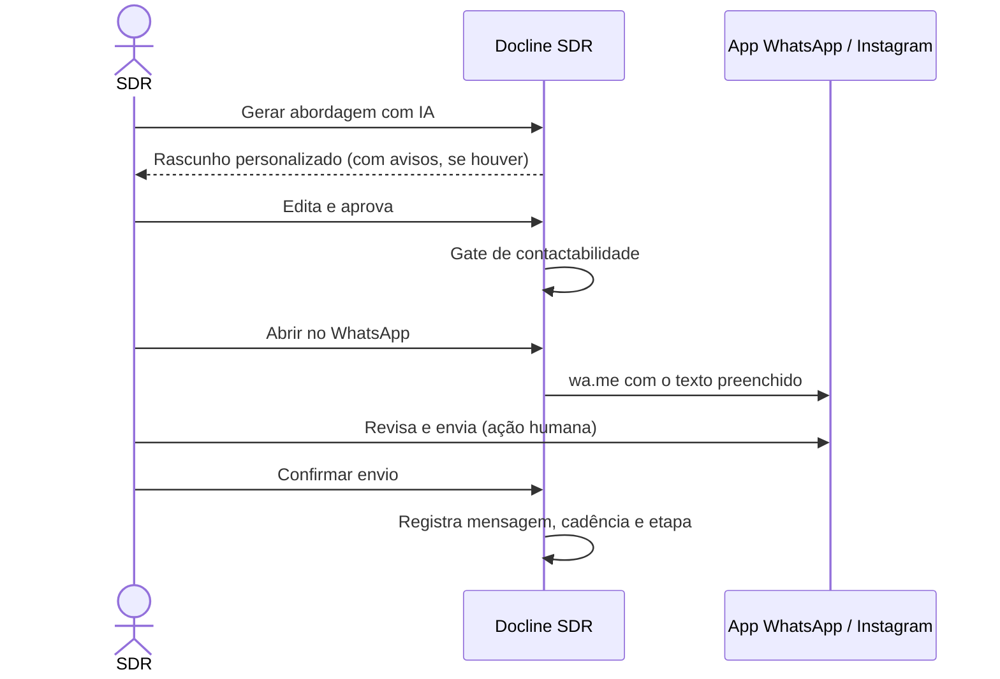

# MVP — Docline SDR

> **Status:** Fase 0 (escopo proposto para aprovação) · O MVP corresponde às **Fases 1 a 6** do [ROADMAP](./ROADMAP.md).

## Sumário

1. [Objetivo](#1-objetivo)
2. [Hipóteses a validar](#2-hipóteses-a-validar)
3. [Ajustes em relação à sugestão original](#3-ajustes-em-relação-à-sugestão-original)
4. [Escopo incluído](#4-escopo-incluído)
5. [Fora do escopo do MVP](#5-fora-do-escopo-do-mvp)
6. [Como o contato funciona no MVP (modo assistido)](#6-como-o-contato-funciona-no-mvp-modo-assistido)
7. [Telas do MVP](#7-telas-do-mvp)
8. [Requisitos não funcionais](#8-requisitos-não-funcionais)
9. [Métricas de sucesso](#9-métricas-de-sucesso)
10. [Definição de pronto](#10-definição-de-pronto)
11. [Critérios de lançamento (go-live do piloto)](#11-critérios-de-lançamento-go-live-do-piloto)

---

## 1. Objetivo

Colocar nas mãos de um pequeno grupo de SDRs uma ferramenta que **substitua a planilha + WhatsApp Web** na prospecção de escritórios de contabilidade, com:

- base de leads limpa (normalizada e sem duplicados);
- rotina diária guiada (fila, cadência, follow-up);
- mensagens personalizadas pela IA e aprovadas por humanos;
- conformidade LGPD desde o primeiro contato;
- números confiáveis sobre o que funciona.

O MVP **não** envia mensagens automaticamente. Ele prepara, registra e organiza o contato que o humano faz.

---

## 2. Hipóteses a validar

| # | Hipótese | Como medir |
|---|---|---|
| H1 | SDRs preparam um primeiro contato personalizado em menos de 1 minuto com a IA | Tempo entre abrir o lead e confirmar o envio |
| H2 | Mensagens personalizadas pela IA têm taxa de resposta maior que a abordagem atual | Taxa de resposta por abordagem × linha de base informada pela Docline |
| H3 | A cadência estruturada reduz leads esquecidos | % de leads em etapa aberta sem atividade há mais de 7 dias |
| H4 | A base importada tem duplicidade relevante, e a deduplicação reduz retrabalho | Pares detectados e mesclados por importação |
| H5 | O modo assistido é aceito pela equipe enquanto a API não chega | Adoção: % de contatos registrados no sistema |

---

## 3. Ajustes em relação à sugestão original

A sugestão de MVP (§31) foi mantida. Foram **adicionados** itens que os próprios requisitos exigem "desde a primeira versão" (§25) ou sem os quais o MVP não se sustenta:

| Adição | Motivo |
|---|---|
| **Lista Não Contatar, opt-out e base legal por lead/canal** | §25 exige desde a 1ª versão; risco legal e de reputação se faltar |
| **Auditoria de alterações e controle de acesso por perfil** | §4 (histórico completo), §23, §25 |
| **Modo assistido de contato (WhatsApp/Instagram)** | Sem ele, a IA gera mensagens que não chegam a lugar nenhum. Permite operar antes da API oficial |
| **Registro manual de respostas** | Necessário para parar a cadência e medir resposta antes dos webhooks |
| **Transferência ao Comercial (básica)** | Fecha o ciclo SDR → oportunidade, sem o qual não há "conversão" para medir |

---

## 4. Escopo incluído

Prioridade: **MUST** (sem isso não lança) · **SHOULD** (forte desejo, cortável se atrasar).

### M01 — Autenticação, perfis e equipe · MUST

- Login com e-mail e senha; redefinição de senha por e-mail; sessão segura.
- Sem cadastro público: **ADMIN convida** usuários e define o perfil (Administrador, Gestor, SDR, Comercial).
- Desativar usuário revoga sessões.
- Permissões aplicadas no servidor ([SECURITY §4](./SECURITY.md#4-autorização-rbac)).
- *SHOULD:* 2FA (TOTP) para ADMIN e GESTOR.

**Aceite:** um SDR não consegue ler, por URL ou API, um lead atribuído a outro SDR; a tentativa gera registro na auditoria.

### M02 — Cadastro e gestão de leads · MUST

- Criar/editar lead com os campos do §4 (empresa, fantasia, responsável, telefones, WhatsApp, Instagram, e-mail, site, endereço, cidade, UF, CEP, CNPJ, origem, URL da origem, data de entrada, categoria, observações, responsável comercial, etapa, tags).
- Múltiplas pessoas e múltiplos pontos de contato por lead.
- **Origem obrigatória**, com data da coleta e base legal (com padrão por origem).
- Verificação de duplicidade **antes de salvar** (exibe possíveis existentes).
- Observações (notas) com autor e data; tags; responsável.
- Histórico de alterações de campos (quem, quando, antes → depois).
- Arquivar (nunca excluir).

**Aceite:** ao digitar `(88) 99999-9999` em um lead novo quando outro lead já tem `+55 88 99999-9999`, o sistema avisa antes de salvar.

### M03 — Lista, filtros e ações em massa · MUST

- Grade com colunas configuráveis, ordenação, busca por nome/CNPJ/telefone.
- Filtros combináveis (§20): UF, cidade, segmento, possui WhatsApp/Instagram/site, etapa, origem, faixa e intervalo de score, responsável, tags, contactabilidade, datas.
- **Contagem antes de executar qualquer ação em massa**, com quebra "contactáveis × bloqueados".
- Ações em massa: atribuir responsável, adicionar/remover tag, mover etapa, inscrever em cadência.
- Visões salvas (pessoais e compartilhadas).

**Aceite:** ação em massa sobre um filtro mostra "250 leads selecionados · 231 contactáveis · 19 bloqueados" e exige confirmação.

### M04 — Importação CSV/XLSX · MUST

- Upload (limite padrão 10 MB / 50 mil linhas), seleção de aba e linha de cabeçalho.
- Detecção de codificação (UTF-8 / Windows-1252) e delimitador (`;`, `,`, tab).
- **Mapeamento coluna → campo** com sugestão automática por similaridade de nome ("Telefone comercial" → telefone; "Nome Escritório" → empresa; "Município" → cidade) e modelos reutilizáveis.
- Colunas não mapeadas podem ir para campos extras (`custom_fields`) ou ser ignoradas.
- Definição do lote: origem, data da coleta, base legal, responsável padrão, tags e política de duplicados (criar e sinalizar / pular / completar campos vazios do existente).
- **Prévia** antes de gravar: valores normalizados, erros e avisos por linha, status (novo, já existe, possível duplicado, duplicado no próprio arquivo, na Lista Não Contatar, inválido), com decisão por linha.
- Processamento assíncrono com progresso e **relatório final** (criados, atualizados, ignorados, erros, duplicados sinalizados, suprimidos).

**Aceite:** importar a mesma planilha duas vezes não cria leads duplicados; o sistema avisa que o arquivo já foi importado.

### M05 — Normalização · MUST

Telefone/DDD/WhatsApp (E.164, celular × fixo, 9º dígito), CNPJ (numérico e **alfanumérico**, com validação de DV), nomes (espaços, capitalização, siglas), cidade e UF (casamento com o cadastro do IBGE), Instagram (URL/`@` → handle), URL (esquema, domínio, parâmetros de rastreio), e-mail (minúsculo, sintaxe, provedor gratuito). Regras em [ARCHITECTURE §12.2](./ARCHITECTURE.md#122-suítes-obrigatórias-requisito-35).

**Aceite:** `(88) 99999-9999`, `88999999999` e `+55 88 99999-9999` resultam no mesmo valor normalizado.

### M06 — Deduplicação · MUST

- Detecção ao criar/importar/editar e varredura diária.
- Sinais: CNPJ, telefone, e-mail, Instagram, nome+cidade, similaridade de nome (sem termos genéricos).
- Tela **Possíveis duplicados**: comparação lado a lado, motivos e confiança; ações **Mesclar** (escolhendo campo a campo), **Manter separados**, **Ignorar**.
- Mesclagem preserva tudo (contatos, eventos, tarefas, mensagens, origens) e guarda cópia do registro mesclado.
- Toda decisão vai para a auditoria. **Nenhuma exclusão automática.**

**Aceite:** decidir "Manter separados" impede que o mesmo par volte à fila.

### M07 — Lead scoring · MUST (configuração por tela: SHOULD)

- Modelo inicial do §10 (via seed), com regras em banco e explicação por critério no lead.
- Faixas Frio/Morno/Quente/Prioridade configuráveis.
- Recalculo automático quando um critério muda.
- *SHOULD:* tela para o ADMIN ajustar pesos, simular o impacto e ativar nova versão.

### M08 — Pipeline Kanban · MUST

17 etapas iniciais, arrastar e soltar, contagem por coluna, filtros, motivo de perda obrigatório, histórico com duração por etapa, configuração de nomes/ordem/cores pelo ADMIN. Regras em [SDR-FLOW §3](./SDR-FLOW.md#3-pipeline-kanban).

### M09 — Timeline do lead · MUST

Todos os eventos em ordem cronológica, com ator, filtros por tipo e paginação (§12).

### M10 — Minha Fila SDR · MUST

Seções e ordenação de [SDR-FLOW §5](./SDR-FLOW.md#5-minha-fila-sdr), com ações rápidas em cada item.

### M11 — Follow-ups e cadência · MUST

Cadência padrão D0/D2/D5/D10 → Sem resposta, configurável pelo ADMIN; tarefas geradas automaticamente; **parada automática** ao registrar resposta ou opt-out; follow-up avulso agendável.

### M12 — IA de prospecção · MUST

Botão **Gerar abordagem com IA** → **Editar** → **Aprovar** → **Enviar** (assistido). Os 8 tipos de mensagem do §17. Guardrails, registro da versão gerada e da enviada ([AI-SDR](./AI-SDR.md)). *SHOULD:* sugestão de classificação da resposta.

### M13 — Registro de contatos e respostas · MUST

"Abrir no WhatsApp" (`wa.me` com texto), "Copiar e abrir Instagram", "Ligar" (`tel:`), confirmar envio, registrar ligação/reunião, registrar resposta recebida (colar texto) com classificação.

### M14 — Conformidade · MUST

Lista Não Contatar (por telefone, e-mail, Instagram, CNPJ), opt-out em 1 clique, detecção de palavras de opt-out nas respostas registradas, base legal e opt-in por canal, gate de contactabilidade em todas as ações, auditoria, registro de solicitações de titulares, anonimização por ADMIN.

### M15 — Transferência ao Comercial · MUST

Checklist de qualificação, criação de oportunidade, notificação do comercial, marcação de ganho/perda ([SDR-FLOW §8](./SDR-FLOW.md#8-qualificação-e-transferência-ao-comercial)).

### M16 — Dashboard e relatórios básicos · MUST

- KPIs do §22: total de leads, novos, contatados, respostas, taxa de resposta, interessados, oportunidades, conversões, taxa de conversão (período selecionável).
- Funil por etapa; leads por cidade e por origem; desempenho por SDR; evolução diária.
- Exportação CSV dos relatórios (ADMIN/GESTOR, auditada).

### M17 — Dados de desenvolvimento · MUST

Seed com empresas fictícias, incluindo duplicados propositais e formatos variados ([DATABASE §8.4](./DATABASE.md#84-demais-seeds)).

---

## 5. Fora do escopo do MVP

| Item | Fase prevista | Preparação feita no MVP |
|---|---|---|
| Envio via WhatsApp Cloud API, webhooks de status | 7 | Porta `MessagingProvider`, tabelas `messages`/`conversations`, opt-in no modelo |
| Instagram API (DMs recebidas, comentários, Business Discovery) | 8 | Porta `SocialProfileProvider`, modo assistido |
| Busca no Google Places / dados abertos CNPJ | 9 | Porta `PlaceSearchProvider`/`CompanyRegistryProvider`, origem `GOOGLE`/`RECEITA_OPEN_DATA` |
| Campanhas completas (elegibilidade, metas, limites) | 10 | Filtros salvos, ações em massa, `campaign_id` nas mensagens |
| Analytics avançado (conversão por abordagem/campanha, mensal, mapas) | 11 | Eventos e atribuição completos desde o MVP |
| Distribuição automática (round-robin, território, disponibilidade) | Futura | `lead_assignments`, interface `AssignmentStrategy` |
| Integrações CRM/Gestão AR/Gestão 360, Calendar, Gmail, telefonia | 12 | `external_references`, portas |
| E-mail como canal de prospecção | Futura | Tipo `EMAIL` em pontos de contato e canais |
| Insights automáticos da IA sobre a carteira | 11+ | Modelo de dados ([DATABASE §9](./DATABASE.md#9-preparação-para-inteligência-comercial)) |
| App nativo / modo offline | Futura | UI responsiva |

---

## 6. Como o contato funciona no MVP (modo assistido)

- O sistema **nunca** envia sozinho no MVP e não usa automação não oficial de WhatsApp/Instagram.
- Limites diários por SDR e intervalo mínimo entre contatos ao mesmo lead são configuráveis ([SDR-FLOW §6](./SDR-FLOW.md#6-contato-pelos-canais)).
- A conta de WhatsApp usada pelo SDR deve ser a corporativa da Docline (não pessoal), sujeita aos termos do WhatsApp.

---

## 7. Telas do MVP

| Tela (menu §29) | Conteúdo essencial | Celular |
|---|---|---|
| **Dashboard** | KPIs, funil, por cidade/origem/SDR, evolução diária | Leitura |
| **Minha Fila** | Seções priorizadas com ações rápidas | ✅ Completo |
| **Leads** | Grade, filtros, contagem, ações em massa, visões salvas | Busca e lista |
| **Lead (detalhe)** | Cabeçalho (nome, etapa, score, selos), contatos com ações (ligar, WhatsApp), timeline, notas, tarefas, mensagens, IA | ✅ Ver lead, adicionar observação, alterar etapa, ver telefone, registrar contato, agendar follow-up |
| **Pipeline** | Kanban com filtros | Lista por etapa |
| **Importar** | Assistente: upload → mapeamento → prévia → confirmação → relatório | — |
| **Duplicados** | Fila de pares, comparação lado a lado, decisões | — |
| **Mensagens** | Mensagens recentes, pendentes de confirmação, respostas sem classificação | Leitura |
| **Relatórios** | Relatórios básicos com exportação | — |
| **Equipe** | Usuários, perfis, convites | — |
| **Configurações** | Pipeline, score, cadência, tags, origens, motivos, horários, palavras de opt-out, Lista Não Contatar | — |
| **Campanhas, Prospecção, Integrações** | Visíveis no menu como "Em breve" ou ocultas por perfil | — |

Diretrizes de interface: poucas informações por tela, ações principais sempre visíveis, atalhos de teclado, estados vazios que ensinam o próximo passo, tema claro/escuro.

---

## 8. Requisitos não funcionais

| Requisito | Meta |
|---|---|
| Desempenho | p95 < 300 ms em ações comuns; lista filtrada < 800 ms com 100 mil leads (teste com seed volumoso) |
| Importação | 10 mil linhas: prévia < 1 min, confirmação < 2 min |
| IA | Geração de rascunho < 15 s (p95), com indicador de progresso |
| Disponibilidade | Horário comercial; backups diários; restauração testada |
| Segurança | Itens MUST do [SECURITY §18](./SECURITY.md#18-checklist-por-fase) |
| LGPD | Itens do [LGPD §19](./LGPD.md#19-checklist-por-fase) para o MVP |
| Responsividade | Fluxos móveis da tabela acima funcionando em telas de 360 px |
| Acessibilidade | Navegação por teclado, contraste AA nas telas principais |

---

## 9. Métricas de sucesso

Medidas no piloto (4 semanas após o go-live):

| Métrica | Meta |
|---|---|
| Adoção | ≥ 90% dos contatos de prospecção registrados no sistema |
| Tempo para preparar o 1º contato | Mediana < 60 s |
| Aproveitamento da IA | ≥ 60% dos rascunhos aprovados com edição leve (≤ 30% de alteração) |
| Conformidade | **0** contatos a identificadores na Lista Não Contatar |
| Follow-ups em atraso | < 10% das tarefas abertas |
| Leads esquecidos | < 5% dos leads em etapas abertas |
| Duplicidade após importação | < 2% de pares pendentes não revisados após 1 semana |

---

## 10. Definição de pronto

Uma história só está pronta quando:

1. Atende aos critérios de aceite.
2. Tem testes automatizados (unitário e/ou integração; E2E nas jornadas críticas).
3. Lint, typecheck e testes passam no CI.
4. Permissões verificadas no servidor e cobertas por teste.
5. Emite eventos de timeline e auditoria quando altera dados.
6. Funciona no celular, quando a tela está na lista de fluxos móveis.
7. Documentação atualizada (este diretório `docs/` e o changelog).
8. Revisada em PR pequeno e focado.

---

## 11. Critérios de lançamento (go-live do piloto)

- [ ] Todas as histórias MUST concluídas e testadas em staging com seed fictício.
- [ ] Teste de aceitação com 1–2 SDRs e o gestor (UAT).
- [ ] Validação jurídica: LIA, textos de primeira abordagem, política de retenção, aviso de privacidade ([LGPD §20](./LGPD.md#20-itens-para-validação-jurídica)).
- [ ] Decisão de hospedagem e transferência internacional resolvida.
- [ ] Importação da base real feita em produção, com revisão de duplicados.
- [ ] Backup e restauração testados.
- [ ] Monitoramento de erros (Sentry) e alertas de jobs ativos.
- [ ] Treinamento da equipe (30–60 min) e guia rápido.
- [ ] Plano de rollback (voltar à planilha) documentado.
