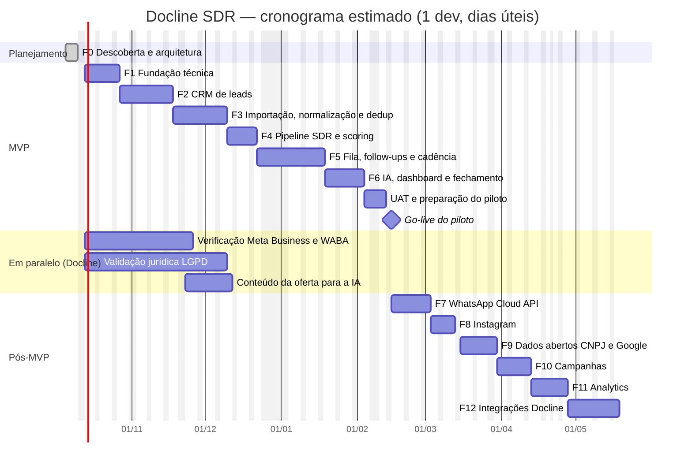

# Roadmap, Backlog, Riscos e Cronograma — Docline SDR

> **Status:** Fases 1 a 10 concluídas no código (MVP; WhatsApp, Instagram e base aberta do CNPJ desligados por padrão em produção; Campanhas sem envio) · próximo: UAT e go-live do piloto ([GO-LIVE](./GO-LIVE.md)), as ativações que dependem da Meta e do jurídico ([INTEGRATIONS §16](./INTEGRATIONS.md#16-checklist-de-ativação-de-uma-integração)) e a Fase 11 · **Última revisão:** 2026-10-10
> Relacionados: [MVP](./MVP.md) · [ARCHITECTURE](./ARCHITECTURE.md) · [README](../README.md)

## Sumário

1. [Visão geral das fases](#1-visão-geral-das-fases)
2. [Premissas do cronograma](#2-premissas-do-cronograma)
3. [Cronograma técnico](#3-cronograma-técnico)
4. [Marcos e pontos de decisão](#4-marcos-e-pontos-de-decisão)
5. [Detalhamento por fase e backlog](#5-detalhamento-por-fase-e-backlog)
6. [Registro de riscos](#6-registro-de-riscos)
7. [Dependências](#7-dependências)
8. [Forma de trabalho](#8-forma-de-trabalho)

---

## 1. Visão geral das fases

| Fase | Nome | Objetivo | Duração estimada* | Bloco |
|---|---|---|---|---|
| 0 | Descoberta e arquitetura | Requisitos, riscos, arquitetura, modelo de dados, plano | ✅ concluída | Planejamento |
| 1 | Fundação técnica | Monorepo, banco, auth, RBAC, auditoria, fila, layout, CI, staging | ✅ concluída (2026-10-08) | MVP |
| 2 | CRM de leads | Cadastro, pessoas, contatos, lista e filtros, timeline, base de conformidade | ✅ concluída (2026-10-09) | MVP |
| 3 | Importação, normalização e deduplicação | Planilhas com prévia, normalização completa, motor e tela de duplicados | ✅ concluída (2026-10-09) | MVP |
| 4 | Pipeline SDR | Kanban, histórico de etapas, lead scoring configurável | ✅ concluída (2026-10-09) | MVP |
| 5 | Fila e follow-ups | Tarefas, cadência, Minha Fila, gate de contactabilidade, contato assistido, transferência | ✅ concluída (2026-10-09) | MVP |
| 6 | IA de prospecção | Gerar/editar/aprovar/enviar, guardrails, avaliação; dashboard e relatórios básicos; UAT | ✅ concluída no código (2026-10-09); UAT e go-live com a Docline | MVP |
| 7 | Integração WhatsApp | Cloud API para leads com opt-in, webhooks, status, janela de atendimento | ✅ concluída no código (2026-10-09); ativação depende da Meta e do jurídico | Canais |
| 8 | Instagram | DMs recebidas, comentários, enriquecimento (Business Discovery) | ✅ concluída no código (2026-10-09); ativação depende do App Review da Meta e do jurídico | Canais |
| 9 | Google / API de prospecção | Dados abertos CNPJ, tela de prospecção, Google Places (se aprovado) | ✅ concluída no código (2026-10-10), sem o Google Places (aguarda parecer); ativação depende do jurídico | Captação |
| 10 | Campanhas | Seleção, elegibilidade, limites, métricas, A/B | ✅ concluída no código (2026-10-10); a campanha não envia, libera para a cadência | Escala |
| 11 | Analytics | Rollups, conversões por dimensão, insights, distribuição automática | ~2 semanas | Inteligência |
| 12 | Integrações Docline | API com chaves, webhooks de saída, CRM, Lista Não Contatar compartilhada | ~3 semanas (depende das APIs) | Ecossistema |

\* Em semanas de trabalho de 1 desenvolvedor full-stack sênior. Ver premissas.

---

## 2. Premissas do cronograma

1. **1 desenvolvedor full-stack sênior** dedicado, com desenvolvimento assistido por IA.
2. Um **responsável de negócio da Docline** disponível para validações semanais (30–60 min) e decisões das [questões em aberto](./ARCHITECTURE.md#16-questões-em-aberto).
3. Estimativas em **dias úteis**, com margem de incerteza de **±25%**. Feriados nacionais e recesso de fim de ano considerados.
4. Prazos externos (Meta, App Review, jurídico) correm **em paralelo** e não estão nas durações das fases; viram bloqueios se não forem iniciados a tempo ([§7](#7-dependências)).
5. Tamanhos do backlog: **P** ≈ meio dia · **M** ≈ 1 dia · **G** ≈ 2–3 dias.
6. Com **2 desenvolvedores**, o MVP tende a cair para ~10–11 semanas (paralelismo não é linear).

---

## 3. Cronograma técnico

Início considerado: **13/10/2026** (12/10 é feriado nacional).

Leitura aproximada:

| Marco | Data estimada |
|---|---|
| Staging com login, RBAC e layout (fim da F1) | fim de outubro/2026 |
| Base importada e deduplicada em staging (fim da F3) | início de dezembro/2026 |
| MVP completo em staging (fim da F6) | início de fevereiro/2027 |
| **Go-live do piloto** | **meados de fevereiro/2027** |
| WhatsApp API em produção (F7) | início de março/2027, se a Meta tiver aprovado |
| Fases 8–12 concluídas | maio/2027 |

---

## 4. Marcos e pontos de decisão

| Marco | Critério | Decisão |
|---|---|---|
| **M0 — Aprovação da Fase 0** | Documentos revisados | Seguir para a Fase 1; responder questões em aberto prioritárias |
| **M1 — Fundação pronta** | Staging no ar, login, RBAC testado, CI verde | — |
| **M2 — Base confiável** | Importação + dedup funcionando com dados fictícios | Liberar importação da base real (após validação jurídica da origem) |
| **M3 — MVP completo** | Histórias MUST concluídas, E2E verde, desempenho com 100 mil leads | Iniciar UAT |
| **M4 — Go-live do piloto** | [Critérios de lançamento](./MVP.md#11-critérios-de-lançamento-go-live-do-piloto) | Piloto de 4 semanas com métricas do [MVP §9](./MVP.md#9-métricas-de-sucesso) |
| **M5 — Go/no-go WhatsApp API** | Meta aprovada, templates aprovados, opt-in definido, parecer jurídico | Ativar `meta_cloud` |
| **M5b — Go/no-go Instagram API** | App Review aprovado, acesso às mensagens liberado na conta, parecer jurídico (item 12 da LGPD §20) | Ativar `meta_graph`; depois de uma semana, decidir o critério "Instagram ativo" |
| **M6 — Go/no-go prospecção automatizada de fontes** | Parecer sobre dados abertos CNPJ e Google Places | Ativar provedores da Fase 9 |

---

## 5. Detalhamento por fase e backlog

Prioridade: **MUST** · **SHOULD** · **COULD**. Tamanho: **P/M/G** (ver premissas).

### Fase 1 — Fundação técnica

**Entregáveis:** repositório estruturado, banco com migrações, autenticação e RBAC, auditoria, fila, layout com menu lateral, CI, staging.
**Aceite da fase:** um ADMIN convida um SDR; o SDR faz login e vê o layout; tentativas fora da permissão são negadas e auditadas; CI verde; staging no ar.

**Situação (2026-10-08):** ✅ concluída no código, com pendências registradas. O critério de aceite é coberto pela suíte E2E (`apps/web/e2e/fase1.spec.ts`) e o CI roda verde no GitHub. Pendências:

- **Staging no ar:** hospedagem decidida (Render, região Virginia — ARCHITECTURE ADR-019). `render.yaml` e imagem validados de ponta a ponta; a subida **depende da conta da Docline na Render e das credenciais de e-mail (SMTP)**.
- **F1-13 parcial:** logs pino com mascaramento entregues; o Sentry passou para F2-17, *entregue na Fase 2* (falta só o DSN da conta da Docline).
- **F1-15 (2FA):** passou para F2-16, *entregue na Fase 2*.
- **Limite de login por conta** (SECURITY §12): passou para F2-18, *entregue na Fase 2*.

Detalhes em [CHANGELOG](../CHANGELOG.md).

| ID | História / tarefa | Prior. | Tam. |
|---|---|---|---|
| F1-01 | Monorepo pnpm (`apps/web`, `apps/worker`, `packages/core`, `db`, `integrations`, `config`), TypeScript estrito, ESLint/Prettier, regras de fronteira entre módulos | MUST | M |
| F1-02 | `docker-compose` (PostgreSQL + Mailpit) e scripts de desenvolvimento | MUST | P |
| F1-03 | Prisma: schema inicial (users, teams, audit_logs, app_settings, states, municipalities), extensões `pg_trgm`/`unaccent` | MUST | M |
| F1-04 | Validação de variáveis de ambiente (Zod) alinhada ao `.env.example` | MUST | P |
| F1-05 | Better Auth: login, convite, redefinição de senha, sessão, rate limit | MUST | M |
| F1-06 | RBAC: matriz de permissões, `authorize()`, escopos, testes | MUST | M |
| F1-07 | Auditoria append-only (trigger) + padrão de caso de uso (autoriza → valida → persiste → evento → audita) | MUST | M |
| F1-08 | pg-boss, porta `JobQueue`, bootstrap do worker, health check | MUST | P |
| F1-09 | Layout SaaS: menu lateral (§29), tema claro/escuro, componentes base, responsivo | MUST | M |
| F1-10 | Seed de referência: UFs e municípios (IBGE), feriados nacionais | MUST | P |
| F1-11 | CI (lint, typecheck, testes, build, gitleaks, audit) | MUST | P |
| F1-12 | Staging: Dockerfiles, Render Blueprint, migrações no pre-deploy | MUST | M |
| F1-13 | Logs pino com mascaramento + Sentry — *Sentry movido para F2-17* | MUST | P |
| F1-14 | Registro de provedores + adaptadores `fake` (esqueleto) | MUST | P |
| F1-15 | 2FA (TOTP) para ADMIN/GESTOR — *movido para F2-16* | SHOULD | P |

### Fase 2 — CRM de leads

**Entregáveis:** cadastro completo de leads com pessoas e pontos de contato, lista com filtros avançados e contagem, detalhe responsivo, timeline, histórico, base de conformidade.
**Aceite:** critérios M02, M03, M09 e parte de M14 do [MVP](./MVP.md#4-escopo-incluído).

**Situação (2026-10-09):** ✅ concluída no código; as 18 histórias (F2-01 a F2-18) foram entregues.

O aceite é coberto pelas jornadas E2E `apps/web/e2e/fase2-ui.spec.ts`, `fase2-api.spec.ts` e `fase2-login.spec.ts`:

| Critério | O que a jornada comprova |
|---|---|
| M02 | O mesmo telefone em outro formato é avisado antes de salvar. |
| M03 | Busca, contagem "contactáveis × bloqueados" e ação em massa com simulação. |
| M09 | Timeline. |
| M14, parte | Opt-out em 1 clique bloqueia o WhatsApp e aparece na Lista Não Contatar. |

Decisões e pendências:

- **Exportação síncrona** (sem arquivo guardado no servidor), em vez de job assíncrono: ARCHITECTURE §9.2.
- **2FA:** disponível para todos, com lembrete para ADMIN/GESTOR. Bloquear o acesso sem 2FA fica para antes da Fase 7. *(Entregue na 0.7.1, logo depois da Fase 7: sem 2FA, ADMIN/GESTOR só acessam "Minha conta".)*
- **Sentry:** pronto; falta o DSN da conta da Docline.
- **Staging:** continua dependendo da conta da Docline na Render.

Detalhes em [CHANGELOG](../CHANGELOG.md).

| ID | História / tarefa | Prior. | Tam. |
|---|---|---|---|
| F2-01 | Modelo: leads, lead_people, contact_points, lead_origins, tags, notes, segments, lead_sources | MUST | M |
| F2-02 | Normalização básica no cadastro (telefone, e-mail, CNPJ); a completa vem na F3 | MUST | M |
| F2-03 | Cadastro/edição de lead com pessoas e pontos de contato; origem, coleta e base legal obrigatórias | MUST | G |
| F2-04 | Verificação de duplicidade exata antes de salvar | MUST | M |
| F2-05 | Detalhe do lead (cabeçalho, contatos com `tel:`/`wa.me`, notas, tags, selos) responsivo | MUST | G |
| F2-06 | Timeline (`lead_events`) e histórico de alterações (auditoria filtrada) | MUST | M |
| F2-07 | Lista com DSL de filtros, ordenação, cursor e busca | MUST | G |
| F2-08 | Contagem prévia + ações em massa (atribuir, tags) com `dryRun` | MUST | M |
| F2-09 | Visões salvas | SHOULD | P |
| F2-10 | Atribuição manual + histórico de responsáveis | MUST | P |
| F2-11 | Conformidade base: permissões por canal, Lista Não Contatar (HMAC), opt-out, selo "Não contatar" | MUST | M |
| F2-12 | Arquivar lead; anonimizar (ADMIN) | MUST | M |
| F2-13 | Seed de desenvolvimento com ~2.000 empresas fictícias | MUST | P |
| F2-14 | Exportação auditada (ADMIN/GESTOR) com proteção contra CSV injection | SHOULD | P |
| F2-15 | Registro manual de solicitações de titulares | SHOULD | P |
| F2-16 | 2FA (TOTP) para ADMIN/GESTOR (vindo da F1-15; obrigatório antes das Fases 7–9) | SHOULD | P |
| F2-17 | Sentry: erros do servidor web e do worker, sem dados pessoais (vindo da F1-13; precisa da conta/DSN da Docline) | MUST | P |
| F2-18 | Limite de tentativas de login por conta (SECURITY §12), sem permitir bloqueio proposital de terceiros | MUST | P |

### Fase 3 — Importação, normalização e deduplicação

**Entregáveis:** assistente de importação completo, biblioteca de normalização, motor e tela de duplicados.
**Aceite:** critérios M04, M05 e M06 do MVP; suítes de teste de telefone, CNPJ, deduplicação e importação ([ARCHITECTURE §12.2](./ARCHITECTURE.md#122-suítes-obrigatórias-requisito-35)).

**Situação (2026-10-09):** ✅ concluída no código; as 13 histórias (F3-01 a F3-13) foram entregues.

O aceite é coberto pela jornada E2E `apps/web/e2e/fase3.spec.ts`, que roda com o worker de verdade, e pelas suítes de integração `import.int.test.ts` e `dedup.int.test.ts`:

| Critério | O que a jornada comprova |
|---|---|
| M04 | Planilha com título acima do cabeçalho: mapeamento sugerido, prévia, gravação e relatório. Reimportar o mesmo arquivo avisa e não cria leads. |
| M05 | `(88) 99812-3401`, `88998123401` e `+55 88 99812-3401` são o mesmo contato. A prévia marca as repetições no próprio arquivo. |
| M06 | "Manter separados" não volta à fila, nem depois da varredura completa. Mesclar com o nome do outro lead reúne tudo; o lead mesclado continua para consulta. |

As suítes do ARCHITECTURE §12.2 (telefone, CNPJ, deduplicação e importação) estão em testes unitários, de propriedade e de integração.

Decisões e pendências:

- **Leitor de XLSX próprio** (fflate + saxes), em vez do ExcelJS: ADR-020.
- **Arquivo enviado** fica em `import_files` só até o worker ler, sem *object storage*; é apagado na mesma transação.
- **Duplicados na importação:** a busca roda na própria linha (e não pelo job `dedup.check-lead`), para o relatório contar os sinalizados.
- **Sinais:** valor repetido em mais de 20 leads não conta (ex.: telefone de associação). "Ignorar" volta à fila só com uma regra nova.
- **Modelos de mapeamento:** salvos na configuração do lote e sugeridos pelo cabeçalho. Não há tela nem rota própria (`/import-mapping-templates`).
- **`POST /normalize/preview`:** não implementada; a prévia da importação já mostra os valores normalizados.
- **Outra aba do XLSX:** pede o arquivo de novo, porque o original é descartado depois da leitura.
- **Staging:** continua dependendo da conta da Docline na Render.

Detalhes em [CHANGELOG](../CHANGELOG.md).

| ID | História / tarefa | Prior. | Tam. |
|---|---|---|---|
| F3-01 | Normalização completa (telefone BR + variantes `wa_id`, CNPJ alfanumérico, nomes, cidades IBGE, UF, Instagram, URL, e-mail, CEP) + testes de propriedade | MUST | G |
| F3-02 | Upload seguro + detecção de codificação, delimitador, aba e cabeçalho | MUST | M |
| F3-03 | Mapeamento coluna → campo com sugestão automática e modelos reutilizáveis | MUST | M |
| F3-04 | Configuração do lote (origem, coleta, base legal, responsável, tags, política de duplicados) | MUST | P |
| F3-05 | Prévia (`import.preview`): normalização, validação, casamento com base, arquivo e Lista Não Contatar | MUST | G |
| F3-06 | Decisão por linha, confirmação (`import.commit` em lotes) e relatório | MUST | M |
| F3-07 | Detecção de reimportação (hash do arquivo) | SHOULD | P |
| F3-08 | Motor de deduplicação: sinais, pesos, *blocking*, `pg_trgm` em `name_core` | MUST | G |
| F3-09 | Tela Possíveis Duplicados (lado a lado, motivos, confiança) | MUST | M |
| F3-10 | Mesclagem campo a campo com snapshot, movimentação de filhos e auditoria | MUST | G |
| F3-11 | Manter separados / Ignorar, com auditoria | MUST | P |
| F3-12 | Varredura diária (`dedup.scan`) | MUST | P |
| F3-13 | Retenção: purga automática de `import_rows` | MUST | P |

### Fase 4 — Pipeline SDR

**Entregáveis:** Kanban configurável, histórico de etapas, lead scoring explicável.
**Aceite:** critérios M07 e M08; suítes de pipeline e score.

**Situação (2026-10-09):** ✅ concluída no código; as 8 histórias (F4-01 a F4-08) foram entregues.

O aceite é coberto pela jornada E2E `apps/web/e2e/fase4.spec.ts`, que roda com o worker de verdade, e pelas suítes `pipeline.int.test.ts`, `scoring.int.test.ts`, `transitions.test.ts` e `scoring.test.ts`:

| Critério | O que a jornada comprova |
|---|---|
| M08 | O lead entra em "Novo"; arrastar entre etapas grava o histórico. Se outra pessoa alterou o lead, o movimento é recusado e o card volta. "Primeiro contato" não aparece como destino manual. Perda pede o motivo. A ficha mostra as três passagens com a duração. |
| M07 | A ficha explica o score por critério. Incluir a cidade nas prioritárias recalcula no worker (20 → 35, Frio → Morno), e o histórico mostra o motivo. Um rascunho com peso novo é simulado e ativado, e a base é recalculada (35 → 65). |
| F4-04 | No celular, o quadro vira uma lista por etapa, com o botão de mover. |

As suítes do ARCHITECTURE §12.2 cobrem o pipeline (transições, motivo obrigatório, histórico com duração, conflito de versão) e o score (soma, teto `CLAMP`, `SCALE`, faixas, regra inativa, pontos negativos, versão do modelo, explicação).

Decisões e pendências:

- **"Primeiro contato" nunca é manual**, nem para gestor: o lead entra nessa etapa ao registrar o contato (Fase 5), depois do gate de contactabilidade.
- **"Convertido"** é marcado por gestor ou administrador até existir oportunidade ganha (Fases 5–6). As etapas de cadência, "Respondeu" e "Oportunidade" também são movidas à mão só por eles, como correção auditada (`override`).
- **Motivo "Pediu para não ser contatado"** inclui o lead na Lista Não Contatar na mesma transação (LGPD). A tela avisa antes de mover.
- **Barra de desfechos:** durante o arraste, as etapas de perda e de conversão aparecem numa barra fixa, porque ficam no fim de um quadro com 17 colunas.
- **Quadro por `POST`**, com a mesma seleção da lista de leads (DSL e busca).
- **Colunas de etapa aceitam nulo** no banco. O seed e a subida do worker põem em "Novo" os leads sem etapa, e o worker calcula o score de quem ainda não tem.
- **Primeiro cálculo do score** vai só para o histórico do score, sem evento na timeline.
- **Critérios sem dado ainda:** "Já respondeu" e "Mostrou interesse" pontuam a partir da Fase 5; "Instagram ativo" fica inativo até a Fase 8; avaliações do Google, até a validação jurídica.
- **Simulação** roda na transação do pedido, o que basta na escala do MVP; com bases grandes, vira job.
- **Próximo passo no card** (SDR-FLOW §3.3) depende das tarefas da Fase 5.
- **Staging:** continua dependendo da conta da Docline na Render.

Detalhes em [CHANGELOG](../CHANGELOG.md).

| ID | História / tarefa | Prior. | Tam. |
|---|---|---|---|
| F4-01 | Pipelines e etapas (seed das 17), configuração de etapas pelo ADMIN | MUST | M |
| F4-02 | Kanban: contagem por coluna, cards paginados, arrastar e soltar, filtros, lock otimista | MUST | G |
| F4-03 | Regras de transição, motivo de perda, histórico com duração | MUST | M |
| F4-04 | Pipeline no celular (lista por etapa) | MUST | P |
| F4-05 | Motor de score: registro de critérios, modelo versionado, `CLAMP`/`SCALE`, faixas | MUST | M |
| F4-06 | Recalculo por evento e em massa; histórico; explicação na ficha | MUST | M |
| F4-07 | Tela de pesos com simulação e ativação de versão | SHOULD | M |
| F4-08 | Cadastro de cidades prioritárias | MUST | P |

### Fase 5 — Fila e follow-ups

**Entregáveis:** tarefas, cadência configurável, Minha Fila, gate de contactabilidade, contato assistido, respostas, transferência ao Comercial.
**Aceite:** critérios M10, M11, M13, M14 e M15; suítes de cadência e opt-out.

**Situação (2026-10-09):** ✅ concluída no código; as 13 histórias (F5-01 a F5-13) foram entregues.

O aceite é coberto pela jornada E2E `apps/web/e2e/fase5.spec.ts` e pelas suítes `cadence.int.test.ts`, `messaging.int.test.ts`, `tasks.int.test.ts`, `operations.int.test.ts` (oportunidades, fila e jobs), `schedule.test.ts`, `calendar.test.ts`, `opt-out.test.ts`, `contact-timing.test.ts` e `queue.test.ts`:

| Critério | O que a jornada comprova |
|---|---|
| M11 | Inscrever o lead na cadência padrão cria a tarefa do primeiro passo e leva o lead a "Aguardando prospecção". Depois do envio, o "Follow-up 1" fica agendado. Um follow-up avulso é criado e reagendado. |
| M10 | O passo aparece na Minha Fila com a ação "Contatar" e sai dela depois do envio confirmado. A oportunidade aparece para o comercial com "Aceitar". |
| M13 | O diálogo mostra o contato liberado pelo gate. "Abrir no WhatsApp" leva a `wa.me` com o texto, e só a confirmação registra o envio, avança a etapa e grava a timeline. |
| M14 | A resposta "Sair" é avisada já ao digitar. Ao registrar, o lead entra na Lista Não Contatar, vai a "Sem interesse", a cadência termina com o motivo "Opt-out" e o WhatsApp fica bloqueado. A tela Mensagens e a Conformidade mostram o registro. |
| M15 | Sem o checklist, a transferência é recusada. Com ele, o lead vai a "Oportunidade" e o comercial recebe o aviso no sino. Ele aceita pela fila e marca "Ganha (parceiro)", e o lead vai a "Convertido". |

As suítes cobrem a agenda da cadência (D0/D2/D5/D10 em dias úteis, feriado de Finados, janela e fuso do lead, "Sem resposta"), a parada automática (resposta, opt-out, mudança de etapa, arquivamento, mesclagem, contato inválido), pausa, retomada e passo pulado. Também cobrem os limites do gate (janela, intervalo e primeiros contatos por dia) e a detecção de opt-out (certa ou possível). Por fim, cobrem a fila (seções, prioridade e cada lead uma vez), os jobs de atrasados e esquecidos, a transferência e a anonimização das mensagens.

Decisões e pendências:

- **Contato assistido de ponta a ponta.** WhatsApp, Instagram e e-mail abrem um diálogo que consulta o gate e registra a mensagem como "a confirmar". O envio só conta com a confirmação; sem ela, a pendência fica na fila e em Mensagens. "Ligar" continua com `tel:`, e a ligação se registra em "Registrar contato". Nada é enviado automaticamente.
- **Os botões de WhatsApp da ficha deixaram de ser links `wa.me` diretos** (Fase 2): o contato fica registrado e a cadência avança.
- **Regras de contato** (janela, intervalo de 48 h, 40 primeiros contatos por SDR por dia, prazos da fila, palavras de opt-out) ficam em `app_settings`. Os padrões estão no código, e a tela é do ADMIN. Fim de janela "24:00" vale até o fim do dia. O limite diário conta no fuso do SDR.
- **Opt-out na resposta:** uma resposta curta com a palavra, ou uma frase de opt-out, é pedido certo. Ela vence a classificação escolhida e leva o lead à Lista Não Contatar e a "Sem interesse" com o motivo "Pediu para não ser contatado". A palavra dentro de um texto maior vira tarefa para o SDR decidir; nada é excluído ou bloqueado em caso de dúvida.
- **Resposta sem classificação** encerra a cadência (motivo "O lead respondeu") e cria a tarefa "Responder". "Ausente" pausa em vez de encerrar.
- **Prazo de resposta (SLA)** em horas corridas.
- **Inscrever na cadência** leva o lead a "Aguardando prospecção". O envio assistido cumpre o passo vencido mesmo quando a pessoa não o escolheu.
- **Editar uma cadência** sobe a versão; quem já está nela segue pela posição do passo. Reagendar um passo leva a data da inscrição junto.
- **Cadência de reativação de 90 dias** não foi implementada (SHOULD); o tipo de mensagem já existe.
- **Transferência:** o comercial pode ser alguém com perfil Comercial, Gestor ou Administrador. Ele passa a ver o lead (escopo do perfil Comercial). O SDR continua com acesso; o modo somente leitura depois da transferência fica para a Fase 6. Mesclar dois leads com oportunidades abertas é recusado.
- **Fila de outra pessoa:** gestor e administrador consultam, sem ações.
- **Avisos no app** (tabela `notifications`, sino no topo, atualizado a cada minuto): transferência recebida, aceite atrasado, tarefas atrasadas e leads esquecidos.
- **LGPD na operação:** a timeline (append-only) guarda só tipos, datas e classificações, sem títulos, resultados ou textos livres. A anonimização limpa os textos de mensagens, anotações, tarefas, checklist e avisos.
- **Fora desta fase:** modelos de mensagem e abordagens (`message_templates`) ficam para a IA da Fase 6. A prioridade é calculada na leitura da fila, sem coluna gravada.
- **E2E:** o preparo do banco abre a janela de contato o dia todo e remove os feriados, para a jornada rodar a qualquer hora. Janela, feriados e limites têm testes com relógio fixo.
- **Staging:** continua dependendo da conta da Docline na Render.

Detalhes em [CHANGELOG](../CHANGELOG.md).

| ID | História / tarefa | Prior. | Tam. |
|---|---|---|---|
| F5-01 | Tarefas: criar, reagendar, concluir com resultado | MUST | M |
| F5-02 | Atividades: registrar ligação, reunião, visita | MUST | P |
| F5-03 | Motor de cadência: calendário (dias úteis, feriados, janela, fuso do lead) | MUST | G |
| F5-04 | Inscrição, `cadence.tick`, avanço de etapas por chave, fim → Sem resposta | MUST | M |
| F5-05 | Parada automática (resposta, opt-out, mudança de etapa, arquivamento, contato inválido) | MUST | M |
| F5-06 | Configuração de cadências (ADMIN) | MUST | M |
| F5-07 | Minha Fila SDR (seções, prioridade, ações rápidas), responsiva | MUST | G |
| F5-08 | Gate de contactabilidade completo + limites de frequência e de horário | MUST | M |
| F5-09 | Contato assistido: `wa.me`, Instagram, `tel:`, confirmar envio, pendências | MUST | M |
| F5-10 | Registrar resposta recebida + palavras de opt-out + classificação manual | MUST | M |
| F5-11 | Jobs de atrasados e esquecidos + notificações no app | MUST | P |
| F5-12 | Transferência ao Comercial (checklist, oportunidade, notificação, ganho/perda) | MUST | M |
| F5-13 | Puxar leads do pool (com trava) | SHOULD | P |

### Fase 6 — IA de prospecção e fechamento do MVP

**Entregáveis:** SDR AI (geração com aprovação humana), conjunto de avaliação, dashboard e relatórios básicos, testes E2E, UAT e go-live do piloto.
**Aceite:** critérios M12 e M16 do MVP e [critérios de lançamento](./MVP.md#11-critérios-de-lançamento-go-live-do-piloto).

**Situação (2026-10-09):** ✅ concluída no código; F6-01 a F6-10 entregues. F6-11 (UAT, treinamento, importação da base real e go-live) tem o roteiro em [GO-LIVE](./GO-LIVE.md) e depende da Docline: staging na Render, validação jurídica e decisão sobre ligar a IA real.

O aceite é coberto pela jornada E2E `apps/web/e2e/fase6.spec.ts` e pelas suítes `ai-sdr.int.test.ts`, `analytics.int.test.ts`, `ai-domain.test.ts`, `eval.test.ts`, `analytics-domain.test.ts` e `anthropic.test.ts`:

| Critério | O que a jornada comprova |
|---|---|
| M12 | No contato assistido, "Gerar com IA" traz o rascunho com os avisos (contexto fraco, suposições). Um termo proibido acrescentado na edição bloqueia a aprovação até ser corrigido. O texto aprovado é o que vai no link do WhatsApp; a confirmação registra o envio e marca o rascunho como enviado, com a nota do SDR. Na resposta recebida, "Sugerir com IA" mostra a classe e a confiança, e só "Usar sugestão" classifica. |
| M16 | O dashboard mostra os indicadores do período, a evolução diária (com tabela), os funis e as quebras por cidade, origem e SDR; atalhos de período e filtro por pessoa ficam na URL; período inválido volta ao padrão com aviso. Relatórios exportam CSV (registrado na auditoria). O SDR vê só os próprios números e não acessa Relatórios. |

Decisões e pendências:

- **IA desligada por padrão** (`AI_PROVIDER=fake`): rascunhos de um modelo fixo, com aviso na tela, e nenhum dado para terceiros até a Docline decidir a transferência internacional ([LGPD §16](./LGPD.md#16-transferência-internacional)). O adaptador Anthropic está pronto e testado contra um servidor local: `claude-opus-5-5`, esforço explícito, saída estruturada, cache do prompt de sistema e *fallback* de recusa do lado do servidor.
- **A chamada à IA corre fora da transação** do banco: o pedido é registrado, o provedor responde e o resultado (ou a falha) é gravado em outra transação. Falhas contam na cota; saída fora do formato tem uma nova tentativa.
- **Guardrails:** bloqueiam a aprovação termo proibido, telefone, e-mail ou link e valor fora dos fatos aprovados; os demais são avisos (tamanho, opt-out, nome fora do contexto, mensagem genérica, texto parecido com o de outros leads). Lead na Lista Não Contatar ou sem base legal não chega à IA.
- **Aprovar prepara o contato assistido** com o texto aprovado (gate de novo); um envio ativo por rascunho, e cancelar o envio permite preparar de novo.
- **Cota diária por pessoa e orçamento mensal**, com aviso aos administradores em 80%.
- **Avaliação offline** com 400 casos fictícios e 32 respostas, na CI com o provedor falso. A primeira rodada achou formas coloquiais de opt-out que a regra determinística não pegava; elas entraram nas palavras padrão.
- **Indicadores** com definição única (SDR-FLOW §11), ao vivo, medidos com 100 mil leads (ARCHITECTURE §13). O dashboard caiu de 4,6 s para 0,5 s (30 dias) com agregação por lead e `GROUPING SETS`.
- **Pendências da Fase 5 resolvidas:** SDR só consulta o lead depois da transferência; próxima ação no card do Kanban.
- **Fora desta fase:** modelos de mensagem (`message_templates`) ficam com os modelos aprovados da Meta (Fase 7); quebras por canal e abordagem, intervalo de confiança e *rollups* diários na Fase 11; purga automática de `ai_generations` pelos prazos de retenção depois do go-live.
- **Staging:** continua dependendo da conta da Docline na Render.

Detalhes em [CHANGELOG](../CHANGELOG.md).

| ID | História / tarefa | Prior. | Tam. |
|---|---|---|---|
| F6-01 | Porta `AiProvider` + `FakeAiProvider` + adaptador Anthropic | MUST | M |
| F6-02 | ContextBuilder (whitelist), prompts versionados, base de conhecimento Docline | MUST | M |
| F6-03 | Gerar → editar → aprovar → enviar para os 8 tipos de mensagem | MUST | G |
| F6-04 | Guardrails antes e depois da geração | MUST | M |
| F6-05 | Registro em `ai_generations` (custo, edição, descarte) + cotas e orçamento | MUST | M |
| F6-06 | Sugestão de classificação de respostas | SHOULD | P |
| F6-07 | Conjunto de avaliação offline + rubrica | MUST | M |
| F6-08 | Dashboard básico (KPIs, funil, cidade, origem, SDR, evolução diária) | MUST | G |
| F6-09 | Relatórios básicos + exportação | MUST | M |
| F6-10 | Endurecimento: E2E das jornadas, teste de desempenho com 100 mil leads, revisão de segurança | MUST | M |
| F6-11 | UAT, treinamento, importação da base real, go-live do piloto | MUST | M |

### Fase 7 — Integração WhatsApp

**Entregáveis:** envio pela WhatsApp Cloud API (modelo aprovado e texto livre na janela), webhooks de status e de mensagens recebidas, opt-in por número com evidência, conversas e janela na ficha e na tela Conversas, modelos sincronizados e ligados às abordagens, saúde do número e custo estimado.

**Situação (2026-10-09):** ✅ concluída no código; F7-01 a F7-08 entregues, **F7-09 adiada** (abaixo). A API fica **desligada por padrão** (`WHATSAPP_PROVIDER=assisted`); a homologação usa o provedor simulado (`fake`) com `pnpm whatsapp:simulate`. Ligar depende da Docline: verificação da empresa na Meta, WABA e número, modelos aprovados, parecer jurídico ([INTEGRATIONS §16.1](./INTEGRATIONS.md#161-ativar-o-whatsapp-pela-api-cloud-api)).

O aceite é coberto pela jornada E2E `apps/web/e2e/fase7.spec.ts` e pelas suítes `whatsapp.int.test.ts`, `whatsapp-webhooks.int.test.ts`, `whatsapp-domain.test.ts`, `whatsapp-schema.int.test.ts`, `meta-cloud.test.ts` e `signature.test.ts`:

| Item | O que os testes comprovam |
|---|---|
| F7-01 | Modelo aprovado vai para a fila e sai pelo job uma vez só (pedido repetido não duplica); texto livre só com a janela aberta; falhas da Meta com explicação; resultado incerto não é reenviado sozinho; o gate é conferido de novo no envio. Adaptador testado contra um servidor local que imita a Graph API. |
| F7-02 | Verificação do endpoint e assinatura obrigatória (E2E); webhook repetido não duplica; status fora de ordem não volta a mensagem; o status corrige um envio de resultado incerto. |
| F7-03 | Na ficha: números com opt-in e janela, conversa com `Enviada → Entregue → Lida`; a resposta abre a janela e libera o texto livre; Conversas lista quem espera resposta. |
| F7-04 | Sincronização preserva as decisões do ADMIN (abordagem, ativo); situação e qualidade do modelo chegam pelo webhook; modelo removido na Meta fica marcado, sem apagar o histórico. |
| F7-05 | Opt-in com evidência conferida (mensagem daquele número) ou descrita (só ADMIN/GESTOR); número na Lista Não Contatar não recebe opt-in; opt-out e o erro 131050 revogam. |
| F7-06 | Resposta de um número sem o 9º dígito encontra o lead. |
| F7-07 | A resposta recebida ganha a sugestão de classificação da IA; "Sair" vai direto para a Lista Não Contatar. |
| F7-08 | Saúde do número com aviso aos ADMINs quando piora; custo estimado pela categoria cobrada; visão do mês em Configurações → WhatsApp. |

Decisões e pendências:

- **Opt-in por número** (ADR 021): a Meta exige a permissão do próprio número. O opt-in de WhatsApp no nível do lead (Fase 2) deixou de liberar a API; a tela da base legal não oferece mais essa opção.
- **Sem reenvio automático** (ADR 022): a Cloud API não tem chave de idempotência, e uma mensagem duplicada no celular de quem está sendo prospectado é pior que uma falha. A tentativa é marcada antes da chamada; o desfecho é gravado com atualização condicional (job e webhook não aplicam o efeito duas vezes); cada envio leva o nosso id em `biz_opaque_callback_data` para a reconciliação.
- **Graph API direta com `fetch`** e versão fixada (ADR 023): a Meta não mantém SDK oficial para Node. Inbox de webhooks idempotente pelo SHA-256 do corpo.
- **Números sem lead não viram leads**: ficam para ADMIN/GESTOR decidirem e são apagados em 90 dias.
- **Envio real desligado fora de produção** sem `ALLOW_REAL_SENDS=true`; o simulador de webhooks recusa rodar com `meta_cloud`.
- **Custo estimado** com tabela editável (valores iniciais de fontes secundárias, em USD); conferir na tabela oficial da Meta, que fatura em BRL no Brasil desde 01/07/2026 para clientes elegíveis.
- **F7-09 adiada** (passos de cadência `API_MESSAGE` com envio automático, COULD): enviar sem uma pessoa exige decidir volume por dia, comportamento com falha e revisão do texto, e só faz sentido depois de medir qualidade e custo com envios humanos. Até lá, o passo vira tarefa e a pessoa cumpre enviando o modelo pela ficha. Candidata à Fase 10 (Campanhas), que já trata elegibilidade e limites. **Na Fase 10, continua adiada:** a campanha libera leads para a cadência e não envia (ADR 029).
- **2FA obrigatória para ADMIN/GESTOR** (prometida para antes desta fase): entregue na 0.7.1, logo depois; sem 2FA, só "Minha conta" ([SECURITY §3](./SECURITY.md#3-autenticação)).
- **Pendências:** confirmação de descadastro ao titular (depende do jurídico e de um modelo próprio); revalidar a tabela de códigos de erro da Meta antes de ligar.

Detalhes em [CHANGELOG](../CHANGELOG.md).

| ID | História / tarefa | Prior. |
|---|---|---|
| F7-01 | Adaptador `meta_cloud`: envio de template e de texto livre (janela aberta), idempotência | MUST |
| F7-02 | Webhooks: verificação, assinatura, inbox, status (`sent`/`delivered`/`read`/`failed`), mensagens recebidas | MUST |
| F7-03 | Conversas e janela de atendimento na UI | MUST |
| F7-04 | Sincronização de templates aprovados + vínculo com abordagens | MUST |
| F7-05 | Opt-in com evidência; gate exige opt-in para modo API | MUST |
| F7-06 | Casamento de `wa_id` com e sem 9º dígito | MUST |
| F7-07 | Classificação automática de respostas recebidas | SHOULD |
| F7-08 | Monitor de qualidade/limites do número e custo por mensagem | SHOULD |
| F7-09 | Passos de cadência `API_MESSAGE` (somente com opt-in) — *adiada, ver acima* | COULD |

### Fase 8 — Instagram

**Entregáveis:** mensagens e comentários da conta profissional da Docline pela Instagram API (Facebook Login), respostas na janela de 24 h, resposta privada a comentários, quem não é lead para decidir, conta conectada e métricas públicas dos perfis dos leads (Business Discovery) para o critério "Instagram ativo".

**Situação (2026-10-09):** ✅ concluída no código; F8-01 a F8-04 entregues. A API fica **desligada por padrão** (`INSTAGRAM_PROVIDER=assisted`); a homologação usa o provedor simulado (`fake`) com `pnpm instagram:simulate`. Ligar depende da Docline: conta profissional ligada a uma Página, **App Review** das permissões, acesso às mensagens liberado na conta e parecer jurídico ([INTEGRATIONS §16.2](./INTEGRATIONS.md#162-ativar-o-instagram-pela-api)). F8-01 entrega o lado do sistema (variáveis, verificação da conta, roteiro do App Review); o App Review em si é da Docline com a Meta.

O aceite é coberto pela jornada E2E `apps/web/e2e/fase8.spec.ts` e pelas suítes `instagram.int.test.ts`, `instagram-discovery.int.test.ts`, `instagram-domain.test.ts`, `instagram-schema.int.test.ts` e `meta-graph.test.ts`:

| Item | O que os testes comprovam |
|---|---|
| F8-01 | Verificação da conta (ativa, token recusado avisa os ADMINs uma vez); variáveis obrigatórias com `meta_graph`; adaptador testado contra um servidor local que imita a Graph API; envio real desligado fora de produção. |
| F8-02 | Verificação do endpoint e assinatura obrigatória (E2E); DM vira resposta do lead (cadência parada, etapa, aviso, sugestão da IA, "Sair" → Lista Não Contatar); webhook repetido não duplica; quem não é lead fica para decidir; ecos conciliam envios e registram respostas dadas pelo app; "visto" marca como lida; comentários só de leads, sem texto na timeline. |
| F8-03 | Resposta só com a janela aberta (antes, fora dela e com a API desligada, não); resposta privada uma vez por comentário e até 7 dias; falhas conhecidas voltam com "Tentar de novo", resultado incerto é corrigido pelo eco. |
| F8-04 | Cada @ consultado uma vez, só de leads em contato, com teto por hora e validade; limite da Meta interrompe a rodada; falha mantém o que se sabia; @ trocado é consultado de novo; o score passa a contar "Instagram ativo" quando o critério está ligado. |

Decisões e pendências:

- **Só responder, nunca iniciar** (ADR 025): a API não permite o primeiro contato; ele continua assistido. A tag `human_agent` (até 7 dias) não é usada.
- **Resposta privada** passa pelo gate do contato assistido (Lista Não Contatar, base legal, horário e intervalo): é a Docline escrevendo para alguém que só comentou.
- **Comentários só de leads já cadastrados**; comentário não é resposta à cadência; pedido de opt-out num comentário público é sinalizado para uma pessoa.
- **Business Discovery mínimo** (ADR 026): três números públicos, teto por hora, leads com opt-out ou bloqueados de fora. O critério "Instagram ativo" continua **inativo no seed**: o ADMIN liga depois de ver os dados.
- **Mesmo desenho de envio do WhatsApp** (ADR 022): sem reenvio automático; o eco do webhook corrige um envio de resultado incerto.
- **Pendências:** App Review e parecer jurídico (item 12 da [LGPD §20](./LGPD.md#20-itens-para-validação-jurídica)); revalidar os limites e códigos de erro da Meta antes de ligar; menções em stories e respostas a stories chegam como mensagens com rótulo, sem tratamento próprio.

Detalhes em [CHANGELOG](../CHANGELOG.md).

| ID | História / tarefa | Prior. |
|---|---|---|
| F8-01 | Conexão da conta profissional, permissões, App Review | MUST |
| F8-02 | Webhooks de DMs e comentários → mensagens/atividades; parada de cadência | MUST |
| F8-03 | Responder DMs dentro da janela permitida | SHOULD |
| F8-04 | Business Discovery → critério "Instagram ativo" | SHOULD |

### Fase 9 — Google / API de prospecção

**Entregáveis:** cópia local, mensal, dos escritórios de contabilidade ativos da base aberta do CNPJ; tela Prospecção com busca, comparação com a base e aprovação humana; potencial por cidade; "Completar com dados abertos" na ficha.

**Situação (2026-10-10):** ✅ concluída no código; F9-01, F9-02 e F9-05 entregues, F9-04 em parte e F9-03 adiada (abaixo). A base aberta fica **desligada em produção** (`COMPANY_REGISTRY_PROVIDER=disabled`); a homologação usa a base simulada (`fake`, escritórios fictícios no layout da Receita). Ligar depende do parecer jurídico (item 6 da [LGPD §20](./LGPD.md#20-itens-para-validação-jurídica)) e de conferir o formato e o endereço vigentes da publicação ([INTEGRATIONS §16.3](./INTEGRATIONS.md#163-ativar-a-base-aberta-do-cnpj)): o servidor da Receita não estava acessível no ambiente de desenvolvimento, e o adaptador foi testado contra um servidor local que imita a pasta oficial.

O aceite é coberto pela jornada E2E `apps/web/e2e/fase9.spec.ts` e pelas suítes `registry-ingestion.int.test.ts`, `prospecting.int.test.ts`, `prospecting-domain.test.ts`, `registry-schema.int.test.ts` e `receita-open-data.test.ts`:

| Item | O que os testes comprovam |
|---|---|
| F9-01 | Só ativos de contabilidade (principal; secundária só se ligada), município casado com o IBGE, CPF fora da razão social, empresário individual fora por padrão; carga interrompida retoma do arquivo; mês novo atualiza e apaga o que saiu; queda grande não apaga nada e avisa; mês incompleto não é usado; ZIP corrompido, sem compressão ou grande demais falha com aviso; download parado vira "indisponível". |
| F9-02 | Busca por UF, cidades, CNAE, só matriz, nome e quantidade; comparação (CNPJ, nome na cidade, contato, filial, Lista Não Contatar) igual à da importação; nada vira lead sem aprovação; aprovação cria o lead com a origem e os contatos (sem WhatsApp presumido) ou completa o existente; Lista Não Contatar recusada na aprovação; aprovação simultânea não duplica; recusa some das buscas seguintes; resultados apagados em 30 dias; SDR sem acesso. |
| F9-04 | Ficha: só campos vazios, contatos da Lista Não Contatar de fora, origem registrada, escopo do lead respeitado; sem CNPJ ou fora da base, o card explica. |
| F9-05 | Por cidade: escritórios da base aberta, já são leads, faltam, cobertura, leads e contatados; cidades prioritárias marcadas; atalho para buscar na cidade. |

Decisões e pendências:

- **Cópia local filtrada** (ADR 027): a Receita publica arquivos, não uma API de busca; a busca roda no nosso banco, sem chamada externa por busca. Só arquivos oficiais, sem scraping.
- **Resultados sem os dados e aprovação que refaz a comparação** (ADR 028): a base pode mudar entre a busca e a aprovação.
- **F9-03 (Google Places) adiada:** depende do parecer jurídico sobre os termos da Google Maps Platform (o que pode ser exibido e guardado) e de um projeto Google Cloud com faturamento e alertas. A porta e a variável `PLACES_PROVIDER` continuam previstas ([INTEGRATIONS §8](./INTEGRATIONS.md#8-google)).
- **F9-04 em parte:** o enriquecimento pelo CNPJ usa a cópia local (só escritórios de contabilidade ativos). Ficam para depois a consulta de CNPJ fora do recorte e a de **CEP** (ViaCEP/BrasilAPI), que dependem de escolher o serviço e avaliar termos e limites.
- **Pendências:** parecer jurídico (dados abertos e, à parte, empresário individual/MEI); conferir formato e endereço na ativação; a população por município não está no seed do IBGE (a coluna some na tela até lá).

Detalhes em [CHANGELOG](../CHANGELOG.md).

| ID | História / tarefa | Prior. |
|---|---|---|
| F9-01 | Ingestão filtrada dos dados abertos CNPJ (CNAEs de contabilidade, ativas) | MUST |
| F9-02 | Tela Prospecção: busca por UF/cidade/CNAE/quantidade, comparação com a base, aprovação | MUST |
| F9-03 | Adaptador Google Places (exibição ao vivo, `place_id`), se aprovado juridicamente | SHOULD |
| F9-04 | Enriquecimento pontual por CNPJ e CEP | SHOULD |
| F9-05 | Potencial por cidade (universo × trabalhados) | SHOULD |

### Fase 10 — Campanhas

**Entregáveis:** campanhas com seleção congelada a partir do filtro da lista de leads, elegibilidade com motivos, distribuição entre SDRs, liberação diária para a cadência com limite por SDR, funil por janela de atribuição, teste A/B de abordagens; telas Campanhas (lista, nova, detalhe, edição), campanha e abordagem sugerida na Minha Fila e na ficha.

**Situação (2026-10-10):** ✅ concluída no código; F10-01 a F10-05 entregues. **A campanha não envia mensagens** (ADR 029): libera leads para a cadência, e cada contato continua do SDR, pelo gate. Não depende de terceiros; a recomendação é usar depois das primeiras semanas do piloto ([GO-LIVE §14](./GO-LIVE.md#14-campanhas)).

O aceite é coberto pela jornada E2E `apps/web/e2e/fase10.spec.ts` e pelas suítes `campaigns.int.test.ts`, `campaigns-domain.test.ts`, `campaigns-schema.int.test.ts` e `contactability.test.ts`:

| Item | O que os testes comprovam |
|---|---|
| F10-01 | Só gestão (`campaign.manage`); SDRs ativos que prospectam, abordagens ativas, datas e filtro validados; rascunho → montando → pronta → ativa ⇄ pausada → concluída → arquivada, sem pular etapas; estrutura travada depois de ativar e retrato descartado se mudar numa campanha pronta; lock otimista; filtro vazio ou grande demais (mais de 5.000) volta ao rascunho com o erro. |
| F10-02 | Motivos por lead: arquivado/mesclado/anonimizado, Lista Não Contatar (lead e contato do canal), sem base legal, sem contato no canal, ganho/perdido, oportunidade aberta, em cadência, em outra campanha em andamento, contato recente (frequência) e responsável fora da campanha; tudo conferido de novo na liberação (opt-out depois da montagem → "não liberado"). |
| F10-03 | Lead do SDR da campanha fica com ele; pool por carga e score; nenhum lead tomado de outra pessoa; até o limite diário por SDR, só em dias de expediente, com trava contra duas rodadas; inscrição na cadência com a campanha, tarefa na Minha Fila e atribuição `CAMPAIGN`; nenhuma mensagem enviada; conclusão pela data de fim. |
| F10-04 | Funil com base declarada por passo e marcos numa janela de 90 dias da liberação (contato por mensagem ou ligação atendida, entrega, resposta, interesse, oportunidade, conversão, opt-out); recálculo idempotente; mensagens marcadas com a campanha. |
| F10-05 | Variantes alternadas dentro da lista de cada SDR; taxas por variante; comparação só com 30 contatados por variante, teste de duas proporções com Bonferroni e sem vencedora automática; abordagem sorteada sugerida ao SDR. |

Decisões e pendências:

- **Campanha não envia** (ADR 029): o limite diário é de leads liberados para a cadência, não de mensagens; o passo `API_MESSAGE` automático (F7-09) continua adiado.
- **Atribuição por janela e A/B por variante sorteada** (ADR 030): conta o que acontece até 90 dias depois da liberação; a comparação usa a variante sorteada, não a abordagem que o SDR acabou usando.
- **Feriados** não seguram a liberação (só os dias da semana das regras de contato); as tarefas da cadência vencem no próximo dia útil do lead.
- **Pendências:** a Fase 11 (Analytics) pode trazer a quebra por campanha nos relatórios; campanha por cidade prioritária ou faixa de score com pesos é evolução possível.

Detalhes em [CHANGELOG](../CHANGELOG.md).

| ID | História / tarefa | Prior. |
|---|---|---|
| F10-01 | Campanhas com filtro, snapshot e responsável | MUST |
| F10-02 | Elegibilidade (gate, frequência, campanha concorrente) com motivos | MUST |
| F10-03 | Distribuição dos leads da campanha e limites diários | MUST |
| F10-04 | Métricas: selecionados → aptos → contatados → entregues → respondidos → interessados → oportunidades → conversões → opt-outs | MUST |
| F10-05 | Teste A/B de abordagens | SHOULD |

### Fase 11 — Analytics

| ID | História / tarefa | Prior. |
|---|---|---|
| F11-01 | Rollups diários e *materialized views* | MUST |
| F11-02 | Conversão por cidade, campanha, abordagem, canal e segmento; desempenho por SDR; evolução mensal; WhatsApp × Instagram | MUST |
| F11-03 | Intervalos de confiança e alerta de amostra insuficiente | SHOULD |
| F11-04 | Insights da carteira (SQL + redação pela IA) | SHOULD |
| F11-05 | Distribuição automática (round-robin, território, disponibilidade) | SHOULD |

### Fase 12 — Integrações Docline

| ID | História / tarefa | Prior. |
|---|---|---|
| F12-01 | Chaves de API com escopos e revogação | MUST |
| F12-02 | Webhooks de saída assinados | MUST |
| F12-03 | `external_references` + sincronização com o CRM Docline | MUST (depende da API) |
| F12-04 | Lista Não Contatar compartilhada com outros sistemas | MUST |
| F12-05 | Google Calendar para reuniões | COULD |
| F12-06 | Exportação incremental para BI | COULD |

---

## 6. Registro de riscos

Probabilidade (P) e impacto (I): **A** alta · **M** média · **B** baixa.

| ID | Risco | P | I | Mitigação | Fase |
|---|---|:-:|:-:|---|---|
| R01 | Política de opt-in do WhatsApp impede prospecção fria via API | A | A | Modo assistido; opt-in legítimo; outros canais; validação jurídica | 5, 7 |
| R02 | Restrição da conta WhatsApp por denúncias no modo assistido | M | A | Limites diários, personalização, opt-out imediato, conta corporativa | 5 |
| R03 | API do Instagram não permite iniciar DM | Certa | M | Fluxo assistido permanente para primeiro contato | 8 |
| R04 | Termos do Google impedem montar base com dados do Places | A | A | Guardar só `place_id`; dados abertos CNPJ como fonte primária; parecer jurídico | 9 |
| R05 | Base legal insuficiente para parte das bases existentes | M | A | Origem e base obrigatórias; triagem antes de importar; descartar listas sem procedência | 3 |
| R06 | Mesclagem errada de leads | M | A | Nunca automática; snapshot; termos genéricos removidos; testes | 3 |
| R07 | Planilhas com baixa qualidade | A | M | Prévia, normalização, relatório por linha | 3 |
| R08 | IA inventa fatos ou gera mensagem inadequada | M | A | Fatos aprovados, guardrails, aprovação humana, avaliação | 6 |
| R09 | Injeção de prompt via bio/site/mensagens | B | M | Delimitação, sem ferramentas, validação, humano aprova | 6 |
| R10 | Custo de IA acima do previsto | B | M | Cotas, orçamento, cache, lote, painel de custo | 6 |
| R11 | Crescimento de escopo | A | A | MVP com MUST/SHOULD; backlog priorizado; fases com aceite | Todas |
| R12 | Baixa adoção pelos SDRs | M | A | UX rápida, fila, celular, piloto curto com feedback semanal | 6 |
| R13 | Atraso nas aprovações da Meta (verificação, templates, App Review) | M | M | Iniciar na Fase 1, em paralelo | 7, 8 |
| R14 | Hospedagem fora do Brasil sem tratamento de transferência | M | M | Render/Virginia decidida (ADR-019): cláusulas-padrão no DPA e validação jurídica antes de dados reais; só dados fictícios até lá | 1, 6 |
| R15 | CNPJ alfanumérico tratado de forma errada | M | M | Suporte e testes desde a Fase 3 | 3 |
| R16 | Respostas do WhatsApp não associadas ao lead (9º dígito) | M | M | Casamento por variantes, com testes | 7 |
| R17 | Dependência de um único desenvolvedor | M | A | Documentação, testes, ADRs, PRs pequenos | Todas |
| R18 | APIs dos sistemas Docline inexistentes ou sem documentação | M | M | Webhooks de saída, n8n nas bordas, `external_references` | 12 |
| R19 | Desempenho com 500 mil leads | B | M | Índices, cursor, rollups, particionamento planejado | 11 |
| R20 | Mudança de políticas das plataformas | A | M | Adaptadores; revisão antes de cada fase; versões de API fixadas | 7–9 |
| R21 | Vazamento por exportação indevida | B | A | Exportação restrita e auditada; escopos por perfil | 2 |
| R22 | Dados reais em seeds, testes ou no Git | B | A | Política, `.gitignore` de planilhas, revisão de PR, gitleaks | Todas |

---

## 7. Dependências

| Dependência | Responsável | Necessária para | Iniciar até |
|---|---|---|---|
| Aprovação desta Fase 0 e respostas às questões prioritárias | Docline | Fase 1 | Imediato |
| Contas GitHub e de hospedagem (staging) + domínio | Docline | F1 | Início da F1 |
| E-mail transacional + domínio com SPF/DKIM | Docline + dev | F1 | F1 |
| **Verificação da empresa na Meta, WABA, número e nome de exibição** | Docline | F7 | **Início da F1 (longo prazo de aprovação)** |
| **Validação jurídica LGPD** (LIA, textos, retenção, aviso de privacidade, encarregado) | Jurídico/DPO | Go-live do piloto | **Início da F1** |
| Estrutura (só as colunas) das planilhas atuais da Docline e origem de cada base | Comercial | F3 | Durante a F2 |
| Cidades prioritárias e territórios por SDR | Comercial | F4 | Durante a F3 |
| Decisão sobre as etapas FU1–FU3 | Comercial | F4 | Durante a F3 |
| Fatos aprovados da oferta (parceria, benefícios, objeções comuns) e tom de voz | Comercial/Marketing | F6 | Durante a F5 |
| Conta, chave e DPA do provedor de IA | Docline | F6 | Durante a F5 |
| ~~Decisão de hospedagem/região de produção~~ ✅ Render, Virginia (2026-10-08). Falta: cláusulas-padrão no DPA da Render | Docline + jurídico | Go-live | Até a F5 |
| Equipe do piloto (SDRs, gestor, comercial) para UAT | Docline | F6 | Durante a F5 |
| Templates de WhatsApp aprovados pela Meta | Comercial + dev | F7 | Durante a F6 |
| App Meta + App Review (Instagram) | Docline + dev | F8 | Durante a F7 |
| Parecer sobre dados abertos CNPJ e Google Places | Jurídico | F9 | Durante a F7 |
| Projeto Google Cloud com faturamento e alertas | Docline | F9 (se Places aprovado) | Durante a F8 |
| Documentação das APIs CRM/Gestão AR/Gestão 360 | TI Docline | F12 | Durante a F10 |

---

## 8. Forma de trabalho

Conforme §34 dos requisitos:

1. **Incrementos pequenos e verificáveis:** uma história por PR, sempre que possível.
2. **Antes de mudanças arquiteturais importantes:** explicar o impacto e registrar ADR em [ARCHITECTURE §15](./ARCHITECTURE.md#15-registro-de-decisões-adrs).
3. **Após cada etapa:** lint, typecheck e testes executados; erros investigados até a causa raiz; documentação atualizada; `CHANGELOG.md` com o que foi concluído (criado na Fase 1).
4. **Sem atalhos:** nada de esconder erros, desabilitar testes ou substituir código funcional sem necessidade.
5. **Revisão semanal** com o responsável de negócio: demo, decisões pendentes, repriorização do backlog.
6. **Branches e commits:** branch por fase/história, commits descritivos (Conventional Commits), PRs revisados antes do merge.
