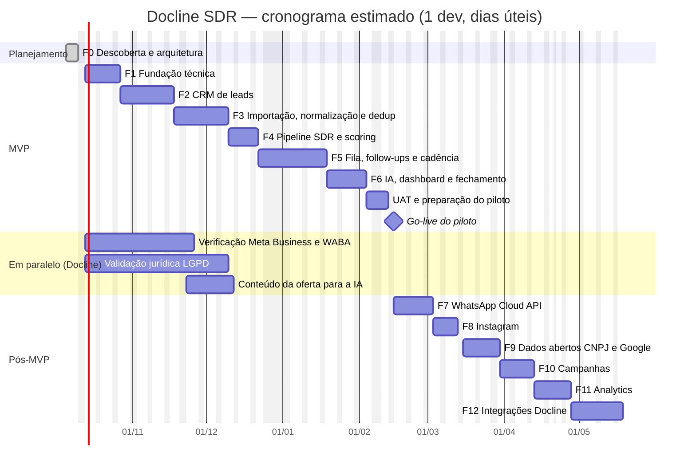

# Roadmap, Backlog, Riscos e Cronograma — Docline SDR

> **Status:** Fases 1 a 3 concluídas · próxima: Fase 4 (Pipeline SDR) · **Última revisão:** 2026-10-09
> Relacionados: [MVP](./MVP.md) · [ARCHITECTURE](./ARCHITECTURE.md) · [README](../README.md)

## Sumário

1. [Visão geral das fases](#1-visão-geral-das-fases)
2. [Premissas do cronograma](#2-premissas-do-cronograma)
3. [Cronograma técnico](#3-cronograma-técnico)
4. [Marcos e pontos de decisão](#4-marcos-e-pontos-de-decisão)
5. [Detalhamento por fase e backlog](#5-detalhamento-por-fase-e-backlog)
6. [Registro de riscos](#6-registro-de-riscos)
7. [Dependências](#7-dependências)
8. [Forma de trabalho](#8-forma-de-trabalho)

---

## 1. Visão geral das fases

| Fase | Nome | Objetivo | Duração estimada* | Bloco |
|---|---|---|---|---|
| 0 | Descoberta e arquitetura | Requisitos, riscos, arquitetura, modelo de dados, plano | ✅ concluída | Planejamento |
| 1 | Fundação técnica | Monorepo, banco, auth, RBAC, auditoria, fila, layout, CI, staging | ✅ concluída (2026-10-08) | MVP |
| 2 | CRM de leads | Cadastro, pessoas, contatos, lista e filtros, timeline, base de conformidade | ✅ concluída (2026-10-09) | MVP |
| 3 | Importação, normalização e deduplicação | Planilhas com prévia, normalização completa, motor e tela de duplicados | ✅ concluída (2026-10-09) | MVP |
| 4 | Pipeline SDR | Kanban, histórico de etapas, lead scoring configurável | ~1,5 semana | MVP |
| 5 | Fila e follow-ups | Tarefas, cadência, Minha Fila, gate de contactabilidade, contato assistido, transferência | ~2,5 semanas | MVP |
| 6 | IA de prospecção | Gerar/editar/aprovar/enviar, guardrails, avaliação; dashboard e relatórios básicos; UAT | ~3,5 semanas | MVP |
| 7 | Integração WhatsApp | Cloud API para leads com opt-in, webhooks, status, janela de atendimento | ~2,5 semanas + prazos da Meta | Canais |
| 8 | Instagram | DMs recebidas, comentários, enriquecimento (Business Discovery) | ~1,5 semana + App Review | Canais |
| 9 | Google / API de prospecção | Dados abertos CNPJ, tela de prospecção, Google Places (se aprovado) | ~2 semanas | Captação |
| 10 | Campanhas | Seleção, elegibilidade, limites, métricas, A/B | ~2 semanas | Escala |
| 11 | Analytics | Rollups, conversões por dimensão, insights, distribuição automática | ~2 semanas | Inteligência |
| 12 | Integrações Docline | API com chaves, webhooks de saída, CRM, Lista Não Contatar compartilhada | ~3 semanas (depende das APIs) | Ecossistema |

\* Em semanas de trabalho de 1 desenvolvedor full-stack sênior. Ver premissas.

---

## 2. Premissas do cronograma

1. **1 desenvolvedor full-stack sênior** dedicado, com desenvolvimento assistido por IA.
2. Um **responsável de negócio da Docline** disponível para validações semanais (30–60 min) e decisões das [questões em aberto](./ARCHITECTURE.md#16-questões-em-aberto).
3. Estimativas em **dias úteis**, com margem de incerteza de **±25%**. Feriados nacionais e recesso de fim de ano considerados.
4. Prazos externos (Meta, App Review, jurídico) correm **em paralelo** e não estão nas durações das fases; viram bloqueios se não forem iniciados a tempo ([§7](#7-dependências)).
5. Tamanhos do backlog: **P** ≈ meio dia · **M** ≈ 1 dia · **G** ≈ 2–3 dias.
6. Com **2 desenvolvedores**, o MVP tende a cair para ~10–11 semanas (paralelismo não é linear).

---

## 3. Cronograma técnico

Início considerado: **13/10/2026** (12/10 é feriado nacional).

Leitura aproximada:

| Marco | Data estimada |
|---|---|
| Staging com login, RBAC e layout (fim da F1) | fim de outubro/2026 |
| Base importada e deduplicada em staging (fim da F3) | início de dezembro/2026 |
| MVP completo em staging (fim da F6) | início de fevereiro/2027 |
| **Go-live do piloto** | **meados de fevereiro/2027** |
| WhatsApp API em produção (F7) | início de março/2027, se a Meta tiver aprovado |
| Fases 8–12 concluídas | maio/2027 |

---

## 4. Marcos e pontos de decisão

| Marco | Critério | Decisão |
|---|---|---|
| **M0 — Aprovação da Fase 0** | Documentos revisados | Seguir para a Fase 1; responder questões em aberto prioritárias |
| **M1 — Fundação pronta** | Staging no ar, login, RBAC testado, CI verde | — |
| **M2 — Base confiável** | Importação + dedup funcionando com dados fictícios | Liberar importação da base real (após validação jurídica da origem) |
| **M3 — MVP completo** | Histórias MUST concluídas, E2E verde, desempenho com 100 mil leads | Iniciar UAT |
| **M4 — Go-live do piloto** | [Critérios de lançamento](./MVP.md#11-critérios-de-lançamento-go-live-do-piloto) | Piloto de 4 semanas com métricas do [MVP §9](./MVP.md#9-métricas-de-sucesso) |
| **M5 — Go/no-go WhatsApp API** | Meta aprovada, templates aprovados, opt-in definido, parecer jurídico | Ativar `meta_cloud` |
| **M6 — Go/no-go prospecção automatizada de fontes** | Parecer sobre dados abertos CNPJ e Google Places | Ativar provedores da Fase 9 |

---

## 5. Detalhamento por fase e backlog

Prioridade: **MUST** · **SHOULD** · **COULD**. Tamanho: **P/M/G** (ver premissas).

### Fase 1 — Fundação técnica

**Entregáveis:** repositório estruturado, banco com migrações, autenticação e RBAC, auditoria, fila, layout com menu lateral, CI, staging.
**Aceite da fase:** um ADMIN convida um SDR; o SDR faz login e vê o layout; tentativas fora da permissão são negadas e auditadas; CI verde; staging no ar.

**Situação (2026-10-08):** ✅ concluída no código, com pendências registradas. O critério de aceite é coberto pela suíte E2E (`apps/web/e2e/fase1.spec.ts`) e o CI roda verde no GitHub. Pendências:

- **Staging no ar:** hospedagem decidida (Render, região Virginia — ARCHITECTURE ADR-019). `render.yaml` e imagem validados de ponta a ponta; a subida **depende da conta da Docline na Render e das credenciais de e-mail (SMTP)**.
- **F1-13 parcial:** logs pino com mascaramento entregues; o Sentry passou para F2-17, *entregue na Fase 2* (falta só o DSN da conta da Docline).
- **F1-15 (2FA):** passou para F2-16, *entregue na Fase 2*.
- **Limite de login por conta** (SECURITY §12): passou para F2-18, *entregue na Fase 2*.

Detalhes em [CHANGELOG](../CHANGELOG.md).

| ID | História / tarefa | Prior. | Tam. |
|---|---|---|---|
| F1-01 | Monorepo pnpm (`apps/web`, `apps/worker`, `packages/core`, `db`, `integrations`, `config`), TypeScript estrito, ESLint/Prettier, regras de fronteira entre módulos | MUST | M |
| F1-02 | `docker-compose` (PostgreSQL + Mailpit) e scripts de desenvolvimento | MUST | P |
| F1-03 | Prisma: schema inicial (users, teams, audit_logs, app_settings, states, municipalities), extensões `pg_trgm`/`unaccent` | MUST | M |
| F1-04 | Validação de variáveis de ambiente (Zod) alinhada ao `.env.example` | MUST | P |
| F1-05 | Better Auth: login, convite, redefinição de senha, sessão, rate limit | MUST | M |
| F1-06 | RBAC: matriz de permissões, `authorize()`, escopos, testes | MUST | M |
| F1-07 | Auditoria append-only (trigger) + padrão de caso de uso (autoriza → valida → persiste → evento → audita) | MUST | M |
| F1-08 | pg-boss, porta `JobQueue`, bootstrap do worker, health check | MUST | P |
| F1-09 | Layout SaaS: menu lateral (§29), tema claro/escuro, componentes base, responsivo | MUST | M |
| F1-10 | Seed de referência: UFs e municípios (IBGE), feriados nacionais | MUST | P |
| F1-11 | CI (lint, typecheck, testes, build, gitleaks, audit) | MUST | P |
| F1-12 | Staging: Dockerfiles, Render Blueprint, migrações no pre-deploy | MUST | M |
| F1-13 | Logs pino com mascaramento + Sentry — *Sentry movido para F2-17* | MUST | P |
| F1-14 | Registro de provedores + adaptadores `fake` (esqueleto) | MUST | P |
| F1-15 | 2FA (TOTP) para ADMIN/GESTOR — *movido para F2-16* | SHOULD | P |

### Fase 2 — CRM de leads

**Entregáveis:** cadastro completo de leads com pessoas e pontos de contato, lista com filtros avançados e contagem, detalhe responsivo, timeline, histórico, base de conformidade.
**Aceite:** critérios M02, M03, M09 e parte de M14 do [MVP](./MVP.md#4-escopo-incluído).

**Situação (2026-10-09):** ✅ concluída no código; as 18 histórias (F2-01 a F2-18) foram entregues.

O aceite é coberto pelas jornadas E2E `apps/web/e2e/fase2-ui.spec.ts`, `fase2-api.spec.ts` e `fase2-login.spec.ts`:

| Critério | O que a jornada comprova |
|---|---|
| M02 | O mesmo telefone em outro formato é avisado antes de salvar. |
| M03 | Busca, contagem "contactáveis × bloqueados" e ação em massa com simulação. |
| M09 | Timeline. |
| M14, parte | Opt-out em 1 clique bloqueia o WhatsApp e aparece na Lista Não Contatar. |

Decisões e pendências:

- **Exportação síncrona** (sem arquivo guardado no servidor), em vez de job assíncrono: ARCHITECTURE §9.2.
- **2FA:** disponível para todos, com lembrete para ADMIN/GESTOR. Bloquear o acesso sem 2FA fica para antes da Fase 7.
- **Sentry:** pronto; falta o DSN da conta da Docline.
- **Staging:** continua dependendo da conta da Docline na Render.

Detalhes em [CHANGELOG](../CHANGELOG.md).

| ID | História / tarefa | Prior. | Tam. |
|---|---|---|---|
| F2-01 | Modelo: leads, lead_people, contact_points, lead_origins, tags, notes, segments, lead_sources | MUST | M |
| F2-02 | Normalização básica no cadastro (telefone, e-mail, CNPJ); a completa vem na F3 | MUST | M |
| F2-03 | Cadastro/edição de lead com pessoas e pontos de contato; origem, coleta e base legal obrigatórias | MUST | G |
| F2-04 | Verificação de duplicidade exata antes de salvar | MUST | M |
| F2-05 | Detalhe do lead (cabeçalho, contatos com `tel:`/`wa.me`, notas, tags, selos) responsivo | MUST | G |
| F2-06 | Timeline (`lead_events`) e histórico de alterações (auditoria filtrada) | MUST | M |
| F2-07 | Lista com DSL de filtros, ordenação, cursor e busca | MUST | G |
| F2-08 | Contagem prévia + ações em massa (atribuir, tags) com `dryRun` | MUST | M |
| F2-09 | Visões salvas | SHOULD | P |
| F2-10 | Atribuição manual + histórico de responsáveis | MUST | P |
| F2-11 | Conformidade base: permissões por canal, Lista Não Contatar (HMAC), opt-out, selo "Não contatar" | MUST | M |
| F2-12 | Arquivar lead; anonimizar (ADMIN) | MUST | M |
| F2-13 | Seed de desenvolvimento com ~2.000 empresas fictícias | MUST | P |
| F2-14 | Exportação auditada (ADMIN/GESTOR) com proteção contra CSV injection | SHOULD | P |
| F2-15 | Registro manual de solicitações de titulares | SHOULD | P |
| F2-16 | 2FA (TOTP) para ADMIN/GESTOR (vindo da F1-15; obrigatório antes das Fases 7–9) | SHOULD | P |
| F2-17 | Sentry: erros do servidor web e do worker, sem dados pessoais (vindo da F1-13; precisa da conta/DSN da Docline) | MUST | P |
| F2-18 | Limite de tentativas de login por conta (SECURITY §12), sem permitir bloqueio proposital de terceiros | MUST | P |

### Fase 3 — Importação, normalização e deduplicação

**Entregáveis:** assistente de importação completo, biblioteca de normalização, motor e tela de duplicados.
**Aceite:** critérios M04, M05 e M06 do MVP; suítes de teste de telefone, CNPJ, deduplicação e importação ([ARCHITECTURE §12.2](./ARCHITECTURE.md#122-suítes-obrigatórias-requisito-35)).

**Situação (2026-10-09):** ✅ concluída no código; as 13 histórias (F3-01 a F3-13) foram entregues.

O aceite é coberto pela jornada E2E `apps/web/e2e/fase3.spec.ts`, que roda com o worker de verdade, e pelas suítes de integração `import.int.test.ts` e `dedup.int.test.ts`:

| Critério | O que a jornada comprova |
|---|---|
| M04 | Planilha com título acima do cabeçalho: mapeamento sugerido, prévia, gravação e relatório. Reimportar o mesmo arquivo avisa e não cria leads. |
| M05 | `(88) 99812-3401`, `88998123401` e `+55 88 99812-3401` são o mesmo contato. A prévia marca as repetições no próprio arquivo. |
| M06 | "Manter separados" não volta à fila, nem depois da varredura completa. Mesclar com o nome do outro lead reúne tudo; o lead mesclado continua para consulta. |

As suítes do ARCHITECTURE §12.2 (telefone, CNPJ, deduplicação e importação) estão em testes unitários, de propriedade e de integração.

Decisões e pendências:

- **Leitor de XLSX próprio** (fflate + saxes), em vez do ExcelJS: ADR-020.
- **Arquivo enviado** fica em `import_files` só até o worker ler, sem *object storage*; é apagado na mesma transação.
- **Duplicados na importação:** a busca roda na própria linha (e não pelo job `dedup.check-lead`), para o relatório contar os sinalizados.
- **Sinais:** valor repetido em mais de 20 leads não conta (ex.: telefone de associação). "Ignorar" volta à fila só com uma regra nova.
- **Modelos de mapeamento:** salvos na configuração do lote e sugeridos pelo cabeçalho. Não há tela nem rota própria (`/import-mapping-templates`).
- **`POST /normalize/preview`:** não implementada; a prévia da importação já mostra os valores normalizados.
- **Outra aba do XLSX:** pede o arquivo de novo, porque o original é descartado depois da leitura.
- **Staging:** continua dependendo da conta da Docline na Render.

Detalhes em [CHANGELOG](../CHANGELOG.md).

| ID | História / tarefa | Prior. | Tam. |
|---|---|---|---|
| F3-01 | Normalização completa (telefone BR + variantes `wa_id`, CNPJ alfanumérico, nomes, cidades IBGE, UF, Instagram, URL, e-mail, CEP) + testes de propriedade | MUST | G |
| F3-02 | Upload seguro + detecção de codificação, delimitador, aba e cabeçalho | MUST | M |
| F3-03 | Mapeamento coluna → campo com sugestão automática e modelos reutilizáveis | MUST | M |
| F3-04 | Configuração do lote (origem, coleta, base legal, responsável, tags, política de duplicados) | MUST | P |
| F3-05 | Prévia (`import.preview`): normalização, validação, casamento com base, arquivo e Lista Não Contatar | MUST | G |
| F3-06 | Decisão por linha, confirmação (`import.commit` em lotes) e relatório | MUST | M |
| F3-07 | Detecção de reimportação (hash do arquivo) | SHOULD | P |
| F3-08 | Motor de deduplicação: sinais, pesos, *blocking*, `pg_trgm` em `name_core` | MUST | G |
| F3-09 | Tela Possíveis Duplicados (lado a lado, motivos, confiança) | MUST | M |
| F3-10 | Mesclagem campo a campo com snapshot, movimentação de filhos e auditoria | MUST | G |
| F3-11 | Manter separados / Ignorar, com auditoria | MUST | P |
| F3-12 | Varredura diária (`dedup.scan`) | MUST | P |
| F3-13 | Retenção: purga automática de `import_rows` | MUST | P |

### Fase 4 — Pipeline SDR

**Entregáveis:** Kanban configurável, histórico de etapas, lead scoring explicável.
**Aceite:** critérios M07 e M08; suítes de pipeline e score.

| ID | História / tarefa | Prior. | Tam. |
|---|---|---|---|
| F4-01 | Pipelines e etapas (seed das 17), configuração de etapas pelo ADMIN | MUST | M |
| F4-02 | Kanban: contagem por coluna, cards paginados, arrastar e soltar, filtros, lock otimista | MUST | G |
| F4-03 | Regras de transição, motivo de perda, histórico com duração | MUST | M |
| F4-04 | Pipeline no celular (lista por etapa) | MUST | P |
| F4-05 | Motor de score: registro de critérios, modelo versionado, `CLAMP`/`SCALE`, faixas | MUST | M |
| F4-06 | Recalculo por evento e em massa; histórico; explicação na ficha | MUST | M |
| F4-07 | Tela de pesos com simulação e ativação de versão | SHOULD | M |
| F4-08 | Cadastro de cidades prioritárias | MUST | P |

### Fase 5 — Fila e follow-ups

**Entregáveis:** tarefas, cadência configurável, Minha Fila, gate de contactabilidade, contato assistido, respostas, transferência ao Comercial.
**Aceite:** critérios M10, M11, M13, M14 e M15; suítes de cadência e opt-out.

| ID | História / tarefa | Prior. | Tam. |
|---|---|---|---|
| F5-01 | Tarefas: criar, reagendar, concluir com resultado | MUST | M |
| F5-02 | Atividades: registrar ligação, reunião, visita | MUST | P |
| F5-03 | Motor de cadência: calendário (dias úteis, feriados, janela, fuso do lead) | MUST | G |
| F5-04 | Inscrição, `cadence.tick`, avanço de etapas por chave, fim → Sem resposta | MUST | M |
| F5-05 | Parada automática (resposta, opt-out, mudança de etapa, arquivamento, contato inválido) | MUST | M |
| F5-06 | Configuração de cadências (ADMIN) | MUST | M |
| F5-07 | Minha Fila SDR (seções, prioridade, ações rápidas), responsiva | MUST | G |
| F5-08 | Gate de contactabilidade completo + limites de frequência e de horário | MUST | M |
| F5-09 | Contato assistido: `wa.me`, Instagram, `tel:`, confirmar envio, pendências | MUST | M |
| F5-10 | Registrar resposta recebida + palavras de opt-out + classificação manual | MUST | M |
| F5-11 | Jobs de atrasados e esquecidos + notificações no app | MUST | P |
| F5-12 | Transferência ao Comercial (checklist, oportunidade, notificação, ganho/perda) | MUST | M |
| F5-13 | Puxar leads do pool (com trava) | SHOULD | P |

### Fase 6 — IA de prospecção e fechamento do MVP

**Entregáveis:** SDR AI (geração com aprovação humana), conjunto de avaliação, dashboard e relatórios básicos, testes E2E, UAT e go-live do piloto.
**Aceite:** critérios M12 e M16 do MVP e [critérios de lançamento](./MVP.md#11-critérios-de-lançamento-go-live-do-piloto).

| ID | História / tarefa | Prior. | Tam. |
|---|---|---|---|
| F6-01 | Porta `AiProvider` + `FakeAiProvider` + adaptador Anthropic | MUST | M |
| F6-02 | ContextBuilder (whitelist), prompts versionados, base de conhecimento Docline | MUST | M |
| F6-03 | Gerar → editar → aprovar → enviar para os 8 tipos de mensagem | MUST | G |
| F6-04 | Guardrails antes e depois da geração | MUST | M |
| F6-05 | Registro em `ai_generations` (custo, edição, descarte) + cotas e orçamento | MUST | M |
| F6-06 | Sugestão de classificação de respostas | SHOULD | P |
| F6-07 | Conjunto de avaliação offline + rubrica | MUST | M |
| F6-08 | Dashboard básico (KPIs, funil, cidade, origem, SDR, evolução diária) | MUST | G |
| F6-09 | Relatórios básicos + exportação | MUST | M |
| F6-10 | Endurecimento: E2E das jornadas, teste de desempenho com 100 mil leads, revisão de segurança | MUST | M |
| F6-11 | UAT, treinamento, importação da base real, go-live do piloto | MUST | M |

### Fase 7 — Integração WhatsApp

| ID | História / tarefa | Prior. |
|---|---|---|
| F7-01 | Adaptador `meta_cloud`: envio de template e de texto livre (janela aberta), idempotência | MUST |
| F7-02 | Webhooks: verificação, assinatura, inbox, status (`sent`/`delivered`/`read`/`failed`), mensagens recebidas | MUST |
| F7-03 | Conversas e janela de atendimento na UI | MUST |
| F7-04 | Sincronização de templates aprovados + vínculo com abordagens | MUST |
| F7-05 | Opt-in com evidência; gate exige opt-in para modo API | MUST |
| F7-06 | Casamento de `wa_id` com e sem 9º dígito | MUST |
| F7-07 | Classificação automática de respostas recebidas | SHOULD |
| F7-08 | Monitor de qualidade/limites do número e custo por mensagem | SHOULD |
| F7-09 | Passos de cadência `API_MESSAGE` (somente com opt-in) | COULD |

### Fase 8 — Instagram

| ID | História / tarefa | Prior. |
|---|---|---|
| F8-01 | Conexão da conta profissional, permissões, App Review | MUST |
| F8-02 | Webhooks de DMs e comentários → mensagens/atividades; parada de cadência | MUST |
| F8-03 | Responder DMs dentro da janela permitida | SHOULD |
| F8-04 | Business Discovery → critério "Instagram ativo" | SHOULD |

### Fase 9 — Google / API de prospecção

| ID | História / tarefa | Prior. |
|---|---|---|
| F9-01 | Ingestão filtrada dos dados abertos CNPJ (CNAEs de contabilidade, ativas) | MUST |
| F9-02 | Tela Prospecção: busca por UF/cidade/CNAE/quantidade, comparação com a base, aprovação | MUST |
| F9-03 | Adaptador Google Places (exibição ao vivo, `place_id`), se aprovado juridicamente | SHOULD |
| F9-04 | Enriquecimento pontual por CNPJ e CEP | SHOULD |
| F9-05 | Potencial por cidade (universo × trabalhados) | SHOULD |

### Fase 10 — Campanhas

| ID | História / tarefa | Prior. |
|---|---|---|
| F10-01 | Campanhas com filtro, snapshot e responsável | MUST |
| F10-02 | Elegibilidade (gate, frequência, campanha concorrente) com motivos | MUST |
| F10-03 | Distribuição dos leads da campanha e limites diários | MUST |
| F10-04 | Métricas: selecionados → aptos → contatados → entregues → respondidos → interessados → oportunidades → conversões → opt-outs | MUST |
| F10-05 | Teste A/B de abordagens | SHOULD |

### Fase 11 — Analytics

| ID | História / tarefa | Prior. |
|---|---|---|
| F11-01 | Rollups diários e *materialized views* | MUST |
| F11-02 | Conversão por cidade, campanha, abordagem, canal e segmento; desempenho por SDR; evolução mensal; WhatsApp × Instagram | MUST |
| F11-03 | Intervalos de confiança e alerta de amostra insuficiente | SHOULD |
| F11-04 | Insights da carteira (SQL + redação pela IA) | SHOULD |
| F11-05 | Distribuição automática (round-robin, território, disponibilidade) | SHOULD |

### Fase 12 — Integrações Docline

| ID | História / tarefa | Prior. |
|---|---|---|
| F12-01 | Chaves de API com escopos e revogação | MUST |
| F12-02 | Webhooks de saída assinados | MUST |
| F12-03 | `external_references` + sincronização com o CRM Docline | MUST (depende da API) |
| F12-04 | Lista Não Contatar compartilhada com outros sistemas | MUST |
| F12-05 | Google Calendar para reuniões | COULD |
| F12-06 | Exportação incremental para BI | COULD |

---

## 6. Registro de riscos

Probabilidade (P) e impacto (I): **A** alta · **M** média · **B** baixa.

| ID | Risco | P | I | Mitigação | Fase |
|---|---|:-:|:-:|---|---|
| R01 | Política de opt-in do WhatsApp impede prospecção fria via API | A | A | Modo assistido; opt-in legítimo; outros canais; validação jurídica | 5, 7 |
| R02 | Restrição da conta WhatsApp por denúncias no modo assistido | M | A | Limites diários, personalização, opt-out imediato, conta corporativa | 5 |
| R03 | API do Instagram não permite iniciar DM | Certa | M | Fluxo assistido permanente para primeiro contato | 8 |
| R04 | Termos do Google impedem montar base com dados do Places | A | A | Guardar só `place_id`; dados abertos CNPJ como fonte primária; parecer jurídico | 9 |
| R05 | Base legal insuficiente para parte das bases existentes | M | A | Origem e base obrigatórias; triagem antes de importar; descartar listas sem procedência | 3 |
| R06 | Mesclagem errada de leads | M | A | Nunca automática; snapshot; termos genéricos removidos; testes | 3 |
| R07 | Planilhas com baixa qualidade | A | M | Prévia, normalização, relatório por linha | 3 |
| R08 | IA inventa fatos ou gera mensagem inadequada | M | A | Fatos aprovados, guardrails, aprovação humana, avaliação | 6 |
| R09 | Injeção de prompt via bio/site/mensagens | B | M | Delimitação, sem ferramentas, validação, humano aprova | 6 |
| R10 | Custo de IA acima do previsto | B | M | Cotas, orçamento, cache, lote, painel de custo | 6 |
| R11 | Crescimento de escopo | A | A | MVP com MUST/SHOULD; backlog priorizado; fases com aceite | Todas |
| R12 | Baixa adoção pelos SDRs | M | A | UX rápida, fila, celular, piloto curto com feedback semanal | 6 |
| R13 | Atraso nas aprovações da Meta (verificação, templates, App Review) | M | M | Iniciar na Fase 1, em paralelo | 7, 8 |
| R14 | Hospedagem fora do Brasil sem tratamento de transferência | M | M | Render/Virginia decidida (ADR-019): cláusulas-padrão no DPA e validação jurídica antes de dados reais; só dados fictícios até lá | 1, 6 |
| R15 | CNPJ alfanumérico tratado de forma errada | M | M | Suporte e testes desde a Fase 3 | 3 |
| R16 | Respostas do WhatsApp não associadas ao lead (9º dígito) | M | M | Casamento por variantes, com testes | 7 |
| R17 | Dependência de um único desenvolvedor | M | A | Documentação, testes, ADRs, PRs pequenos | Todas |
| R18 | APIs dos sistemas Docline inexistentes ou sem documentação | M | M | Webhooks de saída, n8n nas bordas, `external_references` | 12 |
| R19 | Desempenho com 500 mil leads | B | M | Índices, cursor, rollups, particionamento planejado | 11 |
| R20 | Mudança de políticas das plataformas | A | M | Adaptadores; revisão antes de cada fase; versões de API fixadas | 7–9 |
| R21 | Vazamento por exportação indevida | B | A | Exportação restrita e auditada; escopos por perfil | 2 |
| R22 | Dados reais em seeds, testes ou no Git | B | A | Política, `.gitignore` de planilhas, revisão de PR, gitleaks | Todas |

---

## 7. Dependências

| Dependência | Responsável | Necessária para | Iniciar até |
|---|---|---|---|
| Aprovação desta Fase 0 e respostas às questões prioritárias | Docline | Fase 1 | Imediato |
| Contas GitHub e de hospedagem (staging) + domínio | Docline | F1 | Início da F1 |
| E-mail transacional + domínio com SPF/DKIM | Docline + dev | F1 | F1 |
| **Verificação da empresa na Meta, WABA, número e nome de exibição** | Docline | F7 | **Início da F1 (longo prazo de aprovação)** |
| **Validação jurídica LGPD** (LIA, textos, retenção, aviso de privacidade, encarregado) | Jurídico/DPO | Go-live do piloto | **Início da F1** |
| Estrutura (só as colunas) das planilhas atuais da Docline e origem de cada base | Comercial | F3 | Durante a F2 |
| Cidades prioritárias e territórios por SDR | Comercial | F4 | Durante a F3 |
| Decisão sobre as etapas FU1–FU3 | Comercial | F4 | Durante a F3 |
| Fatos aprovados da oferta (parceria, benefícios, objeções comuns) e tom de voz | Comercial/Marketing | F6 | Durante a F5 |
| Conta, chave e DPA do provedor de IA | Docline | F6 | Durante a F5 |
| ~~Decisão de hospedagem/região de produção~~ ✅ Render, Virginia (2026-10-08). Falta: cláusulas-padrão no DPA da Render | Docline + jurídico | Go-live | Até a F5 |
| Equipe do piloto (SDRs, gestor, comercial) para UAT | Docline | F6 | Durante a F5 |
| Templates de WhatsApp aprovados pela Meta | Comercial + dev | F7 | Durante a F6 |
| App Meta + App Review (Instagram) | Docline + dev | F8 | Durante a F7 |
| Parecer sobre dados abertos CNPJ e Google Places | Jurídico | F9 | Durante a F7 |
| Projeto Google Cloud com faturamento e alertas | Docline | F9 (se Places aprovado) | Durante a F8 |
| Documentação das APIs CRM/Gestão AR/Gestão 360 | TI Docline | F12 | Durante a F10 |

---

## 8. Forma de trabalho

Conforme §34 dos requisitos:

1. **Incrementos pequenos e verificáveis:** uma história por PR, sempre que possível.
2. **Antes de mudanças arquiteturais importantes:** explicar o impacto e registrar ADR em [ARCHITECTURE §15](./ARCHITECTURE.md#15-registro-de-decisões-adrs).
3. **Após cada etapa:** lint, typecheck e testes executados; erros investigados até a causa raiz; documentação atualizada; `CHANGELOG.md` com o que foi concluído (criado na Fase 1).
4. **Sem atalhos:** nada de esconder erros, desabilitar testes ou substituir código funcional sem necessidade.
5. **Revisão semanal** com o responsável de negócio: demo, decisões pendentes, repriorização do backlog.
6. **Branches e commits:** branch por fase/história, commits descritivos (Conventional Commits), PRs revisados antes do merge.
