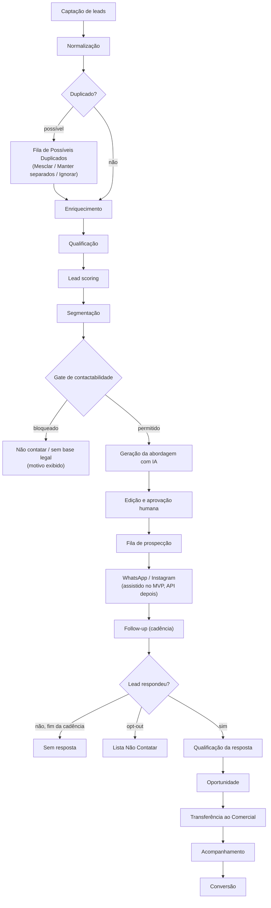
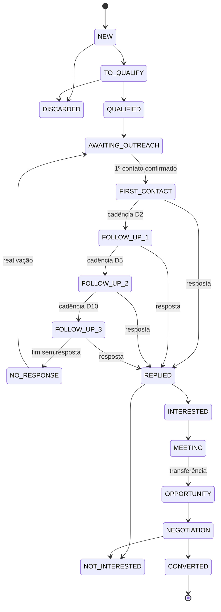

# Fluxo SDR — Docline SDR

> **Status:** Fase 0 · Descreve o processo operacional que o sistema implementa: etapas, regras, automações, eventos e métricas.
> Relacionados: [ARCHITECTURE](./ARCHITECTURE.md) · [DATABASE](./DATABASE.md) · [AI-SDR](./AI-SDR.md) · [LGPD](./LGPD.md)

## Sumário

1. [Visão geral](#1-visão-geral)
2. [Etapas do fluxo](#2-etapas-do-fluxo)
3. [Pipeline (Kanban)](#3-pipeline-kanban)
4. [Cadência e follow-up](#4-cadência-e-follow-up)
5. [Minha Fila SDR](#5-minha-fila-sdr)
6. [Contato pelos canais](#6-contato-pelos-canais)
7. [Resposta do lead e classificação](#7-resposta-do-lead-e-classificação)
8. [Qualificação e transferência ao Comercial](#8-qualificação-e-transferência-ao-comercial)
9. [Contactabilidade (estados independentes)](#9-contactabilidade-estados-independentes)
10. [Distribuição de leads](#10-distribuição-de-leads)
11. [Definição de métricas](#11-definição-de-métricas)
12. [Perguntas de negócio → como o sistema responde](#12-perguntas-de-negócio--como-o-sistema-responde)

---

## 1. Visão geral



Cada etapa gera eventos em `lead_events` (timeline) e, quando altera dados, em `audit_logs`.

---

## 2. Etapas do fluxo

| # | Etapa | Quem | O que acontece | Eventos | Saída |
|---|---|---|---|---|---|
| 1 | **Captação** | SDR/Gestor/sistema | Cadastro manual, importação CSV/XLSX, prospecção (Fase 9), indicação. Origem, data de coleta e base legal **obrigatórias** | `lead.created` / `lead.imported` | Lead em `NEW` |
| 2 | **Normalização** | Sistema | Telefone (E.164), CNPJ, e-mail, Instagram, URL, cidade/UF (IBGE), nomes | — (parte da criação) | Campos normalizados + avisos |
| 3 | **Duplicados** | Sistema → Gestor/SDR | Busca por CNPJ, telefone, e-mail, Instagram, nome+cidade e similaridade. **Nunca exclui automaticamente** | `duplicate.detected`, `lead.merged` | Lead único ou par na fila de revisão |
| 4 | **Enriquecimento** | Sistema/SDR | Município IBGE, CEP, dados de CNPJ (Fase 9), Instagram ativo (Fase 8), site | `lead.enriched` | Mais sinais para score |
| 5 | **Qualificação inicial** | SDR | É do público-alvo? Escritório ativo? Contato correto? | `stage.changed` (`TO_QUALIFY` → `QUALIFIED` ou `DISCARDED`) | Qualificado ou descartado com motivo |
| 6 | **Lead scoring** | Sistema | Regras configuráveis, explicação por critério | `score.changed` | Score 0–100 + faixa |
| 7 | **Segmentação** | Sistema/SDR | Tipo, segmento, cidade, tags, faixa | `tag.added` | Filtros e visões |
| 8 | **Geração da abordagem** | SDR + IA | Botão "Gerar abordagem com IA" → rascunho → editar → aprovar | `ai.generated`, `ai.approved` | Mensagem aprovada |
| 9 | **Fila de prospecção** | Sistema | Lead em `AWAITING_OUTREACH` aparece em "Minha Fila" ordenado por prioridade | `task.created` | Tarefa de primeiro contato |
| 10 | **Contato** | SDR | Modo assistido: abre WhatsApp/Instagram com o texto, envia e confirma. Fase 7: envio via API quando houver opt-in | `message.sent` | `FIRST_CONTACT` + inscrição na cadência |
| 11 | **Follow-up** | Sistema + SDR | Cadência gera tarefas D2/D5/D10; SDR gera e aprova cada mensagem | `cadence.step_due`, `message.sent` | FU1 → FU2 → FU3 → `NO_RESPONSE` |
| 12 | **Resposta** | SDR/sistema | Registro manual (MVP) ou webhook (Fase 7). **Cadência para automaticamente** | `message.received`, `cadence.stopped` | `REPLIED` |
| 13 | **Qualificação da resposta** | SDR (+ sugestão de IA) | Classifica: interessado, dúvida, objeção, sem interesse, opt-out… | `reply.classified` | `INTERESTED`, `NOT_INTERESTED`, Lista Não Contatar… |
| 14 | **Oportunidade** | SDR | Reunião marcada / checklist de qualificação completo | `stage.changed` | `MEETING` → `OPPORTUNITY` |
| 15 | **Transferência** | SDR → Comercial | Cria `opportunity` com qualificação, notifica o comercial | `handoff.created` | Dono passa a ser o comercial |
| 16 | **Acompanhamento** | Comercial | Negociação, tarefas, registro de atividades | `stage.changed` | `NEGOTIATION` |
| 17 | **Conversão** | Comercial | Parceiro ou cliente fechado | `opportunity.won` | `CONVERTED` (tipo `PARTNER`/`CUSTOMER`) |

---

## 3. Pipeline (Kanban)

### 3.1 Etapas

As 17 etapas do seed estão em [DATABASE §8.1](./DATABASE.md#81-etapas-do-pipeline-11-dos-requisitos). Nomes, cores, ordem e SLA são editáveis pelo administrador; a **chave** (`key`) é estável e usada pelas automações.

### 3.2 Regras de movimentação



1. **Arrastar é permitido** entre etapas abertas, exceto onde a regra abaixo exige ação.
2. `FIRST_CONTACT` só é alcançado registrando um contato, nunca arrastando, porque precisa passar pelo gate de contactabilidade.
3. Etapas `LOST` exigem **motivo de perda**.
4. `CONVERTED` exige oportunidade marcada como ganha.
5. Mover para fora das etapas de cadência (ou para `LOST`) **encerra a inscrição ativa** (`STAGE_CHANGED`).
6. GESTOR e ADMIN podem fazer qualquer transição, com registro na auditoria.
7. Cada movimentação grava `lead_stage_history` com duração na etapa anterior.
8. Lock otimista: se outro usuário mexeu no lead, o card volta e o usuário vê o que mudou.

> **Implementação (Fase 4):**
> - A regra 2 vale também para gestor e administrador: "Primeiro contato" não aparece como destino manual.
> - Regra 4: até existir oportunidade (Fases 5–6), "Convertido" é marcado à mão por gestor ou administrador.
> - Regra 6: as etapas preenchidas pelas automações (Follow-up 1 a 3, "Sem resposta", "Respondeu", "Oportunidade") e a reabertura de um lead ganho ou perdido só são feitas à mão por gestor ou administrador. A auditoria registra a movimentação como correção (`override`).
> - Sair de "Sem resposta" (reativação) vale para todos.
> - O motivo "Pediu para não ser contatado" inclui o lead na Lista Não Contatar na hora.
> - A regra 5 entra com a cadência (Fase 5).

### 3.3 Interface

Colunas com contagem e cards paginados por coluna. O card mostra nome, cidade, faixa de score, próximo passo, dias na etapa e selos (WhatsApp, Instagram, Não contatar). Filtros: responsável, cidade, UF, faixa, origem, tag. No celular, as etapas viram uma lista com seletor de etapa (sem arrastar).

> **Implementação (Fase 4):**
> - Os cards de cada coluna vêm do maior score para o menor e, no empate, de quem está há mais tempo na etapa. Mostram também o responsável e o SLA vencido.
> - Durante o arraste, as etapas de perda e de conversão aparecem numa barra fixa, sem rolar até o fim do quadro.
> - Cada card tem o botão "Mover", que faz o mesmo pelo teclado ou no celular.
> - O "próximo passo" no card depende das tarefas da Fase 5.

---

## 4. Cadência e follow-up

### 4.1 Cadência padrão

| Passo | Dia | Tipo de mensagem | Etapa ao concluir | Ação no MVP |
|---|---|---|---|---|
| 1 | D0 | Primeiro contato | `FIRST_CONTACT` | Tarefa → gerar/aprovar/enviar assistido |
| 2 | D2 | Follow-up 1 | `FOLLOW_UP_1` | Tarefa |
| 3 | D5 | Follow-up 2 | `FOLLOW_UP_2` | Tarefa |
| 4 | D10 | Follow-up 3 | `FOLLOW_UP_3` | Tarefa |
| — | D10 + 3 | — | `NO_RESPONSE` | Automático |

### 4.2 Regras

- **Configurável pelo administrador:** passos, dias, canal, tipo de mensagem, etapa-alvo, janela de horário, dias úteis.
- **Dias úteis** (padrão) e feriados nacionais (municipais depois). Contagem no **fuso do lead** (UF).
- **Janela de contato** padrão 08h–18h, segunda a sexta. Tarefas vencem no início da janela.
- **Parada automática** quando: o lead responde (`REPLIED`), registra opt-out, é suprimido, é arquivado, muda manualmente para etapa fora da cadência ou o contato é marcado inválido.
- **Uma cadência ativa por lead.** Reinscrever exige encerrar a anterior.
- **Passo vencido** no MVP vira **tarefa** para o SDR; nada é enviado sem ação humana. Na Fase 7, passos com `action = API_MESSAGE` podem enviar automaticamente **somente** se houver opt-in e template aprovado, e ainda passam pelo gate.
- **Atraso do SDR:** se o SDR executa um passo com atraso, os passos seguintes são recalculados a partir da execução real, para não "acumular" mensagens.
- **Reativação:** leads em `NO_RESPONSE` ficam elegíveis para uma cadência de reativação após N dias (padrão 90), com mensagem do tipo `REACTIVATION`.

### 4.3 Follow-up avulso

O SDR pode agendar um follow-up fora da cadência ("ligar terça às 10h"), criando uma `task` com data e hora. Também funciona pelo celular.

---

## 5. Minha Fila SDR

### 5.1 Seções (§13)

| Seção | Critério |
|---|---|
| **Respostas aguardando ação** | `last_inbound_at > last_contact_at`, sem tarefa concluída depois. SLA padrão: 2 horas úteis |
| **Follow-ups atrasados** | Tarefas abertas com `due_at < agora` |
| **Contatos de hoje** | Tarefas de primeiro contato com vencimento hoje |
| **Follow-ups de hoje** | Tarefas de follow-up com vencimento hoje |
| **Leads quentes** | Faixa `HOT`/`PRIORITY`, contactáveis, sem contato ainda |
| **Novos leads** | Atribuídos ao SDR nos últimos N dias, em `NEW`/`TO_QUALIFY` |
| **Aguardando resposta** | Em cadência, último passo executado, sem resposta |
| **Oportunidades abertas** | Leads do SDR em `MEETING`/`OPPORTUNITY` (acompanhamento) |
| **Esquecidos** | Etapa aberta, sem tarefa aberta, sem atividade há N dias (padrão 7) |

### 5.2 Ordenação por prioridade

Cada item recebe `priority_score` (configurável), por exemplo:

```
prioridade = peso_seção
           + score_do_lead × 0,5
           + min(dias_de_atraso, 10) × 5
           + (resposta_pendente ? 40 : 0)
```

Ordem padrão das seções: respostas → atrasados → hoje → quentes → novos. O SDR pode reordenar por prioridade, vencimento, cidade ou score.

### 5.3 Ações rápidas no item

Abrir lead · Gerar abordagem · Abrir no WhatsApp/Instagram · Ligar (`tel:`) · Registrar contato · Registrar resposta · Reagendar · Concluir. Atalhos de teclado no desktop.

---

## 6. Contato pelos canais

| Modo | Quando | Como funciona |
|---|---|---|
| **Assistido** (MVP) | Sempre disponível, se o gate permitir | 1) Mensagem aprovada. 2) "Abrir no WhatsApp" abre `wa.me/<número>?text=<mensagem>` (ou copia o texto e abre o perfil do Instagram). 3) O **humano** envia no app. 4) O SDR clica em "Confirmar envio" e o sistema registra a mensagem (`mode = ASSISTED`), avança a cadência e a etapa. Se não confirmar, a mensagem fica `PENDING_CONFIRMATION` e aparece como pendência. |
| **API** (Fase 7 WhatsApp) | Lead com **opt-in** registrado e template aprovado (fora da janela de 24h) | Envio pelo sistema com status de entrega e leitura via webhook. |
| **Registro manual** | Contato feito fora do fluxo (ligação, conversa antiga) | "Registrar contato" com data, canal e resumo (`mode = LOGGED`). |

**Limites de uso responsável (modo assistido), configuráveis:** máximo de primeiros contatos por SDR por dia (padrão 40); intervalo mínimo entre contatos ao mesmo lead (padrão 48h, exceto respostas); nenhum contato fora da janela de horário. Ver [LGPD §6](./LGPD.md#6-whatsapp-base-legal-lgpd--opt-in-da-meta).

---

## 7. Resposta do lead e classificação

| Classificação | Ação automática | Sugestão ao SDR |
|---|---|---|
| `INTERESTED` | Etapa → `INTERESTED`; score +; tarefa "propor reunião" | Gerar "Resposta a interessado" / "Agendamento" |
| `QUESTION` | Etapa → `REPLIED`; tarefa "responder dúvida" | Gerar resposta com fatos da base de conhecimento |
| `OBJECTION` | Etapa → `REPLIED`; tarefa | Gerar "Resposta a objeção" |
| `NOT_INTERESTED` | Etapa → `NOT_INTERESTED` (motivo "Sem interesse") | Agradecer e encerrar |
| `OPT_OUT` | **Lista Não Contatar imediatamente**, cadência parada, `contact_status = OPTED_OUT` | Mensagem única de confirmação, se o canal permitir |
| `OUT_OF_OFFICE` | Cadência pausada; tarefa para a data informada | — |
| `WRONG_CONTACT` | Ponto de contato marcado `WRONG_PERSON`; cadência parada | Procurar outro contato |
| `OTHER` | Etapa → `REPLIED`; tarefa | — |

**Ordem de decisão:**
1. **Regras determinísticas de opt-out** primeiro: palavras e expressões configuráveis, como "SAIR", "PARAR", "não quero receber", "remova meu número", "descadastrar".
2. **IA** sugere classificação e confiança ([AI-SDR §12](./AI-SDR.md#12-classificação-de-respostas)).
3. Confiança baixa ou possível opt-out → **humano decide**. Na dúvida sobre opt-out, a cadência é **pausada** até a decisão.

---

## 8. Qualificação e transferência ao Comercial

### 8.1 Checklist de qualificação (proposta, a validar com o Comercial)

| Item | Tipo |
|---|---|
| Decisor identificado (nome e função) | obrigatório |
| Interesse declarado na parceria ou serviço | obrigatório |
| Melhor canal e horário para o comercial | obrigatório |
| Porte aproximado (nº de clientes empresariais do escritório) | recomendado |
| Já trabalha com certificado digital? Com qual fornecedor? | recomendado |
| Principais objeções levantadas | recomendado |
| Reunião agendada (data/hora) | opcional |

### 8.2 Transferência

1. SDR preenche o checklist e clica em **Transferir ao Comercial**.
2. Sistema cria `opportunity` (`OPEN`), define `sales_owner_id`, move para `OPPORTUNITY` e registra `handoff.created`.
3. O comercial é notificado e tem um SLA de aceite (padrão 1 dia útil). Sem aceite, o Gestor é alertado.
4. O SDR continua vendo o lead (somente leitura) para acompanhar o resultado: a conversão conta também para o SDR de origem.
5. Ganha → `CONVERTED` + `conversion_type` (`PARTNER` ou `CUSTOMER`). Perdida → motivo obrigatório.

---

## 9. Contactabilidade (estados independentes)

O requisito §14 pede estados **independentes**. Eles não são uma escada: cada um é verificado separadamente.

| Estado | Fonte da verdade | Significado |
|---|---|---|
| **Telefone identificado** | `contact_points (type=PHONE, status=ACTIVE)` | Há um número válido |
| **WhatsApp identificado** | `contact_points.whatsapp_status ∈ {PROBABLE, CONFIRMED}` | Há indício (fonte) ou confirmação (conversa) de WhatsApp |
| **Base legal registrada** | `contact_permissions.legal_basis ≠ NOT_ASSESSED` | Há fundamento LGPD documentado para o contato |
| **Opt-in de plataforma** | `contact_permissions.opt_in_status = GRANTED` | Exigido para envio via WhatsApp Business Platform (API) |
| **Contato permitido** | Calculado pelo gate | Base legal + sem supressão + canal ativo + regras de frequência e horário |
| **Opt-out** | `suppression_entries.reason = OPT_OUT` | O titular pediu para não ser contatado |
| **Bloqueado** | `suppression_entries` (outros motivos) | Decisão interna, reclamação, ordem legal, contato inválido |

**Regras do gate** (`ContactabilityService`):

```
permitido(lead, canal, modo) =
      não suprimido(identificador, canal)          # Lista Não Contatar
  E   ponto de contato ativo para o canal
  E   base legal ≠ NOT_ASSESSED
  E   (modo ≠ API  OU  opt-in de plataforma = GRANTED  OU  janela de atendimento aberta)
  E   dentro da janela de horário
  E   respeita limites de frequência
  E   lead.status = ACTIVE
```

O resultado traz **motivos legíveis** ("Sem base legal registrada", "Número na Lista Não Contatar desde 12/10/2026"). **Encontrar um telefone publicamente não significa autorização** para mensagens automatizadas: telefone identificado ≠ contato permitido.

---

## 10. Distribuição de leads

| Estratégia | Descrição | Fase |
|---|---|---|
| **Manual** | Gestor atribui um lead ou um lote (ação em massa com contagem prévia) | MVP |
| **Na importação** | Responsável padrão do lote | MVP |
| **Puxar do pool** | SDR pega leads não atribuídos do seu território (com trava para dois SDRs não pegarem o mesmo) | MVP (SHOULD) |
| **Round-robin** | Rodízio entre SDRs ativos de uma equipe | Futura |
| **Por cidade / UF** | `user_territories` | Futura |
| **Por prioridade** | Leads de faixa alta para SDRs designados | Futura |
| **Por disponibilidade** | Respeita `max_active_leads` e ausências | Futura |

Toda atribuição grava `lead_assignments` (histórico de responsáveis) e atualiza `owner_id`/`previous_owner_id`. A arquitetura usa uma interface `AssignmentStrategy` para que novas estratégias entrem sem mudar o restante.

---

## 11. Definição de métricas

Métricas só são úteis se tiverem uma definição única. Toda métrica indica se é de **período** (eventos que aconteceram no intervalo) ou de **coorte** (leads que entraram no intervalo, acompanhados até hoje).

| Métrica | Definição |
|---|---|
| Total de leads | Leads `ACTIVE` (exclui mesclados, arquivados e anonimizados) |
| Novos leads | Leads criados no período |
| Contatados (prospectados) | Leads com ≥ 1 mensagem `OUTBOUND` enviada ou atividade de contato no período |
| Responderam | Leads contatados com ≥ 1 mensagem `INBOUND` após o primeiro contato |
| **Taxa de resposta** | Responderam ÷ Contatados (coorte do primeiro contato no período) |
| Interessados | Leads classificados `INTERESTED` pelo menos uma vez |
| Oportunidades | Oportunidades criadas (transferências) no período |
| Conversões | Oportunidades ganhas no período; dividir por `PARTNER`/`CUSTOMER` |
| **Taxa de conversão** | Conversões ÷ Contatados (coorte). Variante: Conversões ÷ Oportunidades |
| Tempo até 1º contato | `first_contact_at − created_at` (mediana) |
| Tempo de resposta do SDR | Da mensagem `INBOUND` até a próxima ação do SDR (mediana) |
| Aguardando follow-up | Inscrições ativas com próximo passo vencido ou para hoje |
| Esquecidos | Etapa aberta, sem tarefa aberta, sem atividade há N dias |
| Opt-outs | Entradas na Lista Não Contatar com motivo `OPT_OUT` no período |
| **Potencial por cidade** | (Universo conhecido de escritórios no município, ex.: dados abertos CNPJ) − (leads já trabalhados) × taxa de conversão regional suavizada |

Comparações entre abordagens, canais ou cidades com amostras pequenas mostram **intervalo de confiança** ou alerta de "amostra insuficiente", para evitar decisões erradas.

---

## 12. Perguntas de negócio → como o sistema responde

| Pergunta (§3) | Resposta no sistema | Fonte |
|---|---|---|
| Quantos leads temos? | KPI do dashboard | `leads` |
| Quantos foram prospectados? | KPI "Contatados" | `messages`, `activities` |
| Quantos responderam? | KPI + taxa de resposta | `messages` (`INBOUND`) |
| Quantos demonstraram interesse? | KPI "Interessados" | `messages.classification`, `lead_events` |
| Quantos viraram oportunidade? | KPI "Oportunidades" | `opportunities` |
| Quantos viraram parceiros? | Conversões por tipo | `opportunities`, `leads.conversion_type` |
| Qual SDR performa melhor? | Relatório por SDR (volume, resposta, conversão, tempos) | `lead_assignments`, `messages`, `opportunities` |
| Qual cidade converte melhor? | Conversão por cidade | `leads.municipality_code` |
| Qual abordagem converte melhor? | Resposta/conversão por `approach_id` | `messages.approach_id` |
| Qual canal converte melhor? | WhatsApp × Instagram × outros | `messages.channel` |
| Qual segmento converte melhor? | Conversão por segmento/tipo | `leads.segment_id`, `lead_type` |
| Quantos aguardam follow-up? | Seção da fila + KPI | `cadence_enrollments`, `tasks` |
| Quais leads estão esquecidos? | Seção "Esquecidos" + relatório | `leads.last_activity_at`, `tasks` |
| Quais leads estão mais quentes? | Faixas `HOT`/`PRIORITY`, ordenadas | `leads.score` |
| Quais cidades ainda têm potencial? | Mapa/tabela de potencial | `municipalities`, `registry_companies`, `leads` |
